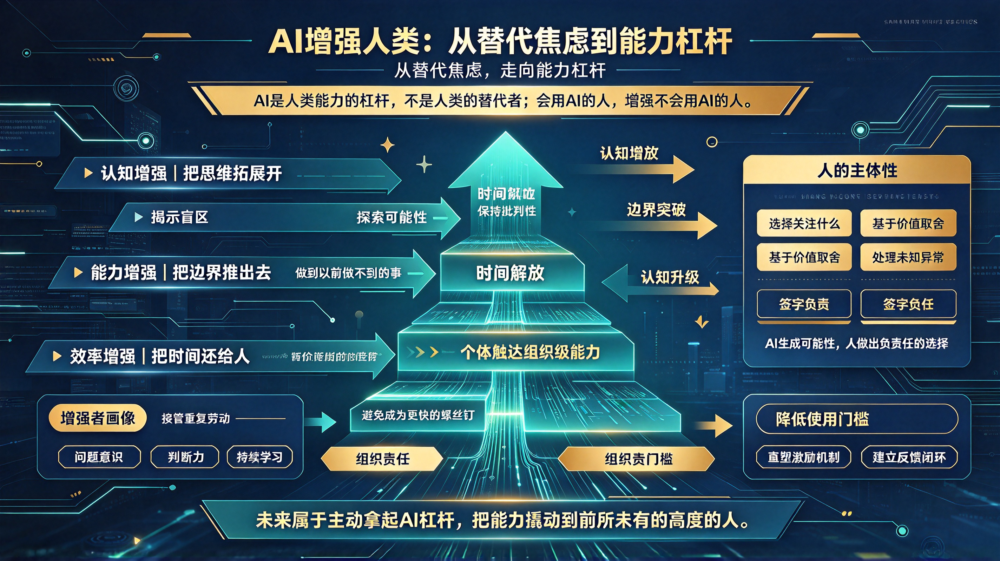

*图：AI是放大器，放大的不是人的价值，而是人的主动性。左侧是"替代焦虑"的零和叙事——AI强一分，人弱一分；右侧是"能力杠杆"的增强叙事——效率增强（把时间还给人）、能力增强（把边界推出去）、认知增强（把思维拓展开），层层递进。杠杆已经放在那里，问题是：你准备撬动什么？*

## 一、一个被误读的时代命题

过去几年，关于AI的公共讨论几乎被一种叙事垄断：**替代**。

"AI会取代多少工作岗位？""哪些职业即将消失？""人类会不会被AI淘汰？"这些问题背后，隐含着一个共同的预设——AI与人类是零和博弈的关系，AI强一分，人类就弱一分。

但这个预设本身就是错的。

AI真正的历史角色，不是人类的替代者，而是**人类能力的杠杆**。正如蒸汽机放大了人类的体力，计算机放大了人类的计算力，大模型正在放大的是人类的**认知力**——理解、推理、创造、连接的能力。

问题的关键从来不是"AI会不会替代人"，而是**"人能不能学会使用AI这个杠杆"**。会用的人，能力被放大十倍、百倍；不会用的人，才会被会用的人替代。

替代发生的本质，不是AI替代人，而是**会用AI的人替代不会用AI的人**。

---

## 二、增强的逻辑：重新理解人机关系的本质

要理解AI如何增强人类，首先要回答一个问题：**人类相对于AI，不可替代的核心是什么？**

答案不在"能力"层面，而在**"主体性"层面**。

| 维度 | AI的强项 | 人类的不可替代性 |
|------|---------|----------------|
| 信息处理 | 海量、高速、不知疲倦 | 有限带宽，但能**选择关注什么** |
| 模式识别 | 从数据中发现统计规律 | 能理解**意义**而非仅相关性 |
| 方案生成 | 快速产出多样化候选 | 能基于**价值观**做出取舍 |
| 执行效率 | 7×24，零误差重复 | 能处理**从未见过的异常** |
| 责任承担 | 无 | **能签字、能负责、能担责** |

AI可以生成一百个方案，但它不知道哪个方案"对"——因为"对"不是一个统计概念，而是一个价值概念。AI可以诊断疾病，但它无法决定"是否告知患者真相"——因为这不是医学问题，而是伦理问题。AI可以写出流畅的文字，但它没有"想说的话"——因为它没有意图，没有立场，没有生命体验。

**人类的不可替代性，不在于"做得更快更好"，而在于"知道为什么做、为谁做、做到什么程度"。**

增强的逻辑就在于此：**AI负责把"可能性空间"打开，人负责在可能性空间中做出负责任的选择。**

---

## 三、增强的三个层次

AI对人类的增强，不是一蹴而就的，而是分层次递进的。

### 第一层：效率增强——把时间还给人

这是最直观、最容易感知的增强层。AI接管重复性、机械性的工作，把人从"低价值劳动"中解放出来。

- 程序员不再手写样板代码，而是专注于架构设计与核心逻辑；
- 设计师不再手动调整像素，而是专注于创意方向与审美判断；
- 分析师不再手动整理数据，而是专注于洞察业务含义与制定策略。

这一层的本质是**时间解放**。AI把人从"不得不做但不想做的事"中解放出来，让人有时间去做"真正想做的事"。

但这一层也有陷阱：如果人只是把省下来的时间用来做更多同样的事，那增强就止步于"更快的螺丝钉"。真正的增强，必须进入第二层。

### 第二层：能力增强——把边界推出去

这一层，AI不再是"替人做事的工具"，而是**"让人做到以前做不到的事的伙伴"**。

- 一个不懂编程的产品经理，可以用AI快速搭建原型，验证想法；
- 一个小型创业团队，可以用AI同时运营内容、客服、数据分析，做到过去需要二十人团队才能做到的事；
- 一个普通研究者，可以用AI快速阅读上百篇论文、发现跨学科的潜在关联，做出过去只有大团队才能完成的综合研究。

这一层的本质是**能力边界的突破**。AI降低了专业门槛，让个体能够触达过去只有组织才能触达的能力范围。**一个人的团队，正在成为可能。**

### 第三层：认知增强——把思维拓展开

这是增强的最高层次。AI不再是执行者，而是**思维的碰撞者、盲区的揭示者、可能性的探索者**。

- 当一个人陷入思维定式时，AI可以主动提出反例、列举被忽略的角度；
- 当一个人做决策时，AI可以模拟多种情景、推演长期后果；
- 当一个人创作时，AI可以生成意想不到的组合，激发新的灵感。

这一层的本质是**认知升级**。AI帮助人看到自己看不到的东西，想到自己想不到的方向。它不是替人思考，而是**让人思考得更深、更广、更清醒**。

但这一层也最危险——当AI越来越善于"帮你想"，人可能逐渐丧失独立思考的能力。因此，认知增强的前提是**保持批判性**：AI的建议永远只是建议，最终的判断必须经过人的审视。

---

## 四、增强者的画像：什么样的人会被AI增强？

不是所有人都会被AI增强。AI是一个放大器，它放大的不是"人的价值"，而是**"人的主动性"**。

会被AI增强的人，通常具备以下特质：

**1. 有明确的问题意识**
AI不会主动发现问题，它只能回应人的提问。一个不知道自己需要什么的人，AI对他毫无用处。增强始于一个好问题。

**2. 有判断力而非依赖心**
AI会给出答案，但答案不一定对。增强者不会盲从AI的输出，而是会交叉验证、质疑推理、追问依据。他们是AI的"主编"，而不是"读者"。

**3. 有整合能力而非单一技能**
AI擅长单点任务，但不擅长跨领域整合。增强者的价值在于把AI生成的碎片化输出，整合成有意义的整体——把代码变成产品，把文字变成策略，把数据变成洞察。

**4. 有持续学习的意愿**
AI本身在快速进化，使用AI的方式也在快速变化。六个月前的最佳实践，今天可能已经过时。增强者必须是终身学习者，始终保持对新工具的好奇与探索。

相反，以下特质的人，很难被AI增强：

- 等待指令、缺乏主动性的人——AI无法替他们决定"该做什么"；
- 拒绝质疑、盲目信任的人——他们会被AI的错误带偏；
- 固守单一技能、拒绝跨界的人——AI会直接替代他们的核心能力；
- 抗拒变化、拒绝学习的人——他们会被工具本身甩下。

**AI不会自动增强人。增强是一种选择，一种能力，一种持续练习的结果。**

---

## 五、组织的责任：构建增强的土壤

个体的增强固然重要，但真正的规模化增强，发生在组织层面。

一个组织要想让AI真正增强员工，而非制造焦虑与对立，必须做到三件事：

**1. 降低使用门槛**
提供易用的AI工具、清晰的指引、充足的培训，让每个员工都能低门槛地开始尝试。不要让AI成为少数技术精英的专属玩具。

**2. 重塑激励机制**
如果考核的还是"工作量"，员工就没有动力用AI提升效率——因为效率越高，考核压力越大。激励必须从"做了多少"转向"创造了多少价值"。

**3. 建立反馈闭环**
员工使用AI的经验、发现的问题、总结的最佳实践，应该在组织内流动起来。让一个人的探索，变成整个组织的能力。

---

## 六、结语：增强的终极意义

> **AI增强人类，最终指向的不是"人变得更高效"，而是"人变得更像人"。**

当AI接管了重复的、机械的、概率性的工作，人终于有机会回归那些真正属于人的事——

> **去创造，而不是复制；**  
> **去判断，而不是计算；**  
> **去连接，而不是传递；**  
> **去追问意义，而不是执行指令。**

技术史上的每一次重大突破，都曾引发"人类将被替代"的恐慌。但回头看，蒸汽机没有替代人类，它让人类走出了体力极限；计算机没有替代人类，它让人类突破了计算极限；AI也不会替代人类，它会让人类突破认知极限。

**替代是假命题，增强才是真方向。**

未来不属于AI，也不属于拒绝AI的人。未来属于那些**主动拿起AI这个杠杆，把自己的能力撬动到前所未有的高度的人**。

杠杆已经放在那里。

问题是：你准备撬动什么？
