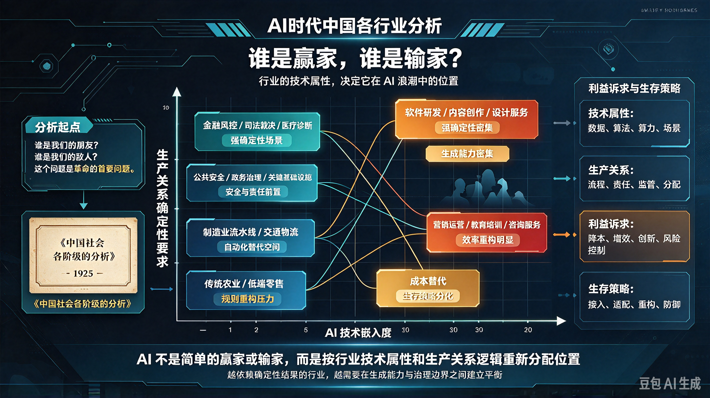

*图：以"技术属性"为标尺的三档分层——极高冲击区（IT、金融、商业服务、内容创作、零售）被降维打击，中高冲击区（医疗、教育、制造、法律）被重构逻辑，低冲击区（个人服务、建筑、农林牧渔）被赋能增强。*

> "谁是我们的朋友？谁是我们的敌人？这个问题是革命的首要问题。"——毛泽东，《中国社会各阶级的分析》，1925 年

1925 年，毛泽东以经济地位为标尺，分析了中国社会各阶级对革命的态度。今天，AI 作为新质生产力的典型代表，正在深刻重塑中国的产业结构。同样的方法论依然有效——**行业的技术属性决定了它在 AI 浪潮中的位置，不同行业处于不同的生产关系中，对 AI 就有不同的利益诉求和生存策略。**

## 一、极高冲击区：被"降维打击"的行业（替代率≥80%）

这些行业的共同特征是：**工作高度标准化、数据密集、规则明确、创造性低。** AI 不是"辅助"它们，而是在**重构它们的底层逻辑**。

### 1. 信息技术与软件开发（AI 影响系数 7.7/10）

**冲击特征：** 纯数字化工作，AI 编程助手深度重构。

- **初级程序员（替代率 70%-87%）：** AI 代码生成工具已覆盖 70%以上基础代码编写。北京某互联网公司 2026 年春节后用会 Cursor 的应届生替代八年经验程序员，单人月成本从 3 万降至 8000-10000 元，需求交付周期从两周压缩至三天。
- **测试工程师（替代率 51.9%-90%）：** 自动化测试技术普及，AI 可自动生成测试用例、执行回归测试。
- **基础运维（替代率 90%+）：** RPA+AI 实现故障自动检测、自动修复。

**行业悖论：** 这是 AI 的"诞生地"，却也是被 AI 冲击最猛烈的行业之一。Anthropic 报告显示，程序员 75%的任务已被 AI 覆盖，在受冲击职业中排名第一。

**生存策略：** 从"写代码的人"转型为"设计系统的人"。架构设计、算法研发、AI 工具链开发等中高端岗位价值重估。

### 2. 金融与保险（AI 影响系数 7.3/10）

**冲击特征：** 高度数据化，后台分析岗位大量替代。

- **基础会计/出纳/审计（替代率 85%-98%）：** 智能财务系统覆盖发票识别、记账、报税及报表生成全流程。牛津大学研究显示基础会计替代概率达 97.6%。
- **银行柜员（替代率 80%-97%）：** 智能柜台与手机银行覆盖 95%以上非现金业务。
- **信贷审核员（替代率 90%+）：** 摩根大通 AI 每年审查 1.2 万份信贷申请，相当于 36 万律师工时。
- **保险核保/定损（替代率 80%+）：** 阳光保险 AI 系统实现 95.6%的单证分类准确率，80%的理赔流程自动化。
- **算法交易：** 已占股票交易量的 80%。

**行业悖论：** 金融业是 AI 应用最成熟的行业之一（风控、交易、客服），但也是岗位替代率最高的行业之一。高盛预测，银行业可通过 AI 额外产生 2000-3400 亿美元产出，但代价是大量基础岗位消失。

**生存策略：** 从"流程执行者"转型为"风险决策者"。深度策略分析、客户关系管理、复杂金融产品设计的价值凸显。

### 3. 商业服务（翻译、咨询、文书）（AI 影响系数 7.2/10）

**冲击特征：** 翻译、咨询、文书被 AI 大幅提效。

- **基础翻译（替代率 85%-99%）：** 大模型翻译精度超人工，通用场景准确率 98%，仅高端同传与文学翻译留存。2023 年以来通用笔译单价下跌 60%以上。
- **电话推销员（替代率约 99%）：** AI 语音机器人实现 7×24 小时外呼，成本为人工的 1/20。
- **客服/呼叫中心（替代率 70%-99%）：** 智能客服处理 80%-92%常规咨询。来伊份 AI 客服独立处理 73.95%咨询量，问题解决时效提升 92.7%。
- **行政文员/数据处理（替代率 92%-99%）：** OCR+RPA 实现会议纪要、日程安排、档案管理全流程自动化，效率为人工 15 倍以上。

**行业悖论：** 这些岗位曾经被视为"体面白领"，如今却成为 AI 替代的重灾区。它们的工作本质是"信息搬运"——而 AI 最擅长的就是信息搬运。

**生存策略：** 从"信息处理者"转型为"关系管理者"。需要深度人际互动、情感连接、复杂谈判的岗位（如高端销售、商务谈判、心理咨询）仍安全。

### 4. 内容创作与传媒（AI 影响系数 6.4/10）

**冲击特征：** 生成式 AI 颠覆内容创作。

- **基础文案/SEO 写手（替代率 70%-85%）：** AI 批量生成脚本、商品详情、新闻快讯。超过 40%标准化内容由 AI 生成，生产成本下降 70%以上。
- **基础设计/美工（替代率 50%-75%）：** 模板化插画、基础 UI 设计被 AI 替代。Figma 等传统设计工具因 Anthropic 的 Claude Design 冲击，股价单日暴跌近 7%，市值较 52 周高点蒸发近 90%。
- **新闻快讯/数据新闻（替代率 50%-60%）：** AI 可独立完成新闻稿生成。
- **影视制作：** AI 剪辑师招聘需求同比暴涨 179%，影视制作周期从"按月/年"压缩至"按天"，部分单集短剧制作仅需数小时。

**行业悖论：** AIGC 打通了内容生产全链路，单人产能达过去 10 人团队水平，但"创意总监"和"原创艺术家"的价值反而被放大——因为当内容生产变得廉价，**真正的原创性和审美判断力**反而成为稀缺资源。

**生存策略：** 从"内容生产者"转型为"创意策划者"。AI 负责"生产"，人类负责"判断"和"品味"。

### 5. 销售零售与电商（AI 影响系数 6.2/10）

**冲击特征：** AI 客服、智能推荐取代基础岗位。

- **收银员/导购（替代率 65%-94%）：** 无人超市、自助结账及智能货架普及。2024 年中国无人零售市场规模突破 4000 亿元。
- **电话销售（替代率约 99%）：** AI 语音机器人实现 7×24 小时外呼。
- **电商运营/选品：** AI 选品、动态定价使库存周转率提升 30%-40%。

**行业悖论：** 零售业是 AI 应用最广泛的行业之一（推荐算法、智能客服、无人收银），但也是"人机协同"最成熟的行业之一——高端销售、私人购物顾问等需要情感交互的岗位反而价值提升。

**生存策略：** 从"交易执行者"转型为"体验设计师"。线下体验、情感连接、个性化服务成为零售的核心竞争力。

## 二、中高冲击区：被"重构逻辑"的行业（替代率 50%-80%）

这些行业的共同特征是：**部分流程可标准化，但核心环节仍需人类判断。** AI 不是"替代"它们，而是在**重塑它们的商业模式**。

### 6. 医疗健康（AI 影响系数 3.8/10）

**冲击特征：** AI 辅助诊断，但诊疗护理依赖物理在场。

- **医学影像技师（替代率 60%-80%）：** AI 肺结节识别准确率 96%，影像技师替代率 65%。
- **病历录入/医保核对（替代率 60%-75%）：** AI 自动处理医疗数据与档案管理。
- **基础分诊（替代率 60%+）：** AI 可实现初步问诊和分诊。

**但核心岗位安全：**

- **外科医生/急诊医师（替代率 5%-15%）：** 需在不确定环境中瞬间决策并承担法律后果。
- **护理人员（替代率<4%）：** 共情与信任建立无法被算法量化。
- **心理咨询师（替代率 5%-15%）：** 深度共情与信任建立是算法禁区。

**行业悖论：** AI 在医疗影像诊断准确率超 95%，早期乳腺癌检测准确率达 99.5%，新药研发周期从 5-10 年缩至 1-2 年，成本降低 60%-70%——但医生和护士的核心价值（临床决策、人文关怀）反而被放大。

**生存策略：** 从"诊断执行者"转型为"综合决策者"。AI 负责"筛查"和"辅助"，医生负责"判断"和"关怀"。

### 7. 教育与培训（AI 影响系数中等）

**冲击特征：** AI 辅助内容生成，但课堂管理靠人。

- **K12 标准化讲师/基础答疑（替代率 15%-50%）：** AI 助教、自适应学习系统替代基础授课、作业批改及答疑。
- **题库整理员/作业批改（替代率 50%+）：** AI 可自动批改作业、生成题库。

**但核心岗位安全：**

- **个性化教学/思维训练（替代率<25%）：** 教师角色转向个性化指导与资源管理。
- **心理辅导/育人引导（替代率<15%）：** 情感交流与个性化引导难以被替代。

**行业悖论：** AI 使学习效率提升 35%，但教育的核心价值（育人、情感连接、价值观塑造）无法被 AI 替代。AI 是"助教"，不是"教师"。

**生存策略：** 从"知识传授者"转型为"学习设计师"。AI 负责"教"，教师负责"育"。

### 8. 制造业（AI 影响系数 4.4/10）

**冲击特征：** 结构性替代——普工减少，机器人运维增加。

- **流水线工人/装配工（替代率 70%-90%）：** 特斯拉上海工厂机器人替代率高达 75%，人力需求减少 60%。
- **质检员（替代率 75%-85%）：** AI 视觉质检准确率超 99%，误检率低于 0.001%。宁德时代 AI 质检系统实现 0.1 秒/件检测速度。
- **包装工/分拣员（替代率 80%-90%）：** 机器人+视觉识别技术已替代分拣和搬运。

**但新岗位涌现：**

- **人机协作专家/AI 训练师：** 制造业 AI 训练师岗位激增 300%。
- **设备运维/机器人调试：** 需要现场物理实操的岗位替代率<20%。

**行业悖论：** 制造业是 AI 应用最深入的行业之一（智能工厂数量突破 3 万家，生产效率提升 22.3%），但也是"人机协同"最成熟的行业之一——AI 不是"替代"工人，而是在**重构工人与机器的关系**。

**生存策略：** 从"操作者"转型为"监督者"和"优化者"。AI 负责"执行"，人类负责"调度"和"改进"。

### 9. 法律与合规（AI 影响系数 4.2/10）

**冲击特征：** 文职受 AI 影响大，一线执法影响小。

- **法律助理/合同审查（替代率 60%-92%）：** AI 秒级处理合同审查、法条检索、文书撰写，合同风险识别准确率达 99.7%。基础合同起草岗从 15 人减至 5 人。
- **专利检索员（替代率 55%）：** AI 可快速扫描万页文书。
- **合规监控（替代率 60%-70%）：** AI 可自动监控合规风险。

**但核心岗位安全：**

- **复杂诉讼律师（替代率约 8%）：** 法律推理与辩护难以完全替代。
- **法官（替代率约 12%）：** 需在不确定性中做出权衡，在价值观冲突中做出取舍。

**行业悖论：** AI 在法律基础工作上效率提升 10 倍，时间缩短 80%，但复杂诉讼、法律推理、法庭辩护等需要"人类判断"的环节，AI 仍无法替代。传统律所依赖初级律师完成文件审查与法律检索的模式正在瓦解。

**生存策略：** 从"文书工作者"转型为"策略顾问"。AI 负责"检索"和"审查"，律师负责"策略"和"辩护"。

## 三、低冲击区：被"赋能增强"的行业（替代率<30%）

这些行业的共同特征是：**依赖创意、复杂决策、高情感交互或物理临场判断。** AI 不是"替代"它们，而是在**增强它们的能力**。

### 10. 个人与生活服务（AI 影响系数 2.5/10）

**冲击特征：** 人对人的照料、美业、家政，AI 难替代。

- **月嫂（替代率<5%）：** 情感交流+信任建立，AI 无法替代。
- **养老护理员（替代率<5%）：** 陪伴+信任，冷冰冰的 AI 很难做到。
- **宠物伴宠师（替代率<5%）：** 前景+25%，需求快速增长。
- **陪诊师（替代率<10%）：** 前景+15%，需求快速增长。
- **美容/美发/纹眉（替代率<10%）：** 依赖个性化审美和线下交互。

**行业特征：** 这些岗位的共同点是**"人对人"的服务**——核心价值在于情感连接、信任建立和个性化体验。AI 可以辅助排期或记录，但无法替代"人味"。

**未来趋势：** 随着人口老龄化加剧，养老护理、陪诊、月嫂等岗位需求将持续增长，薪资和社会地位有望双重提升。

### 11. 建筑工程（AI 影响系数 2.4/10）

**冲击特征：** 现场体力操作，AI 几乎无法渗透。

- **建筑工人（替代率<10%）：** 依赖物理世界非标操作，需要手感和经验。
- **电工/水管工/汽修工（替代率<20%）：** 物理世界临场判断依赖多年积累的手感。
- **消防员/急救员（替代率<10%）：** 高风险决策+物理临场操作。

**但部分环节被赋能：**

- **建筑设计/绘图（替代率 35%-40%）：** AI 可缩短设计周期 40%，但现场施工与造价核心依赖人工经验。
- **工程造价/算量（替代率 40%-55%）：** AI 可自动算量，但核心环节仍需人工审核。

**行业特征：** 高盛预测，美国至 2030 年需新增约 50 万个电工、线路工、建筑工人等技术岗位，以匹配 AI 数据中心基建激增的电力需求——**AI 越发展，越需要这些"物理世界"的工人**。

**未来趋势：** 蓝领技工的薪资和社会地位有望持续提升，因为他们是 AI 无法替代的"物理世界守护者"。

### 12. 农林牧渔（AI 影响系数 2.2/10）

**冲击特征：** 传统农业体力劳动，AI 影响极小。

- **种植业农民（替代率<10%）：** 依赖物理世界操作和多年经验。
- **养殖/畜牧（替代率<15%）：** 依赖现场判断和手工操作。

**但部分环节被赋能：**

- **农业技术员（AI 影响中等）：** AI 病虫害防治准确率 92%，播种采收核心环节仍需人工。
- **植保无人机操作（替代率 35%）：** 大疆 T40 无人机施药效率提升 300%，但核心决策仍需人工。

**行业特征：** AI 在农业中的应用主要是"精准农业"——通过传感器、无人机、AI 算法优化种植方案，但**核心生产环节仍依赖人工**。AI 是"助手"，不是"替代者"。

**未来趋势：** 随着"AI+农业"的深入，农业将从"劳动密集型"向"技术密集型"转型，但农民的核心地位不会动摇。

## 四、总结：AI 时代的行业"主要矛盾"

| 冲击等级 | 代表行业 | 替代率 | 核心特征 | 生存策略 |
|---|---|---|---|---|
| 极高冲击 | IT、金融、商业服务、内容创作、零售 | ≥80% | 标准化、数据密集、规则明确 | 从"执行者"转型为"决策者" |
| 中高冲击 | 医疗、教育、制造、法律 | 50%-80% | 部分可标准化，核心需人类判断 | 从"操作者"转型为"监督者" |
| 低冲击 | 个人服务、建筑、农林牧渔 | <30% | 依赖情感、创意、物理临场 | 保持"人味"，AI 仅作为辅助 |

**AI 时代的主要矛盾，不是"AI 与人类的矛盾"，而是"标准化工作与创造性工作之间的矛盾"——本质上是"可被算法化的任务"与"不可被算法化的价值"之间的博弈。**

正如毛泽东在 1925 年所指出的：**谁是我们的朋友？谁是我们的敌人？**

- **朋友：** 那些依赖创意、情感、复杂决策、物理临场判断的行业——AI 是它们的"赋能者"。
- **敌人：** 那些高度标准化、数据密集、规则明确的行业——AI 是它们的"替代者"。
- **中间派：** 那些部分可标准化、部分需人类判断的行业——AI 是它们的"重构者"。

> 一百年前，毛泽东的回答是：团结真正的朋友，攻击真正的敌人。
>
> 今天，我们的回答是：**让 AI 成为创造性工作的朋友，而不是标准化工作的敌人。**
