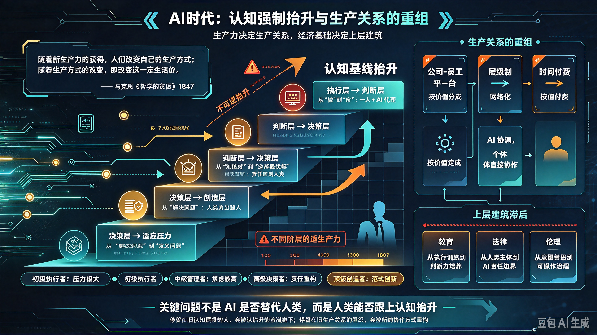

*图：认知基线的三层抬升——执行层→判断层、判断层→决策层、决策层→创造层；每一次抬升，都倒逼生产关系从"雇佣"走向"协作"。*

> "随着新生产力的获得，人们改变自己的生产方式；随着生产方式的改变，即改变这一定生活方式的必然条件，人们便改变自己的一切社会关系。"——马克思，《哲学的贫困》，1847 年

## 一、核心命题：AI 不是"替代"，而是"认知基线抬升"

传统的技术革命（蒸汽机、电力、计算机）主要替代的是**体力**或**重复性脑力劳动**，但 AI 替代的是**认知本身**——它把人类几千年积累的"认知能力"（语言理解、逻辑推理、模式识别、创意生成）变成了像水电一样的基础设施。

这意味着：**以前需要"训练"才能获得的能力，现在变成了"默认配置"。**

- 以前写代码需要学 5 年，现在 AI 能帮你写——但你需要**更高阶的认知**：判断 AI 写的代码是否正确、如何设计系统架构、如何与业务需求对齐。
- 以前做翻译需要学 10 年外语，现在 AI 能帮你翻——但你需要**更高阶的认知**：判断翻译的语境是否准确、文化隐喻是否到位、风格是否恰当。
- 以前做设计需要学美术，现在 AI 能帮你画——但你需要**更高阶的认知**：判断审美方向、理解用户心理、把握品牌调性。

**AI 没有消灭工作，而是消灭了"低认知层级的工作"。** 所有人的认知基线被强制抬升了一层——你不能再停留在"执行层"，必须上升到"判断层"、"决策层"、"创造层"。

## 二、认知抬升的三层结构

### 第一层：执行层 → 判断层

**旧认知：** "我会写代码/做翻译/写文案/做设计。"
**新认知：** "我会判断 AI 写的代码/翻译/文案/设计是否正确、是否合适。"

这一层的核心能力从**"做"**变成了**"审"**。

- 程序员不再是"写代码的人"，而是"代码审查员+系统架构师"。
- 翻译不再是"逐字转换的人"，而是"文化适配专家+风格把控者"。
- 设计师不再是"画图的人"，而是"审美总监+用户体验设计师"。

**生产关系的变化：** 从"一人一岗"变成"一人+AI 代理"。一个人可以完成过去一个团队的工作量，但要求这个人的认知层级从"执行者"跃升到"管理者"。

### 第二层：判断层 → 决策层

**旧认知：** "我知道什么是对的。"
**新认知：** "我知道在多个'对的'选项中，哪个是最优解。"

AI 能给出多个"正确答案"，但它无法判断**哪个答案在当前语境下最优**。这需要人类的高阶认知：

- **价值判断：** 在商业利益、用户体验、社会责任之间如何权衡？
- **风险判断：** 在不确定性中，如何评估不同方案的潜在风险？
- **战略判断：** 在长期目标和短期收益之间，如何选择？

**生产关系的变化：** 从"听命行事"变成"自主决策"。AI 提供了信息和选项，但**最终拍板的责任**必须由人类承担——因为 AI 无法承担法律和道德责任。

### 第三层：决策层 → 创造层

**旧认知：** "我能解决问题。"
**新认知：** "我能定义问题，甚至发现别人看不到的问题。"

AI 擅长解决"定义清晰的问题"，但它不擅长**发现问题本身**。最高阶的认知能力是：

- **问题定义：** 在混沌中识别出真正的问题是什么。
- **范式创新：** 跳出既有框架，提出全新的解决方案。
- **意义建构：** 在复杂信息中提炼出核心洞察，赋予行动以意义。

**生产关系的变化：** 从"解决问题的人"变成"定义问题的人"。AI 是"解题器"，人类是"出题人"。

## 三、不同阶层的认知抬升压力

认知抬升不是均匀分布的——**越靠近"执行层"的人，抬升压力越大；越靠近"创造层"的人，抬升压力越小。**

| 阶层 | 旧认知基线 | 新认知基线 | 抬升幅度 | 适应难度 |
|---|---|---|---|---|
| 初级执行者 | 执行层 | 判断层 | 大 | 极高 |
| 中级管理者 | 判断层 | 决策层 | 中 | 高 |
| 高级决策者 | 决策层 | 创造层 | 小 | 中 |
| 顶级创造者 | 创造层 | 更高阶创造 | 极小 | 低 |

**这就是为什么中级工程师最焦虑**——他们原本处于"判断层"，现在被强制抬升到"决策层"，但这个抬升需要时间、需要试错、需要承担更大的责任。而初级执行者面临的挑战更大：他们必须直接从"执行层"跳到"判断层"，中间没有过渡。

## 四、生产关系的重组：从"雇佣"到"协作"

认知抬升必然导致生产关系的重组。传统的"雇佣关系"正在瓦解，新的生产关系正在形成：

### 1. 从"公司-员工"到"平台-个体"

- **旧生产关系：** 公司提供岗位，员工出卖时间，按劳取酬。
- **新生产关系：** 平台提供 AI 工具和基础设施，个体提供高阶认知能力，按价值分成。

**案例：** 一个资深程序员+AI 代理，可以独立完成过去需要一个 10 人团队才能完成的项目。他不再需要"被雇佣"，而是可以作为一个"独立开发者"直接面向市场。

### 2. 从"层级制"到"网络化"

- **旧生产关系：** 金字塔结构，信息自上而下流动，决策权集中在顶层。
- **新生产关系：** 扁平网络结构，AI 承担了大部分"中层管理"的协调工作，个体之间直接协作。

**案例：** 一个内容创作者+AI 工具，可以独立完成选题、写作、排版、分发、数据分析的全流程，不再需要编辑、美编、运营、数据分析师的层层配合。

### 3. 从"时间付费"到"价值付费"

- **旧生产关系：** 按工时付费，"我工作了 8 小时，所以你应该付我 8 小时的钱。"
- **新生产关系：** 按结果付费，"我交付了这个价值，所以你应该付我这个价值的钱。"

**案例：** 一个设计师用 AI 在 2 小时内完成了过去需要 2 天的工作，客户不会因为他"只工作了 2 小时"就少付钱——因为他交付的价值是一样的。

## 五、上层建筑的滞后：教育、法律、伦理的困境

生产力已经抬升了，但上层建筑（教育体系、法律制度、伦理规范）还在原地踏步——这就是当前社会焦虑的根源。

### 1. 教育体系的困境

- **旧教育：** 培养"执行能力"——背公式、练技能、考证书。
- **新需求：** 培养"判断力、决策力、创造力"——但这些能力很难通过标准化考试来衡量。

**结果：** 学校还在教"如何写代码"，但市场需要的是"如何判断 AI 写的代码是否正确"。教育与市场严重脱节。

### 2. 法律制度的困境

- **旧法律：** 基于"人类行为主体"——谁做的，谁负责。
- **新挑战：** AI 做出的决策，谁负责？AI 生成的内容，版权归谁？AI 造成的损害，谁来赔偿？

**结果：** 法律滞后于技术，导致大量灰色地带。企业不敢大规模部署 AI，因为不知道出了事谁担责。

### 3. 伦理规范的困境

- **旧伦理：** 基于"人类意图"——好人做坏事 vs 坏人做坏事。
- **新挑战：** AI 没有"意图"，但它可能造成伤害。如何定义"AI 的恶"？如何防止 AI 被滥用？

**结果：** 伦理讨论陷入"加速派 vs 减速派"的对立，但双方都没有给出可操作的解决方案。

## 六、结论：认知抬升是不可逆的历史进程

AI 不是"替代"人类，而是**强制人类进化**——它把认知基线抬升了一层，迫使所有人重新组织自己的生产关系。

- **对个人而言：** 你必须从"执行者"进化为"判断者"、"决策者"、"创造者"。停留在旧认知层级的人会被淘汰，不是被 AI"替代"，而是被**认知抬升的浪潮**抛下。
- **对企业而言：** 你必须从"雇佣关系"进化为"协作关系"，从"层级制"进化为"网络化"，从"时间付费"进化为"价值付费"。停留在旧生产关系的企业会被淘汰，不是因为它们"不用 AI"，而是因为它们**无法适应新的生产关系**。
- **对社会而言：** 教育、法律、伦理必须跟上生产力的抬升。否则，认知抬升带来的不是进步，而是撕裂——少数人适应了新高知层级，多数人被困在旧认知层级，社会矛盾加剧。

> 马克思说："手推磨产生的是封建主为首的社会，蒸汽磨产生的是工业资本家为首的社会。"
>
> 今天，我们可以说：**"AI 磨产生的是认知精英为首的社会。"**

问题的关键不是"AI 会不会替代人类"，而是**"人类能否跟上 AI 带来的认知抬升"**。
