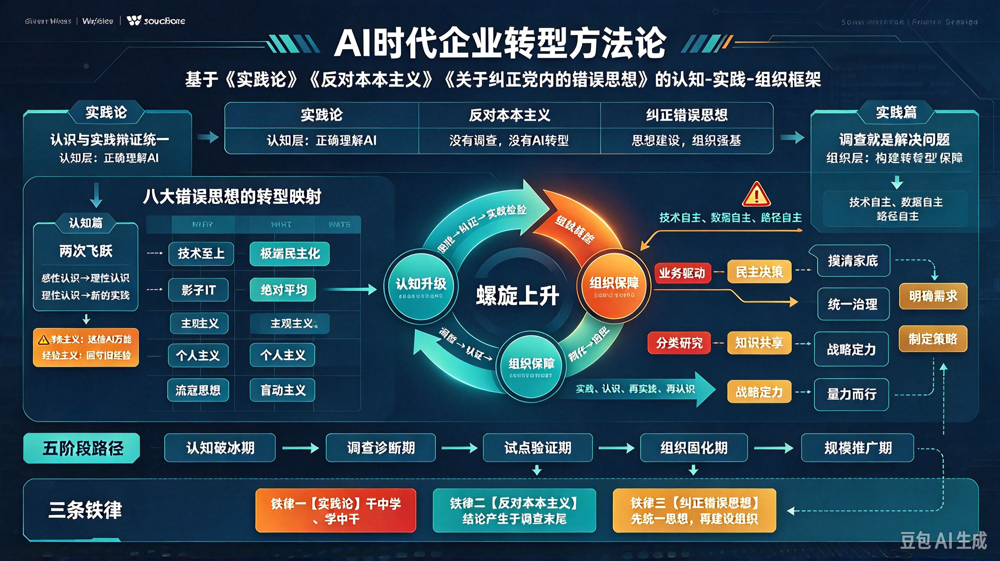

*图：上方是底层原理——AI 强制抬升认知基线（执行层→判断层→决策层→创造层）；中部是三层主干：认知层纠正错误思想、实践层完成调查与"七破七立"、组织层完成生产关系重组；下方是三个阶段（用起来—建系统—重构流程与组织）与"实践—认知—再实践—再认知"的循环；右侧回到战略—组织—技术—人才的闭环。*

本文不是第四篇文章，而是此前三篇的**合订本与施工图**。

前三篇各自解决了一个层面的问题，但任何一篇单独使用都会跑偏：只讲原理，会变成空谈；只讲纠偏，会变成整风；只讲方法，会变成新的本本。方法论的意义，就在于把它们串成一条**从世界观到操作动作**的完整链路。

---

## 一、总纲：一条主线、三层结构、一个闭环

**一条主线：** AI 是新的生产力，它强制抬升了整个社会的认知基线，从而倒逼生产关系重组。企业 AI 转型的全部内容，都可以还原为这一句话的展开。

**三层结构：**

| 层次 | 回答的问题 | 核心内容 | 来源篇章 |
|---|---|---|---|
| **底层原理** | AI 到底是什么 | 认知基线抬升与生产关系重组 | 《认知强制抬升与生产关系的重组》 |
| **认知层** | 什么在阻碍我们 | 八种错误思想的识别与纠正 | 《关于纠正企业内的错误 AI 思想》 |
| **实践层** | 具体怎么干 | 五项调查技术 + "七破七立" | 《反对 AI 开发中的本本主义》 |
| **组织层** | 谁来干、靠什么持续 | 生产关系三条重组线 | 本文综合 |
| **认识论** | 三层如何统一 | 认知与实践的具体的历史的统一 | 《论 AI 认知与实践》 |

**一个闭环：** 战略—组织—技术—人才。其中任何一环缺失，AI 转型都会退化为工具采购。

> 一句话概括这套方法论：**用认知纠偏来对准方向，用调查研究来摸清实际，用"破立对照"来改造旧办法，用组织变革来固化新做法，最后在战略—组织—技术—人才的闭环中反复迭代。**

---

## 二、底层原理：AI 抬升的是认知基线，不是算力额度

在动手之前，必须先解决一个判断：**AI 究竟替代了什么？**

答案是：AI 没有消灭工作，而是消灭了"低认知层级的工作"。以前需要长期训练才能获得的能力——语言理解、逻辑推理、模式识别、创意生成——正在变成像水电一样的基础设施。所有人的认知基线被强制抬升一层：

- **执行层 → 判断层：** 核心能力从"做"变成"审"。程序员不再是写代码的人，而是代码审查员与系统架构师。
- **判断层 → 决策层：** 核心能力从"知道什么是对的"变成"知道在多个对的选项中哪个最优"。价值判断、风险判断、战略判断无法外包。
- **决策层 → 创造层：** 核心能力从"解决问题"变成"定义问题"。AI 是解题器，人类是出题人。

由此得出三条**对企业直接有用的推论**：

**推论一：转型的单位是"岗位的认知层级"，不是"软件系统"。** 买系统买不来认知抬升。一个岗位如果没有被重新定义为更高认知层级的工作，再先进的工具也只是"给马车装上了法拉利的引擎"。

**推论二：转型的产出是"可复用的认知资产"，不是"工具采购清单"。** Skill、Prompt 模板、最佳实践、评测集——这些才是 AI 时代真正沉淀下来的生产资料。

**推论三：转型的检验标准是"认知基线的整体抬升"，不是"AI 采用率"。** 不问"用了多少 AI"，只问"AI 创造了多少真实价值"。

---

## 三、认知层：八种错误思想的识别卡

这一层的作用是**纠偏**——在方向错误的时候，跑得越快，损失越大。

| 错误思想 | 典型症状（企业里真实听到的话） | 纠正原则 |
|---|---|---|
| **单纯技术观点** | "买个工具就行了，这是 IT 部门的事" | AI 是生产关系的变革，不是技术采购 |
| **极端悲观主义** | "AI 不行，试过一次全是错，别折腾了" | 区分"暂时不行"与"根本不行"，从失败中提取认知 |
| **极端冒进主义** | "全面 AI 化，今年就要无人化" | 尊重阶段，量力而行，先试点后放量 |
| **绝对平均主义** | "全员统一推进，所有人都学同一套课程" | 因岗施策、因人施策，分层分类推进 |
| **主观主义** | "某某公司就是这么干的，我们照搬" | 没有调查就没有发言权，因地制宜 |
| **个人主义** | "这是我的独门技巧，凭什么共享出去" | AI 时代的竞争力是组织能力，不是个人武器 |
| **流寇思想** | "这个模型火了换这个，三天热度" | 从试点到生产的完整闭环，做脏活累活 |
| **盲动主义残余** | "AI 能干这事，人就可以撤了" | 人机协同的渐进路径，尊重技术成熟度 |

八种错误思想，本质上可以归为**三类病因**：

- **矮化：** 单纯技术观点、主观主义——把 AI 降格为工具问题、技术问题。
- **极端化：** 极端悲观主义、极端冒进主义——要么神化 AI，要么妖魔化 AI。
- **涣散化：** 绝对平均主义、个人主义、流寇思想、盲动主义残余——组织跟不上认知，认知落不到地上。

**认知层的三条总原则**（详见 [《关于纠正企业内的错误 AI 思想》](/articles/correcting-wrong-ai-thinking-in-enterprises)）：

1. **AI 是认知放大器，不是银弹，也不是威胁。** AI 时代的竞争不是"人与 AI 的竞争"，而是"会用 AI 的人与不会用 AI 的人的竞争"。
2. **因岗施策、因人施策。** 不同岗位、不同层级、不同业务，需求不同、培训不同、考核不同、路径不同。
3. **纠偏归结到两条：加强教育（认知层级跃迁），加强组织（闭环落地）。**

---

## 四、实践层：先调查，后破立

这一层回答"具体怎么干"，分两步：**先调查，摸清实际；再破本本，改造办法。**

### 4.1 五项调查技术

没有调查，就没有发言权。AI 项目启动前，必须完成五项调查：

1. **调查 AI 的真实能力边界。** 不是听厂商 PPT，是用自己的真实业务数据去测，摸清它能做什么、不能做什么。
2. **调查企业的真实数据基础。** 不是听 IT 说"我们有数据"，而是亲自看数据在哪、质量如何、口径是否一致。拥有数据 ≠ 拥有可用的高质量数据。
3. **调查员工的真实使用状况。** 不是看"采用率"，而是了解使用中遇到的真实困难——52%的中国员工表示低质量或误导性的 AI 输出导致了时间浪费。
4. **调查组织的真实流程逻辑。** 大多数现有流程是为"人"设计的，不是为"Agent"设计的。要搞清楚信息如何流动、决策如何做出、责任如何归属。
5. **调查行业的真实竞争态势。** 你不做，竞争对手在做。

### 4.2 "七破七立"对照表

调查之后，是把传统软件工程的"本本"逐条换成 AI 时代的办法（详见 [《反对 AI 开发中的本本主义》](/articles/opposing-book-worship-in-ai-development)）：

| # | 破：旧本本 | 立：新办法 |
|---|---|---|
| 1 | 用确定性流程管理概率性产物 | 承认探索性，容忍失败实验，设置不可预测的探索期 |
| 2 | "买了就行"的采购思维 | 建设思维：数据治理、流程重构、人才培养、组织变革 |
| 3 | "先有锤子再找钉子" | 问题驱动：先定义问题，再判断 AI 是否适用，最后选技术 |
| 4 | 全员统一推进 | 分类指导：因岗施策、因人施策 |
| 5 | 用"试点成功"代替"规模化落地" | 试点即模拟真实复杂度：数据不清洗、人员不挑选、流程不精简 |
| 6 | AI 转型是 IT 部门的事 | CEO 工程：技术、业务、组织统一于一个战略 |
| 7 | "经验不可替代"的教条 | 经验资产化：隐性经验显性化、显性经验数字化、数字经验智能化 |

### 4.3 实践的三个阶段与任务卡

企业 AI 转型大致经过三个阶段，每个阶段有各自的任务，**不能跳跃，也不能停滞**：

| 阶段 | 认知特征 | 核心任务 | 关键动作 | 常见失败模式 |
|---|---|---|---|---|
| **感性认知期** | 知道 AI 很厉害，不知怎么用 | 用起来 | 选高频低风险场景、建立 AI 护栏、积累手感 | 停留在 PPT 与讨论，从不动手 |
| **理性认知期** | 有战略有路线图，未经验证 | 建系统 | 数据治理、能力复用、评价指标转为价值转化率 | 工具堆砌，各系统互不相通 |
| **系统集成期** | 认知接受了实践的修正 | 重构流程、变革组织 | 流程按 Agent 重设计、人机职责重划分、生产关系重组 | 技术上线而组织未动，效果被流程吃掉 |

驱动这一进程的循环是：**实践—认知—再实践—再认知**。每一次失败都是认知深化的契机，每一次成功都是认知跃升的阶梯（详见 [《论 AI 认知与实践》](/articles/on-ai-cognition-and-practice)）。

---

## 五、组织层：生产关系的三条重组线

认知升级了、方法改造了，如果生产关系不变，一切都会回弹。组织层要做三件事，对应生产关系的三条重组线：

**第一条线：从"公司—员工"到"平台—个体"。** 企业提供 AI 工具、数据与基础设施，个体提供高阶认知能力，按价值分成。落到操作上，就是把个人经验沉淀为 Skill 与 Prompt 模板，使其成为可调用的组织资产，而不是留在某个人的会话记录里。

**第二条线：从"层级制"到"网络化"。** AI 承担了大量过去由中层承担的协调、汇总、分发工作，组织因此可以更扁平。落到操作上，是建立跨职能的 AI 转型小组（战略、业务、IT、HR 同席），而不是由 IT 部门单线推进。

**第三条线：从"时间付费"到"价值付费"。** 考核指标从"AI 采用率"转向"AI 价值转化率"；不仅奖励"个人用 AI 提升效率"，更奖励"把 AI 能力沉淀给团队"。落到操作上，是把知识贡献纳入绩效评价。

三条线合起来，就是那个反复出现的闭环：

> **战略**定方向与阶段 → **组织**定权责与协同方式 → **技术**提供可复用的能力底座 → **人才**完成认知层级跃迁 → 反哺**战略**。

---

## 六、诊断对照表：现象—病因—药方

把前三篇的内容压缩成一张现场可用的表。遇到问题时，从左往右查：

| 现场现象 | 认知层病因 | 实践层病因 | 组织层处方 |
|---|---|---|---|
| 不断试点、不断重做、难以放量 | 把 AI 当银弹 | 用"试点成功"代替规模化落地 | 试点设计必须模拟真实复杂度，设"生产化"时间表 |
| 员工绕开 AI 工具选择手动工作 | 把 AI 当威胁 | 未调查员工真实使用困难 | 建立反馈机制，员工从被动接受者变共创者 |
| 工具买了一大堆，业务没变化 | 单纯技术观点 | 先有锤子再找钉子 | CEO 工程 + 问题驱动的立项流程 |
| 试点很成功，推广即失败 | 主观主义（照搬） | 试点环境被简化失真 | 分类指导，复制前先做场景适配评估 |
| 每个人都在偷偷用 AI，成果不沉淀 | 个人主义 | 缺乏经验资产化机制 | 知识共享制度 + 价值付费激励 |
| AI 上线后投诉激增 | 盲动主义残余 | 未验证就嵌入关键流程 | AI 护栏 + 人机协同渐进路径 |
| 今天换模型明天换工具，无疾而终 | 流寇思想 | 缺"从试点到生产"闭环 | 在一个场景深耕到生产，再谈复制 |

---

## 七、落地自检：十二个问题

转型启动前，先用这十二个问题做一次体检。答不上来的，就是下一阶段要补的功课。

**认知层**
1. 我们的管理层里，有多少人**亲自**用过公司采购的 AI 工具超过十次？
2. 我们对 AI 的定位，是"银弹"、"威胁"，还是"认知放大器"？这个共识写下来了吗？
3. 每个受影响岗位的目标认知层级（判断层 / 决策层 / 创造层）是否被明确定义？

**实践层**
4. 五项调查（能力边界、数据基础、员工使用、流程逻辑、竞争态势）做过几项？有书面结论吗？
5. 立项是从"问题"出发还是从"技术"出发？能不能一句话说清要解决什么问题？
6. 是否设置了探索期？团队是否知道"失败的实验是可接受的结果"？
7. 试点环境有没有刻意保留真实复杂度（脏数据、完整流程、普通员工）？
8. AI 输出进入关键业务前，护栏在哪里？谁在边界外把关？

**组织层**
9. AI 转型的第一责任人是谁？是 IT 负责人还是 CEO/业务负责人？
10. 是否有跨职能的常设小组，而非临时项目组？
11. 个人沉淀的 Skill、Prompt、最佳实践，是否有统一的存放与复用通道？
12. 考核指标里，有没有一条是关于"价值转化"或"知识贡献"的？

---

## 八、方法论自身的边界

最后必须提醒：**不要把这份框架本身当成新的"本本"。**

- **不要用框架代替调查。** 这张表列出的所有原则，都是从具体实践中抽象出来的；一旦脱离具体的企业实际、行业实际、技术发展阶段，它们就变成新的教条。先调查，后套用。
- **既不要超越阶段，也不要落后于阶段。** 处于感性认知期的企业，重点是"用起来"，不要直接跳过去做组织重构；已经进入系统集成期的企业，重点是"重构流程、变革组织"，不能还停留在"用 AI 写邮件"的自我满足里。
- **认知与框架都要接受实践检验。** 这套方法论是否正确，不是一个理论问题，而是一个实践问题。用它指导实践，再根据实践的结果修订它——这本身就是"实践—认知—再实践—再认知"的用法示范。

---

## 结语：方法的尽头是行动

回到主线：**AI 强制抬升了认知基线，生产关系必须跟着重组。**

落到企业的具体动作上，就是五句话：

1. **看清原理**——AI 抬升的是认知基线，转型的对象是认知层级。
2. **纠正思想**——对准八种错误倾向定期自查，尤其防止矮化、极端化、涣散化。
3. **调查研究**——五项调查做完之前，不谈方案、不做决策。
4. **改造办法**——按"七破七立"把传统软件工程的本本逐条换成 AI 时代的做法。
5. **变革组织**——用平台—个体、网络化、价值付费三条重组线，把成果固化进生产关系。

> 不要等待"认知完全清晰"再开始实践，因为认知只能在实践中清晰；也不要盲目实践而不总结认知，因为实践需要认知的指导。

**在认知中实践，在实践中认知**——这才是 AI 时代企业转型方法论的全部内容。

---

_本文整合自《关于纠正企业内的错误 AI 思想》《反对 AI 开发中的本本主义》《论 AI 认知与实践》三篇，并以《AI 时代：认知强制抬升与生产关系的重组》为底层原理，供企业 AI 转型实践直接取用。_
