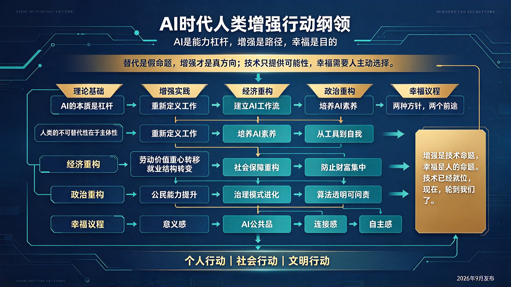

*图：AI时代人类增强行动纲领——AI是能力杠杆，增强是路径，幸福是目的。替代是假命题，增强才是真方向；技术只提供可能性，幸福需要人主动选择。纲领沿"理论基础→增强实践→经济重构→政治重构→幸福议程"展开，落脚于个人行动、社会行动与文明行动。*

## 序言

我们站在一个历史的转折点上。

人工智能的发展，正在以前所未有的速度重塑人类的生产方式、生活方式和思维方式。面对这一变革，人类社会分裂为两种态度：恐惧与驾驭，逃避与拥抱，被动与主动。

本纲领基于一个核心信念：**AI不是人类的替代者，而是人类能力的杠杆。** 替代是假命题，增强才是真方向。AI的历史角色，不是取代人，而是让人突破自身的极限——体力、计算力、认知力的极限。

但增强不会自动发生。它需要人有意识地设计自己与AI的关系，需要社会有意识地重构制度与结构，需要文明有意识地追问幸福的本质。

本纲领旨在回答三个问题：
- 人类如何借助AI实现增强？
- 增强之后，社会经济与政治将如何重构？
- 这一切，如何最终导向人类更幸福的生活？

---

## 第一章：理论基础

### 第一条：AI的本质是杠杆

AI不是与人对立的外来力量，而是人类创造的工具。正如蒸汽机放大了体力、计算机放大了计算力，大模型正在放大的是人类的认知力——理解、推理、创造、连接的能力。

杠杆本身没有善恶。它放大使用者的意图与能力。会用的人，能力被放大十倍、百倍；不会用的人，才会被会用的人替代。

**替代发生的本质，不是AI替代人，而是会用AI的人替代不会用AI的人。**

### 第二条：人类的不可替代性在于主体性

人类相对于AI，不可替代的核心不在"能力"层面，而在**主体性**层面：

- 人知道为什么做、为谁做、做到什么程度；
- 人能基于价值观做出取舍，而非仅基于概率；
- 人能承担责任、签署承诺、面对后果；
- 人有生命体验、有意图、有立场。

AI可以生成一百个方案，但它不知道哪个"对"——因为"对"是一个价值概念，不是统计概念。

**增强的逻辑：AI负责打开可能性空间，人负责在可能性空间中做出负责任的选择。**

### 第三条：两种方针，两个前途

面对AI冲击，人类面临两条道路：

| 方针 | 办法 | 前途 |
|------|------|------|
| 恐惧与逃避 | 禁止、等待、对抗 | 边缘化、衰退、主体性丧失 |
| 驾驭与增强 | 认知重构、能力重塑、协同构建 | 进化、繁荣、主体性增强 |

两个前途之间没有中间道路。犹豫不决，最终只会滑向第一个前途。因为技术不会等待，时代不会等待。

---

## 第二章：增强实践

### 第四条：重新定义你的工作

不要问"AI能帮我做什么"，而要问**"我的工作本质上是什么"**。

- 程序员的本质不是写代码，而是"把需求转化为可运行的系统"；
- 教师的本质不是讲课，而是"帮助学生建立理解"；
- 管理者的本质不是开会，而是"协调资源、做出判断、承担责任"。

一旦定义了工作的本质，你就会发现AI能接管的是表层动作，而核心判断仍在手中。增强才有了方向。

### 第五条：建立你的AI工作流

增强不是偶尔用一下AI，而是**把AI嵌入日常工作流**。通用增强工作流如下：

1. **发散**：让AI生成多个角度、多个框架，打开可能性空间；
2. **筛选**：人基于判断力，选择最有价值的方向；
3. **深化**：让AI针对选定方向展开论述、补充论据；
4. **批判**：人审视逻辑漏洞、事实错误、价值偏差；
5. **定稿**：人做最终编辑，注入个人风格与立场。

核心原则：**AI负责"多"和"快"，人负责"准"和"深"。**

### 第六条：培养AI素养

使用AI的能力，正在成为像读写能力一样的基础素养：

- **提问能力**：知道如何向AI提出精准的问题；
- **验证能力**：知道如何交叉验证AI的输出；
- **整合能力**：知道如何把AI的碎片化输出整合成有意义的整体；
- **边界意识**：知道AI能做什么、不能做什么，不过度信任也不盲目排斥。

这种素养无法通过一次培训获得，它需要在日常使用中反复练习、不断反思。

### 第七条：从工具到自我

增强的最高境界，不是"我用AI完成了更多工作"，而是**"AI帮助我成为了一个更完整的人"**：

- AI帮你处理琐事，让你有时间陪伴家人；
- AI帮你突破能力边界，让你敢于尝试过去不敢想的创造；
- AI帮你看到盲区，让你变得更清醒、更谦逊、更开放。

当增强从"工具层面"深入到"人的层面"，它才真正开始指向幸福。

---

## 第三章：经济重构

### 第八条：劳动价值的重心转移

AI正在系统性地压低体力、技能、知识储备的市场定价，但人的价值并未下降，而是重心在转移：

| 正在贬值的价值 | 正在升值的价值 |
|---------------|---------------|
| 记忆知识 | 提出问题 |
| 执行指令 | 做出判断 |
| 重复技能 | 创造新范式 |
| 信息传递 | 建立信任 |
| 标准化产出 | 个性化表达 |

未来经济的竞争，不再是"谁做得更快更便宜"，而是**"谁更能定义问题、整合资源、创造价值"**。

### 第九条：就业结构的根本性转变

传统就业模式将大规模瓦解，取而代之的是：

- **项目制工作**：人围绕具体问题临时组队，问题解决后解散；
- **一人企业**：借助AI，个体可以独立完成过去需要团队才能完成的工作；
- **组合式职业**：一个人同时从事多种工作，不再被单一身份定义。

### 第十条：社会保障的重构

就业结构的流动性增加，要求社会保障体系从**"绑定就业的福利"转向"绑定人的福利"**——让每个人在流动中仍有安全感，不因职业转换而失去基本保障。

### 第十一条：财富分配的严峻挑战

AI增强带来的生产力跃升，必然产生巨大的经济剩余。关键问题是：**这些剩余归谁所有？**

如果AI能力集中在少数平台手中，剩余也将集中在少数人手中，贫富差距将空前加剧。必须推动AI能力的普惠化，确保技术红利不被垄断。

这不仅是经济问题，更是政治问题。

---

## 第四章：政治重构

### 第十二条：公民能力的提升

当每个公民都能借助AI快速理解政策、分析数据、表达诉求时，政治参与的门槛将大幅降低。公民不再是被动接受信息的"选民"，而是**能够主动分析、主动监督、主动提案的参与者**。

### 第十三条：治理模式的进化

AI可以帮助政府更精准地理解民意、更科学地制定政策、更透明地执行政策。但风险同样存在——如果AI治理系统被少数人控制，它可能成为更高效的控制工具。

**AI时代的政治核心议题：谁控制AI，谁就控制社会。**

### 第十四条：AI公共品

传统权力建立在信息不对称之上。AI正在瓦解这种不对称，但也可能建立新的不对称——**掌握AI基础设施的人掌握权力**。

未来的政治议程必须围绕"AI公共品"展开：

- AI算力是否应像电力一样成为公共基础设施？
- 大模型是否应受到类似公用事业的监管？
- 个人数据的所有权归谁？
- 算法是否应透明、可审计、可问责？

这些问题没有现成答案，需要这个时代的人共同探索。

---

## 第五章：幸福议程

### 第十五条：幸福的悖论

历史反复证明，生产力提升并不自动带来幸福。工业革命让人类摆脱了体力极限，但工人阶级的生活并未立刻改善；互联网让信息自由流动，但焦虑和孤独感反而加剧。

**技术解决的是"能不能"的问题，幸福解决的是"该不该"和"值不值"的问题。** AI可以极大增强人类的能力，但它无法替人类回答"什么是值得过的生活"。

### 第十六条：幸福的前提条件

AI增强为幸福创造了新的前提条件：

- **时间自由**：从重复劳动中解放出来，人终于有时间去做真正热爱的事；
- **能力自由**：个体能力边界被打破，更多人可以实现过去只有少数人才能实现的创造；
- **认知自由**：信息壁垒被打破，人有机会看到更广阔的世界、更多元的生活方式。

但这些只是前提，不是幸福本身。

### 第十七条：幸福的本质

幸福最终取决于三件事：

**1. 意义感**——知道自己为什么而活，知道自己的工作与生活有超越自身的价值。AI可以帮人做事，但不能替人找到意义。意义必须由每个人自己建构。

**2. 连接感**——与他人、与社区、与世界建立真实而深刻的连接。AI可以模拟对话，但不能替代真实的人际关系。幸福永远发生在人与人之间，而不是人与机器之间。

**3. 自主感**——感到自己的生活由自己掌控，而不是被外部力量推着走。AI增强如果让人更依赖、更被动，那它反而损害幸福；只有当它让人更自主、更自由时，它才真正服务于幸福。

---

## 第六章：行动号召

### 第十八条：个人层面的行动

- 学会使用AI这个杠杆，重新定义自己的工作与生活；
- 在能力增强的同时，保持对意义的追问、对连接的珍视、对自主的坚守；
- 成为"增强者"——有明确的问题意识、有判断力而非依赖心、有整合能力而非单一技能、有持续学习的意愿。

### 第十九条：社会层面的行动

- 推动AI能力的普惠化，防止技术红利被垄断；
- 重构教育体系，从知识灌输转向批判性思维与AI素养培养；
- 重构社会保障体系，让每个人在变革中都有尊严、有安全感、有机会；
- 建立算法透明与可问责机制，确保AI不被滥用。

### 第二十条：文明层面的行动

重新思考"什么是好的生活"。当物质生产不再是人类的主要任务，当AI可以替我们做大部分事，人类存在的意义是什么？

这个问题，AI给不了答案。它必须由人类自己，用生活去回答。

---

## 结语：幸福是一种选择

AI不会让人类自动幸福，正如蒸汽机没有让人类自动幸福、互联网没有让人类自动幸福一样。

技术只提供可能性，幸福需要人主动选择。

选择把省下来的时间用于陪伴而非内卷；
选择把增强的能力用于创造而非掠夺；
选择把AI作为通向自由的桥梁，而非新的牢笼。

**增强是技术命题，幸福是人的命题。**

技术已经就位。

现在，轮到我们了。

---

**本纲领于2026年9月发布，面向所有相信人类主体性、相信技术应服务于人类福祉的人。欢迎传播、讨论、实践，并在实践中不断完善。**
