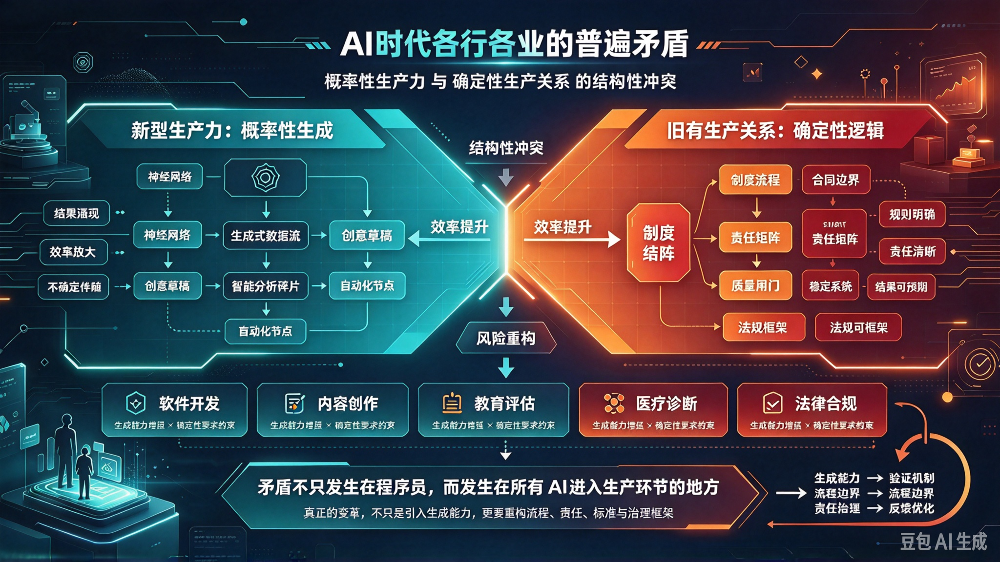

*图：左侧是新型生产力（概率性生成），右侧是旧有生产关系（确定性逻辑），中间的"结构性冲突"不是行业问题，而是时代问题；底部五个行业——软件开发、内容创作、教育评估、医疗诊断、法律合规——同一矛盾在各自领域复现。*

写完《[关于当前 AI 时代程序员主要矛盾的分析](/articles/ai-era-programmer-contradiction/)》之后，一个更值得追问的问题浮现出来：这真的只是程序员的困境吗？

答案是否定的。**它并非程序员群体的专属困境，而是整个 AI 时代生产力变革中的核心张力。** 这一矛盾的本质是：**以概率性生成为特征的新型生产力，与以确定性逻辑为根基的旧有生产关系之间的结构性冲突。**

程序员之所以最先感受到疼痛，只是因为他们离这台新工具最近——不是因为他们最特殊。

## 一、矛盾的普遍性：概率性生产力与确定性生产关系的冲突

大语言模型（LLM）作为一种新型生产工具，其核心机制是**基于统计规律的概率预测**，而非**严格的逻辑推导**。这个技术事实，决定了它与一切传统行业赖以运行的确定性体系之间，必然产生根本性的对立。

传统行业的确定性体系各有形态，但内核相同——用规则把不确定性关在门外：

- 软件工程用**严谨交付**关住它；
- 制造业用**精密控制**关住它；
- 金融与法律用**合规审计**关住它。

大模型恰恰是来拆门的。它是一个开放的概率系统，而上述体系是封闭的确定系统。二者相遇，冲突不以人的意志为转移。

这一冲突在不同行业有不同的第一现场：

- **在软件工程领域**：表现为 AI 生成代码的"幻觉"与系统稳定性要求之间的冲突。AI 可以快速生成看似正确的代码，但在复杂工程场景中，其无法保证逻辑的严密性和可追溯性，导致集成测试故障率飙升，修复成本高昂。
- **在工业制造领域**：表现为 AI 的概率性决策与工业生产的"零容错"要求之间的冲突。工厂产线要求拧螺丝的力矩必须是精确的 35 N·m，而 AI 只能给出"大概率正确"的判断。这种微小的不确定性在规模化生产中会被放大为巨大的质量风险和安全事故——单件偏差 1%，百万件产量就意味着上万次隐患。
- **在金融与法律领域**：表现为 AI 的"黑箱"特性与行业强监管、可解释性要求之间的冲突。金融风控、合同审核等场景需要清晰的决策链路和责任归属，而大模型的决策过程难以被人类理解和审计，无法满足合规要求。

三个行业，三种语言，同一个矛盾。

## 二、矛盾的特殊性：不同行业的具体表现

矛盾内核一致，但**具体表现形式和激烈程度各有不同**。普遍性寓于特殊性之中——只谈普遍性会流于空泛，必须落到每个行业的真实约束上，才能找到真正的解法。

### （一）工业制造：确定性控制与概率性决策的"实时鸿沟"

工业场景对确定性的要求最为严苛。这不仅体现在结果上，更体现在过程上。三条硬约束，恰好逐条命中大模型的软肋：

**1. 输出确定性**

工控系统要求相同的输入必须产生唯一的输出，杜绝任何随机偏差。而大模型的输出会因上下文、版本迭代等因素产生波动——同一个输入，今天和明天的答案可能不同。这在工控语境下不是"特性"，而是**故障**。

**2. 实时闭环**

工业控制（如 PLC）要求毫秒级的响应速度，而大模型推理存在天然时延，难以满足实时闭环控制的需求。控制论的基本要求是：反馈回路的延迟必须远小于被控对象的响应时间常数。当推理时延与产线节拍处于同一量级，闭环就退化成了开环。

**3. 隐性知识壁垒**

制造业的核心竞争力往往内化于老师傅的经验和直觉中，这些"隐性知识"难以被量化和建模，导致 AI"懂规则但不懂场景"。模型可以背下所有工艺参数，却读不懂"这台设备今天声音不太对"。

### （二）企业服务：100% 确定性交付与概率性输出的"信任赤字"

企业采购 AI 服务，核心诉求是解决实际问题，如税务处理、合同起草等——**这些任务的容错率为零**。税务算错一个数、合同漏掉一个条款，代价是罚款、诉讼或商誉损失，而不是"重新生成一次"。

**1. 结果不可复现**

企业流程要求每一步都可追溯、可验证。而 AI 的输出具有随机性，同样的问题可能得到不同的答案，这破坏了企业流程的稳定性。当审计人员问"这个数字是怎么来的"，一个无法复现的过程等于没有过程。

**2. 责任无法锚定**

当 AI 做出错误决策时，责任主体模糊。是算法的错，还是数据的错？是提示词的错，还是审核人的错？这种权责认定的空白，直接制约了企业大规模部署的决心——**企业不是不敢用 AI，而是不敢为 AI 的错误签字。**

### （三）内容创作：结构化规则与语言流畅性的"范式冲突"

即使在看似与 AI 高度契合的内容创作领域，矛盾依然存在。这个案例最有说服力，因为它本应是 AI 的主场。

**1. 规则遵循困境**

企业级内容创作需要遵循严格的元数据、合规性和发布框架。公共大模型擅长语言流畅性，但无法保证对特定企业规则的忠实遵循，生成的内容可能"看起来对，但在关键时刻出错"。**流畅与正确是两种能力**，而人类读者极易把前者误认为后者——这正是风险所在。

**2. 认知负荷转移**

使用 AI 辅助创作后，人类的角色从"作者"转变为"审核者"和"训练师"。审核 AI 生成内容的认知负荷，有时甚至超过了自己动手创作的成本。写一篇文章需要 2 小时，审一篇"看起来没问题"的 AI 文章需要反复核对事实、口径、边界——3 小时，且更难获得成就感。

这与程序员面临的认知负荷激增，是同一种机制在两个行业中的复现。

## 三、解决矛盾的方法论：构建"确定性转换通道"

解决这一普遍矛盾，**不能寄希望于 AI 模型自身变得完全确定**——那等于要求概率系统放弃自己的本质，既不现实，也放弃了它最大的价值。

正确的路径是：通过工程化手段，在概率性模型与确定性需求之间构建一座"转换通道"。模型负责生成，通道负责收敛。

**1. 输入约束层**

通过模板化提示工程、领域特定语言（DSL）等方式，将开放的自然语言输入压缩为结构化的、可控的指令空间，从源头减少不确定性。**输入空间越小，输出分布越窄**——这是全行业通用的第一性原理。

**2. 过程约束层**

引入"约束工程"（Harness Engineering）或"AI 智能体操作系统"（Agent OS）的概念。在 AI 执行过程中，嵌入实时校验机制，如语法树分析、业务规则引擎、安全策略扫描等，确保其行为不偏离预定轨道。关键在于**边生成边校验**，而不是生成完再后悔。

**3. 执行裁决层**

建立"人类掌舵，智能体执行"的混合模式。AI 负责生成候选方案或执行重复性任务，而关键的决策、风险把控和最终裁决权必须保留在人类手中，确保责任可追溯。**权力可以下放，责任不能。**

**4. 评估体系重构**

从传统的"找 Bug"转向"测智商"和"验合规"。构建金标准测试集和红队攻防机制，重点评估 AI 在复杂场景下的逻辑一致性、规则遵循能力和风险抵御能力。评价标准要从"它做对了没有"，变为"**它在什么条件下会做错**"——前者是二元判断，后者才是风险画像。

## 四、结论

当前 AI 时代各行业面临的主要矛盾，是**新型生产力（概率性生成模型）与旧有生产关系（确定性交付体系）之间的冲突**。

这一矛盾是客观存在的，也是推动技术演进和产业升级的根本动力。它之所以令人不适，恰恰是因为它足够根本——不触及生产关系层面的变革，就无法真正释放新生产力。

解决之道不在于否定任何一方。否定概率性，就等于放弃这个时代最大的效率增量；否定确定性，就等于放弃各行业几十年积累的信任基础。

出路在于通过工程创新，推动二者在更高层次上的统一。这要求各行业完成一次共同的角色跃迁：**从"工具使用者"到"体系设计者"**——不再问"AI 能不能做这件事"，而是问"要让 AI 做这件事，我需要重构哪些流程、责任和标准"。

在驾驭概率性工具的同时，坚守确定性交付的底线，最终实现人机协同的螺旋式上升。
