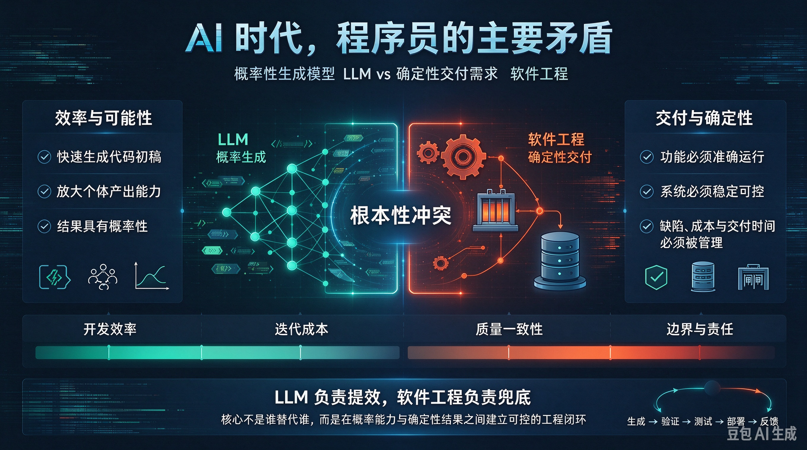

*图：左侧是 LLM 的效率与可能性，右侧是软件工程的交付与确定性，中间是二者的根本性冲突；底部四个刻度——开发效率、迭代成本、质量一致性、边界与责任——正是这一冲突被感知到的位置。*

写代码从来没有像今天这样容易，也从来没有像今天这样难以交付。

一方面，一句自然语言就能换来上百行可运行的代码；另一方面，这些代码能否进入生产环境、能否被复现、能否被追责，仍然悬而未决。这种"产能暴涨、交付未变"的错位，不是某个工具不够好用，而是程序员职业实践中一对结构性矛盾的外在表现。

本文尝试用矛盾分析的方法，把这件事讲清楚。

## 一、矛盾的普遍性：生产力与生产关系的冲突

生产力决定生产关系，生产关系反作用于生产力。当旧的生产关系无法容纳新的生产力时，冲突就以各种具体形式爆发出来——这是每一次技术革命的共同脚本。

在 AI 技术革命浪潮中，程序员群体面临的生产力与生产关系矛盾呈现出新的历史特征。**大语言模型作为新型生产工具，其概率性生成特性与软件工程确定性交付要求之间，构成了当前程序员职业实践中的根本矛盾。**

这一矛盾之所以是"普遍性"的，是因为它不局限于某一环节、某一语言、某一团队：

- **需求分析**：自然语言需求本身充满歧义，而模型会把这种歧义放大成多种可能的实现；
- **代码开发**：生成过程基于概率采样，同一次提问可能得到不同的实现路径；
- **测试验证**：传统测试断言"输入 A 必然得到输出 B"，而概率性产物天然抗拒这种断言；
- **部署运维**：线上问题需要可复现、可回滚、可归因，而生成链条往往无法完整追溯。

它贯穿于软件工程全生命周期，具有普遍性和客观性。承认这一点，是讨论一切后续问题的前提：**这不是"用好提示词"就能绕过的技术问题，而是需要工程体系重构才能容纳的结构问题。**

## 二、矛盾的特殊性：概率性与确定性的对立统一

任何矛盾都有特殊性。同样是"新工具与旧体系"的冲突，AI 时代这一对矛盾的特殊之处在于：冲突的一方不是"更快的确定性工具"，而是**一种本质上不确定性的生成机制**。

### （一）矛盾的主要方面：概率性生成模型的特性

**1. 非确定性输入输出**

自然语言的交互界面带来了近乎无限的表达方式。同一个需求，可以有几十种问法；同一个问法，模型输出对提示词极其敏感——一个词序的调整、一个例子的增删，都可能导向完全不同的实现。**相同输入可能产生不同输出**，这是生成机制的内禀属性，而不是缺陷或 bug。

**2. 向量匹配而非因果推理**

大模型基于高维向量相似度检索进行概率序列生成。它擅长在"曾经见过"的模式之间做插值，却无法复刻人类工程师那种跳跃式的因果推理能力：从现象反推机制、从局部推断全局、从一次失败抽象出一类风险。形式上流畅的代码，可能在因果链条上是断裂的。

**3. 上下文衰减与幻觉生成**

随着上下文长度增加，模型对长距离依赖的处理能力显著下降。在大型代码库中，跨模块、跨层级的约束很容易被"遗忘"，进而产生不存在的 API、不存在的配置项、看似合理但从未被实现的技术细节。这类幻觉最危险的地方在于——它通常能通过语法检查，甚至能通过人眼的粗略审阅。

### （二）矛盾的次要方面：确定性交付需求的本质

**1. 工程系统的刚性约束**

企业级应用要求 100% 可验证的确定性。在金融、医疗、工控、航天等高精行业中，"大概率正确"不是一个可接受的状态。一个概率为 99.9% 的结算逻辑，在每天百万级的交易量下意味着上千次确定的事故。

**2. 责任追溯的必然要求**

关键系统需要**决策可复现、错误可定位、责任可锚定**。当线上出现资金损失或安全事故时，必须能回答：这段代码是谁写的、基于什么判断写的、经过了哪些验证、为什么当时认为它是正确的。概率性生成链条如果缺乏记录，责任就会在"模型—提示词—人工修改"之间消散。

**3. 质量保障的二元标准**

传统测试遵循"输入 A 必然得到输出 B"的 Pass/Fail 标准。这是二元的、无中间状态的。而概率性产物更适合用"置信度""分布"来描述——两套评价体系之间存在范式鸿沟，这是测试环节冲突最激烈的根源。

## 三、矛盾的主要方面与次要方面的转化

矛盾的两个方面不是平分的，也不是固定不变的。在一定条件下，主要方面与次要方面会相互转化。

### （一）当前阶段：概率性占据主导地位

从实践数据看，AI 生成代码在**单元测试阶段通过率虽达 82%**，但在**集成测试阶段故障率骤升至 37%**。这个落差极具信息量：单元测试验证的是局部行为，集成测试验证的是系统约束——恰恰是概率性生成最容易失效的地方。

成本侧的证据同样清晰：企业每在 AI Token 上投入 1 美元，往往伴随着 **0.44 美元的 Bug 修复成本**和 **0.27 美元的代码重写成本**。也就是说，近 80% 的支出化作了无形的隐性损耗——它们不会出现在任何一张采购单上，却实实在在地被工程师的加班、返工和线上事故所消耗。

这些数字指向同一个结论：**在当前阶段，概率性生成仍是矛盾的主要方面。** 它决定了冲突的性质——我们的工程体系还在被一个不确定的输入源持续拉扯，而不是反过来。

### （二）转化条件：工程化约束机制的建立

转化不会自动发生，它需要条件。这个条件就是**确定性转换通道**：在概率性的生成能力与确定性的交付要求之间，插入一层工程化的约束机制，把开放的概率空间逐步收敛为可验证的确定结果。

**输入约束层**

采用模板化提示工程结合领域特定语言（DSL），将开放生成空间压缩为结构化输入。核心思路是：**不要让模型自由发挥，而是让它在给定的语法和语义框架内填空。** 输入越结构化，输出的分布就越窄，可验证性就越强。

**过程约束层**

构建动态规则引擎实现实时校验，包含：

- 语法树分析：在 AST 层面检查结构与模式一致性，而非仅做文本比对；
- 架构模式检测：验证生成代码是否符合既定的分层、依赖方向与接口契约；
- 安全规则扫描：在生成过程中即时拦截注入风险、越权访问、敏感数据外泄。

**执行裁决层**

建立行为操作系统，确立三条不可协商的底线：

- **状态不确定不执行**
- **权限不明确不执行**
- **责任无法锚定不执行**

这三条规则是"确定性转换通道"的最后一道闸门。前两层做的是收敛，这一层做的是否决——宁可不执行，也不执行不可追溯的东西。

## 四、矛盾的特殊表现形式

根本矛盾会在具体实践中表现为若干可观察的现象。以下三种，是当前最具代表性的。

### （一）认知负荷的指数级增长

一个反直觉的事实：使用 AI 辅助后，单文件修改的**决策点从 12 个激增至 47 个，认知负荷提升近 3 倍。**

为什么？因为写代码的时间被压缩了，但"审阅、判断、取舍"的时间被放大了。工程师不再只是想"这段代码怎么写"，而是要不断回答：这个方案对不对？有没有更合适的？它为什么这么写？它的边界条件覆盖了没有？要不要接受？要不要重来？

角色因此发生异化：程序员从"代码作者"转变为"AI 训练师"。而"训练师"的产出是间接的、难以署名、难以量化——**职业成就感趋近于零**。这是比效率更重要的问题：一个让人失去成就感的岗位，无法长期吸引优秀人才。

### （二）人才结构的断层危机

**初级开发者招聘量自 2022 年以来下降了 67%，22 至 25 岁人群在软件开发岗位的就业率下降了约 13%–20%。**

数字背后是一个被压缩的成长通道。传统的"实习生 → 简单缺陷修复 → 小需求开发 → 独立模块"是一条连续的能力积累路径，而 AI 恰恰最擅长接管这条路径上的前半段。当"简单缺陷修复"和"小需求开发"不再需要人来做，初级工程师就失去了从生疏到熟练的练兵场。

**人才梯队的崩塌风险具有滞后性**：今天省下的初级人力成本，会在三到五年后以"无人可晋升为高级"的形式连本带利返还。

### （三）效率悖论的系统性困境

百度内部实践显示，Coding Agent 让**写代码速度提高了十倍以上，但常规的双周迭代周期几乎没有任何明显缩短。**

这不是数据错误，而是约束理论（Theory of Constraints）的必然结果：**编码环节在整条研发链路中约占 20% 的时间**，即使该环节提速十倍，整体周期也仅能缩短约 18%——而这点收益还会被需求澄清、代码评审、联调、发布等待所稀释。

结论令人清醒：**局部的极致优化，永远撞上全局的木桶效应。** 只优化编码环节，就是在优化一个非瓶颈环节。

## 五、解决矛盾的方法论

### （一）坚持两点论与重点论的统一

两点论要求我们全面地看：既要看到 AI 在标准化、低复杂度任务中的效率增益，也要认识到其在复杂工程场景中的局限性。任何一方面的忽视都会导致误判——只看见增益会盲目上马，只看见局限会错失红利。

重点论要求我们抓主要方面：**在关键系统中，必须将确定性作为矛盾的主要方面来抓。** 在金融结算、医疗决策、工业控制场景中，效率是次要矛盾，正确性和可追溯性是主要矛盾；而在原型验证、内部工具、一次性脚本场景中，主次关系可以反过来。

**判断标准不是"这个系统重不重要"，而是"出错后的代价是否可逆"。** 不可逆的，确定性优先。

### （二）推动范式转换：从 CI/CD 到 CC/CD

传统的持续集成/持续部署（CI/CD）范式，建立在**确定性假设**之上：同样的代码、同样的环境，产生同样的构建产物。这个假设在 AI 时代不再成立——当代码本身由概率性机制生成，构建输入就不再稳定。

因此需要从 CI/CD 转向 **CC/CD：持续校准（Continuous Calibration）/ 持续开发（Continuous Development）**。

- **持续校准**：不是"构建一次就通过"，而是持续校验生成产物与既定规约、架构约束、历史基线之间的一致性；
- **持续开发**：不是"开发完再集成"，而是把开发视为一个永不停止的收敛过程。

配套的演进路径是**渐进式自主化**：从人类完全控制，到人类审批下的自动执行，再到有条件自主、异常时回退人工。信任不是一次性授予的，而是沿着这条路径一格一格积累的。

### （三）重构人机协作边界

建立"**AI 辅助 + 确定性兜底**"的混合模式，关键是划清边界，而不是模糊边界：

**AI 承担：**

- 通用组件生成
- 代码片段补全
- 单元测试用例生成

**人类负责：**

- 业务逻辑编排
- 架构设计决策
- 风险把控与责任承担

这条分界线可以用一句话概括：**AI 负责"可以被验证是否正确的部分"，人类负责"决定什么才算正确的部分"。**

### （四）构建新型工程体系

**1. 数据治理前移**

将数据清洗、知识切片、高质量问答对构建作为核心开发工作，而不是前置准备工作。模型的输出质量上限，由输入语料的质量决定——**在 AI 时代，数据工程就是代码工程。**

**2. 评估体系重构**

从"找 Bug"转向"测智商"。传统测试的目标是发现缺陷，而概率性系统需要的是能力评估：构建金标准测试集（Golden Set）作为能力基线，引入红队攻防机制持续探测边界与失效模式。评价一个问题，从"它错了没有"变成"它在什么条件下会错"。

**3. 知识资产沉淀**

建立决策日志系统、代码注释规范、知识图谱，将专家经验数字化。**决策日志**尤其关键：它记录的不是"改了什么"，而是"为什么这么改"——这正是责任锚定与模型微调最稀缺的原料。

## 六、结论

当前 AI 时代程序员的主要矛盾，本质上是**新型生产力（概率性生成模型）与旧有生产关系（确定性交付体系）之间的冲突**。

解决这一矛盾，不能简单否定任何一方——否定概率性，等于放弃这个时代最大的生产力增量；否定确定性，等于放弃软件工程几十年积累的全部可信性基础。正确路径是**通过工程化创新推动二者在更高层次上的统一**：用约束通道把概率收敛为确定，用校准机制把一次性的正确转化为持续的正确。

对程序员个体而言，这意味着一次角色跃迁：**从"代码工人"到"价值决策者"。** 你的价值不再由写了多少行代码衡量，而由你做了多少个正确的判断、承担了多少个不可逆的决策衡量。

驾驭概率性工具，坚守确定性底线——在二者的张力中，实现人机协同的螺旋式上升。
