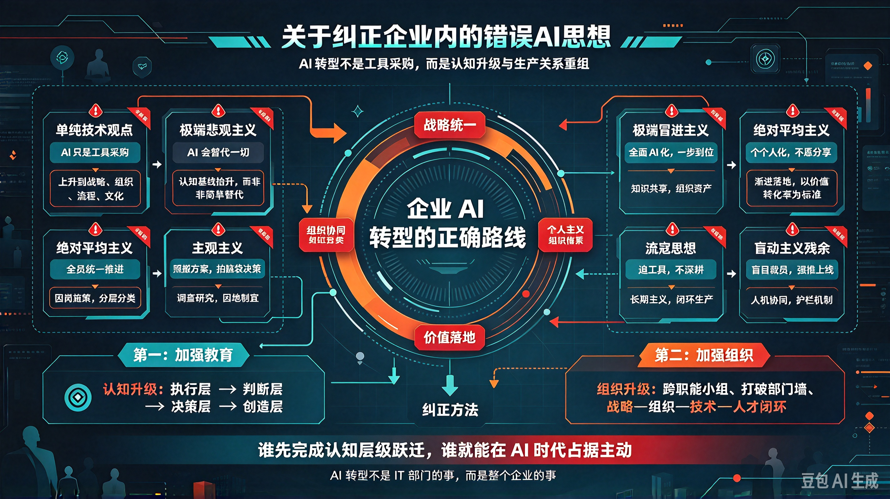

*图：AI 转型不是工具采购，而是认知升级与生产关系重组——八种错误思想（单纯技术观点、极端悲观主义、绝对平均主义、主观主义、极端冒进主义、个人主义、流寇思想、盲动主义残余）与各自的纠正方向；纠正方法归根结底是两条：加强教育（认知层级跃迁），加强组织（战略—组织—技术—人才闭环）。*

企业内的共产党人（管理者与骨干）中存在着各种**非新质生产力要求**的思想，这对于执行企业智能化转型的正确路线，妨碍极大。若不彻底纠正，则 AI 时代赋予企业的任务，是必然担负不起来的。

企业内种种不正确思想的来源，自然是由于组织成员的知识结构、利益立场和认知惯性所构成的；但是企业的领导机关对于这些不正确的思想缺乏一致的坚决的斗争，缺乏对全员作正确路线的教育，也是使这些不正确思想存在和发展的重要原因。

本文根据当前企业 AI 转型的实际情况，指出企业内各种错误 AI 思想的表现、来源及其纠正的方法，号召同志们起来彻底地加以肃清。

## 一、关于单纯技术观点

单纯技术观点在企业一部分同志中非常发展。其表现如：

（一）认为 AI 只是一个**技术问题**，不承认 AI 是一场**生产关系的变革**。甚至还有说"买个工具、装个系统就行了"的，则更进一步认为 AI 不过是 IT 部门的事，与业务无关、与战略无关、与组织无关。

（二）以为 AI 落地也和买软件相仿佛，只是单纯地采购部署的。不知道企业的 AI 转型是一个涉及战略、组织、流程、文化的系统工程。特别是现在，企业决不是单纯地买工具的，它除了引入 AI 技术之外，还要负担重新定义岗位、重构工作流程、重塑评价体系、重建知识资产等重大任务。企业的 AI 落地，不是单纯地为了用 AI 而用 AI，而是为了提升认知层级、重组生产关系、创造新质价值才去用 AI 的，离了对战略、组织、文化的系统性变革，就是失去了 AI 落地的意义，也就是失去了企业智能化转型的意义。

（三）把 AI 的价值仅仅理解为"降本增效"。2026 年埃森哲调研显示，17%的中国企业高管认为 AI 最大价值在于"运营效率提升与成本削减"。这固然重要，但若止步于此，就是把 AI 降格为一台更快的计算器，忽视了它在认知升级、决策重构、价值创造层面的深远意义。

**单纯技术观点的来源：**

（一）**认知水平低**。不认识 AI 对生产关系的重塑作用，不认识 AI 时代的竞争已经从"技术竞赛"转向"认知竞赛"。

（二）**部门墙的思想**。因为企业长期以职能划分组织，各部门各自为政，带来了浓厚的"各扫门前雪"思想，使单纯技术观点有了组织基础。

**纠正的方法：**

（一）加强战略教育。使全体同志认识到：AI 不是工具采购问题，而是企业生存问题。长江商学院 2026 年调研显示，近八成未采用 AI 的企业认为"场景不适用"，这恰恰说明他们还没有从战略高度理解 AI——不是场景不适用，而是认知不适用。

（二）打破部门墙。建立跨职能的 AI 转型小组，使技术、业务、组织三者统一于一个整体战略之下。

## 二、关于极端悲观主义

极端悲观主义在企业一部分同志中非常发展。其表现如：

（一）认为 AI 会取代一切，人类毫无价值。这种思想在中级工程师和白领群体中尤为浓厚——"积累多年的技能会被 AI 轻易学会"的恐惧真实存在。

（二）以为自己的岗位必然消亡，因此消极怠工、拒绝学习。WalkMe 2026 年报告显示，超过 54%的员工绕开公司提供的 AI 工具选择手动工作，33%的员工从未使用过 AI。

（三）把 AI 视为"敌人"而非"工具"。部分员工因担心 AI"太好用"导致失业，选择回避和抵制，WalkMe 公司首席执行官丹·阿迪卡将这种现象描述为一种"AI 疏离"，类似于"悄然躺平"。

**极端悲观主义的来源：**

（一）对 AI 能力的错误高估。把 AI 的"概率性生成"等同于"确定性替代"，不理解 AI 输出的本质是概率分布而非确定结论。

（二）对自身价值的错误低估。不理解 AI 时代人的核心价值从"执行"转向"判断"，从"生产"转向"决策"，从"操作"转向"创造"。

（三）缺乏转型路径。企业只喊"拥抱 AI"，却不提供具体的技能转型通道和学习资源，使员工陷入"知道要变，但不知道怎么变"的困境。

**纠正的方法：**

（一）加强认知教育。使全体同志认识到：AI 不是"替代"人，而是"抬升"人的认知基线。被替代的不是人，而是"低认知层级的工作方式"。

（二）提供转型路径。企业不能只给员工一台"法拉利"，却不教他们怎么开——业界常用比喻揭示这一困境：企业为员工配备了 AI 这辆"法拉利"跑车，但员工往往缺乏驾驶技术（提示词能力）、燃料（业务上下文信息）和道路（API 或基础设施），导致技术潜力无法释放。

（三）树立正确榜样。宣传那些成功转型的案例——从"执行者"成长为"判断者"、从"操作者"成长为"决策者"的同志，用事实打破悲观主义。

## 三、关于极端冒进主义

极端冒进主义在企业一部分同志中非常发展。其表现如：

（一）认为 AI 能解决一切问题，不顾主客观条件，犯着 AI 的急性病。2026 年埃森哲调研显示，88%的高管认为公司已为员工提供了充足的 AI 工具，但仅有 21%的员工表示认同，存在 67 个百分点的认知差距。

（二）不顾企业实际，盲目追求"全面 AI 化"。不愿意艰苦地做数据治理、流程梳理、组织变革等细小严密的基础工作，只想大干，充满着幻想。

（三）把 AI 投资等同于"买了就行"。长江商学院 2026 年一季度调研显示，企业将平均 57.2%的 AI 资金投向了硬件，走出了一条重资产、基础设施化的路径。到了二季度，硬件占比下降至 52.4%，内部 AI 系统投入占比上升至 44.3%，说明部分企业开始从"买硬件"转向"建系统"，但仍有大量企业停留在"囤积硬件"的阶段。

**极端冒进主义的来源：**

（一）对 AI 能力的错误高估。把 AI 的"概率性生成"等同于"确定性交付"，不理解概率性模型与确定性需求之间的根本性冲突。

（二）高管与一线的认知脱节。28%的企业高管认为工作岗位会因 AI 而有根本性改变，而持有这样观点的员工只有 6%。高管在"云端"看 AI，一线在"地面"用 AI，两者之间存在巨大的认知鸿沟。

（三）KPI 驱动。把 AI 采用率当作政绩指标，追求"有没有"而非"好不好"，追求"用了多少"而非"用了多深"。

**纠正的方法：**

（一）加强实事求是教育。使全体同志认识到：AI 落地是一个渐进过程，不能一步到位。MIT 报告显示，超过 80%的企业尝试使用生成式 AI，但仅约 5%的项目能进入生产阶段并带来实质价值。这不是 AI 不行，而是落地方法不对。

（二）缩小认知差距。高管必须深入一线，了解员工在实际使用 AI 中遇到的真实困难——52%的中国员工表示低质量或误导性的 AI 输出导致了时间浪费和效率下降。

（三）建立科学评价体系。不以"AI 采用率"论英雄，而以"AI 价值转化率"为标准——不是问"用了多少 AI"，而是问"AI 创造了多少真实价值"。

## 四、关于绝对平均主义

绝对平均主义在企业一部分同志中非常发展。其表现如：

（一）认为 AI 应该"全员统一推进"，不分岗位、不分层级、不分业务。不理解不同岗位对 AI 的需求截然不同——有的岗位需要 AI"替代"，有的岗位需要 AI"增强"，有的岗位暂时不需要 AI。

（二）认为 AI 培训应该"一刀切"，所有人学同样的课程、考同样的证书。不理解认知抬升的方向因人而异——初级执行者需要从"执行层"抬升到"判断层"，中级管理者需要从"判断层"抬升到"决策层"，高级决策者需要从"决策层"抬升到"创造层"。

（三）认为 AI 红利应该"平均分配"，不分贡献、不分能力。不理解 AI 时代的价值分配逻辑已经从"按时间付费"转向"按价值付费"。

**绝对平均主义的来源：**

（一）对 AI 影响的错误均质化理解。把 AI 对不同岗位的差异化影响，简化为"所有人都一样"。

（二）组织惯性的延续。习惯了"统一标准、统一推进"的管理模式，不适应 AI 时代"个性化、差异化"的新要求。

**纠正的方法：**

（一）加强分类指导。使全体同志认识到：AI 对不同岗位的影响是不同的，必须因岗施策、因人施策。长江商学院调研显示，50%的企业报告 AI 对岗位起到"补充/增强"作用，31.4%的企业感受到了"替代"压力，两者并存，不可一概而论。

（二）建立分层培训体系。针对不同认知层级的员工，提供差异化的 AI 技能培训——不是所有人都需要学"提示词工程"，但所有人都需要学"如何用 AI 思维重构自己的工作"。

（三）改革价值分配机制。从"按时间付费"转向"按价值付费"，让真正利用 AI 创造了价值的人得到应有的回报。

## 五、关于主观主义

主观主义在企业一部分同志中非常发展。其表现如：

（一）不研究本企业的实际情况，照搬其他企业的 AI 方案。不理解每个企业的业务场景、数据基础、组织能力各不相同，AI 落地必须"因地制宜"。

（二）不研究 AI 的技术边界，盲目相信 AI 的"万能"。不理解概率性生成模型与确定性交付需求之间的根本性冲突——LLM 的输出是概率分布，而企业需要的是确定结果。把"不确定性"收敛为"确定性"，才是企业 AI 工程化的核心任务。

（三）不研究员工的真实需求，自上而下强推 AI 工具。2026 年埃森哲调研显示，只有 12%的中国企业员工强烈认同所在公司"已经清晰传达了 2026 年的变革愿景"，多数员工并不认为自己是"AI 重塑工作模式的共创者"。

**主观主义的来源：**

（一）缺乏调查研究。不做需求调研、不做场景分析、不做可行性评估，拍脑袋决策。

（二）技术崇拜。把 AI 当作"银弹"，不理解 AI 的能力边界和适用场景。

（三）官僚主义。自上而下强推，不听取一线员工的反馈和意见。

**纠正的方法：**

（一）加强调查研究。使全体同志认识到：没有调查就没有发言权。AI 落地之前，必须先做场景调研、数据评估、组织诊断。

（二）建立反馈机制。让一线员工参与到 AI 工具的选择、部署和优化中来，使员工从"被动接受者"变为"主动共创者"。

（三）尊重技术规律。理解概率性模型与确定性需求之间的张力，建立"AI 护栏"（Guardrails）机制——让 AI 在确定性边界内自由发挥，边界外由人类把关。

## 六、关于个人主义

个人主义在企业一部分同志中非常发展。其表现如：

（一）把 AI 当作个人竞争力的"秘密武器"，不愿分享、不愿协作。少数掌握了 AI 技能的员工，以此作为"护城河"，拒绝将经验沉淀为组织知识。

（二）把 AI 使用当作"个人选择"，不服从组织的统一战略。认为"我用不用 AI 是我的事"，不理解 AI 转型是组织层面的系统工程，不是个人层面的自由选择。

（三）把 AI 带来的效率提升据为己有，不愿回馈团队。一个人用 AI 完成了过去一个团队的工作量，但不愿意帮助团队成员也掌握同样的能力。

**个人主义的来源：**

（一）竞争文化的影响。企业内部过度强调个人绩效排名，导致员工把 AI 当作"个人武器"而非"组织工具"。

（二）缺乏知识共享机制。企业没有建立 AI 经验沉淀和分享的制度化通道。

**纠正的方法：**

（一）加强集体主义教育。使全体同志认识到：AI 时代的竞争力不是"个人能力"，而是"组织能力"。一个人的 AI 能力再强，也无法替代整个组织的 AI 转型。

（二）建立知识共享机制。鼓励员工将 AI 使用经验沉淀为可复用的 Skill、Prompt 模板、最佳实践，使个人经验变为组织资产。

（三）改革激励机制。不仅奖励"个人使用 AI 的效率提升"，更奖励"帮助团队提升 AI 能力"的行为。

## 七、关于流寇思想

流寇思想在企业一部分同志中非常发展。其表现如：

（一）打一枪换一个地方，不断追逐最新的 AI 工具和模型，不愿在一个场景上深耕。今天试 ChatGPT，明天试 Claude，后天试国产大模型，但从来没有在一个场景上做到"从试点到生产"的完整闭环。

（二）只关注"新"不关注"深"。MIT 报告显示，超过 80%的企业尝试使用生成式 AI，但仅约 5%的项目能进入生产阶段。大量企业停留在"试用"阶段，从未真正将 AI 嵌入核心业务流程。

（三）不愿做数据治理、流程梳理等"脏活累活"，只想"即插即用"地享受 AI 红利。

**流寇思想的来源：**

（一）对 AI 落地的困难估计不足。不理解 AI 从"demo"到"production"之间存在巨大的鸿沟。

（二）浮躁心态。追求"快速见效"，不愿做长期投入。

**纠正的方法：**

（一）加强长期主义教育。使全体同志认识到：AI 落地不是"试用"，而是"深耕"。长江商学院调研显示，进入系统集成期的企业，AI 对经营绩效的贡献存在"反馈时滞"——系统从部署、数据打通到形成稳定的生产力，需要时间。

（二）建立"从试点到生产"的完整路径。每个 AI 项目都必须有明确的"生产化"目标和时间表，不能永远停留在"试用"阶段。

（三）重视基础工作。数据治理、流程梳理、组织变革——这些"脏活累活"才是 AI 落地的真正基础。

## 八、关于盲动主义残余

盲动主义残余在企业一部分同志中仍然存在着。其表现如：

（一）不顾企业实际，盲目裁撤岗位。看到 AI 能替代某些工作，就急于"优化"人员，不考虑转型安置、技能再培训和社会责任。

（二）不顾员工感受，强制推行 AI 工具。不理解员工对 AI 的恐惧和抵触有其合理来源——不是"思想落后"，而是"缺乏安全感"。

（三）不顾技术成熟度，强行上线 AI 系统。在 AI 输出质量不稳定、幻觉问题未解决的情况下，就将其嵌入关键业务流程，导致错误决策和客户投诉。

**盲动主义残余的来源：**

（一）对 AI 能力的盲目自信。不理解当前 AI 仍处于"概率性生成"阶段，远未达到"确定性交付"的水平。

（二）缺乏人文关怀。把员工当作"成本"而非"资产"，把 AI 当作"替代手段"而非"增强工具"。

**纠正的方法：**

（一）加强人文关怀教育。使全体同志认识到：AI 转型的核心不是"替代人"，而是"成就人"。每一个被 AI 影响的员工，都应该有转型的机会和通道。

（二）建立"人机协同"的渐进路径。不是一步到位地"替代"，而是循序渐进地"增强"——先让 AI 做"助手"，再让 AI 做"代理"，最后让 AI 做"协作者"。

（三）尊重技术成熟度。在 AI 系统未经充分验证之前，不将其嵌入关键业务流程。建立"AI 护栏"机制，确保 AI 输出经过人类审核后才能生效。

## 总结

以上八种错误思想，是当前企业 AI 转型中最突出的认知障碍。它们的共同根源在于：**不理解 AI 不是"工具革命"，而是"认知革命"；不是"技术升级"，而是"生产关系重组"。**

AI 作为新质生产力的代表，它的本质不是"替代人的工作"，而是"抬升人的认知基线"。所有人的认知层级都被强制抬升了一层——从"执行层"到"判断层"，从"判断层"到"决策层"，从"决策层"到"创造层"。

纠正这些错误思想的方法，归根结底就是两条：

**第一，加强教育。** 使全体同志认识到 AI 时代的本质——不是"人与 AI 的竞争"，而是"旧认知与新生产力的错位"。谁先完成认知层级的跃迁，谁就能在新时代占据主动。

**第二，加强组织。** 建立跨职能的 AI 转型组织，打破部门墙，打通战略-组织-技术-人才的完整链路。AI 转型不是 IT 部门的事，不是 HR 部门的事，而是整个企业的事。

> 一百年前，毛泽东在古田会议上号召同志们"起来彻底地加以肃清"党内的错误思想。
>
> 今天，我们同样号召全体企业人：起来彻底地纠正对待 AI 的错误思想，以认知升级迎接新质生产力的浪潮。

---

_本文仿《关于纠正党内的错误思想》体例，结合 2026 年企业 AI 转型实际，旨在以经典方法论指导当代实践。_
