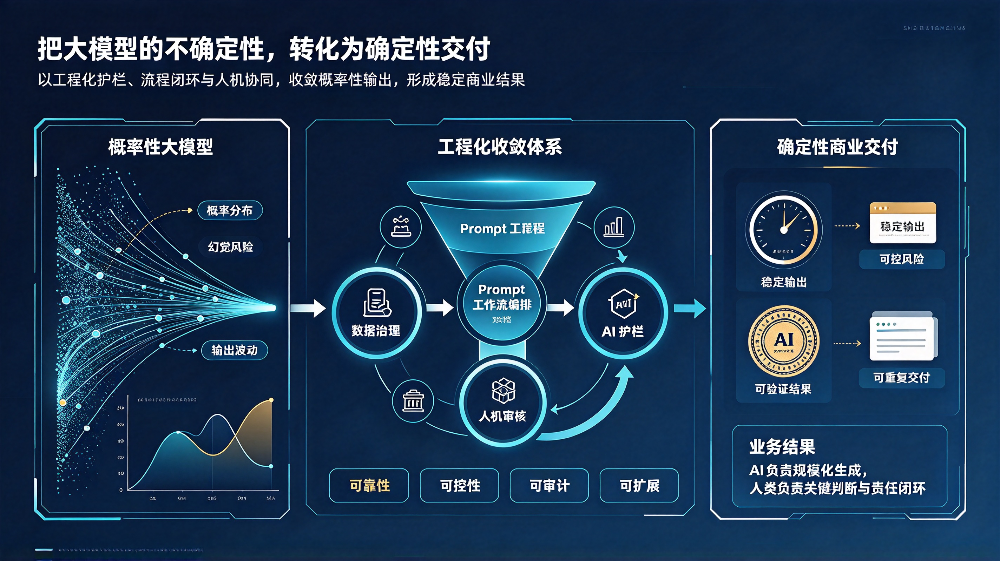

*图：左侧是"概率性大模型"——概率分布、幻觉风险、输出波动；中部是"工程化收敛体系"——以数据治理、工作流编排、AI 护栏、人机审核四大环节构成漏斗与闭环，达成可靠性、可控性、可审计、可扩展；右侧是"确定性商业交付"——稳定输出、可控风险、可验证结果、可重复交付。业务结果的分工是：AI 负责规模化生成，人类负责关键判断与责任闭环。*

## 一、问题的提出

企业 AI 落地中，存在一个长期被回避的根本矛盾：**大模型本质上是概率性的，而商业交付必须是确定性的。**

大模型的每一次生成，本质上都是在一个高维概率分布中采样。同一个 Prompt，今天输出是这样，明天输出是那样；上午还正确，下午就幻觉；对一个用户有效，对另一个用户出错。概率分布、幻觉风险、输出波动——这是大模型与生俱来的三重属性，不会因为模型再先进而消失。

而商业世界的要求恰恰相反：**合同条款不能"大概正确"，财务数字不能"偶尔幻觉"，客服回复不能"时好时坏"，医疗建议不能"视采样而定"。** 商业交付需要的是稳定输出、可控风险、可验证结果、可重复交付——一句话，需要确定性。

许多企业的 AI 项目正是死在这个矛盾上：Demo 阶段惊艳四座，生产阶段事故频发；试点时"看起来能用"，放量后"根本不敢用"。MIT 报告显示，超过 80% 的企业尝试使用生成式 AI，但仅约 5% 的项目能进入生产阶段并带来实质价值。这 80% 与 5% 之间的鸿沟，不是模型能力的鸿沟，而是**从概率性到确定性的鸿沟**——是工程化收敛能力的鸿沟。

本文的目的，就是阐明跨越这道鸿沟的方法：**概率性大模型 → 工程化收敛 → 确定性商业交付**的可信闭环。

---

## 二、正视概率性：不要掩盖，而要管理

**对待大模型的不确定性，有两种错误态度。**

一种是**掩盖**。做 Demo 时精心挑选样例，汇报时只展示成功案例，把概率性的波动藏在聚光灯照不到的地方。这种态度在试点阶段或许能赢得掌声，但一到生产环境，不确定性就会以事故的形式讨回欠账。

另一种是**恐惧**。因为大模型会幻觉、会波动，就断定它"不可用"，于是停留在观望，错失窗口期。这种态度把"不确定性"等同于"不可管理"，同样是错误的。

**正确的态度是：正视概率性，管理概率性，收敛概率性。**

概率性不是缺陷，而是大模型能力与风险的同一体。正因为是概率性的，它才能生成、才能创造、才能处理开放性问题；也正因为是概率性的，它才需要工程化的约束与收敛。**能力与不确定性是同一枚硬币的两面，你不可能只要一面。**

传统软件的确定性来自"逻辑的正确性"——代码路径是确定的，输入确定则输出确定。大模型时代的确定性不可能再来自模型本身，只能来自**模型外围的工程体系**。这就是工程化收敛体系的立足点。

---

## 三、工程化收敛体系：四道防线

工程化收敛体系的核心任务，是把发散的概率性输出，收敛到商业可接受的确定性区间内。它由四道防线构成，缺一不可。

### 第一道防线：数据治理

**垃圾进，垃圾出；治理进，质量出。**

大模型的输出质量，上限由模型决定，下限由数据决定。企业场景中的幻觉，很大一部分不是模型"凭空捏造"，而是被脏数据、过时数据、碎片化知识"误导"的结果。RAG 检索到错误的文档，知识库中存放着过期信息，数据口径在不同部门之间不一致——这些都会让概率性雪上加霜。

数据治理包括：知识库的建设与清洗、数据的时效管理与版本管理、领域知识的结构化、数据质量与口径的统一。它是整个体系的**地基**——地基不稳，上面的防线都是空中楼阁。

### 第二道防线：工作流编排与 Prompt 工程

**不要让模型"自由发挥"，要让模型"按图施工"。**

单次问答是最暴露概率性的使用方式。工程化的做法，是把开放的生成任务，拆解为受约束的工作流：把复杂任务拆分为多个确定性更高的子任务，用结构化输出（JSON、模板、Schema）约束输出格式，用 Few-shot 范例锚定输出风格，用检索增强（RAG）锚定事实依据，在关键节点用规则与代码接管控制流。

Prompt 工程的本质，不是"把话说得漂亮"，而是**缩小采样空间**——通过清晰的指令、充分的上下文、明确的边界条件，把模型从"广阔但摇晃的概率分布"引导到"狭窄且稳定的概率区间"。工作流编排则把多次这种"受约束的生成"串联成可靠的流水线，让单点的小概率波动被流程的冗余与校验所吸收。

### 第三道防线：AI 护栏

**信任但要验证，放行但要设卡。**

工作流约束的是"生成之前"，护栏把守的是"输出之后"。AI 护栏是一整套自动化的校验机制：事实性校验（输出是否有据可查）、格式校验（是否符合约定结构）、合规校验（是否触碰红线）、一致性校验（多次生成是否漂移）、越权拦截（是否执行了不该执行的操作）。

护栏的价值在于：**让错误在到达客户之前被拦截，而不是在到达客户之后被道歉。** 没有护栏的 AI 系统，等于没有质检环节的工厂——产品直发客户，质量全凭运气。可审计性也在这里建立：每一次输入、输出、拦截、放行，都要有完整的日志，事后可追溯、可归因、可复盘。

### 第四道防线：人机审核

**AI 负责规模化生成，人类负责关键判断与责任闭环。**

这是整个体系中最重要的一道防线，也是最终的责任归属。按风险等级分级设卡：

- **低风险场景**（如内部文案草稿）：AI 全自动生成，抽检即可；
- **中风险场景**（如对外营销内容）：AI 生成 + 人工审核后放行；
- **高风险场景**（如合同、财务、医疗、法律意见）：AI 仅作辅助，人类判断并签字负责，AI 的输出只是"建议"而非"决定"。

必须明确一条铁律：**责任永远在人，不在模型。** "是 AI 出的错"在商业世界和法律责任面前不构成辩解。人机审核不是对 AI 的不信任，而是对责任闭环的确认——出了问题，谁审核、谁放行、谁负责，链条清清楚楚。这才是企业敢用、客户敢信的根基。

---

## 四、四个特性：可靠性、可控性、可审计、可扩展

四道防线协同作用，使 AI 系统具备商业交付所需的四个特性：

**可靠性。** 输出质量稳定，不因时间、批次、用户而大幅波动。它来自数据治理的地基、工作流的约束与护栏的校验三者叠加。

**可控性。** 错误被限制在预设边界内，风险被分级管理，出问题时能快速降级（切回人工或旧流程）。它来自护栏的拦截与人机审核的分级设卡。

**可审计。** 每一次输出都可追溯：用了哪个版本的模型、检索了哪些知识、经过哪些校验、谁做的审核。它来自全链路的日志与版本管理。没有可审计性，就没有可信度——出了事故说不清来龙去脉的企业，客户和监管都不会再给它第二次机会。

**可扩展。** 体系一旦建立，新场景的接入是"复制流程 + 调整边界"，而不是"从零试错"。可靠性工程的一次投入，可以在无数业务场景中复利回收。这是 AI 从"项目"走向"能力"的关键。

---

## 五、可信闭环：从交付回溯到模型

**工程化收敛不是单向的漏斗，而是循环的闭环。**

输出经过收敛变成交付，交付之后必须有反馈回流：护栏拦截了什么？人工改了什么？哪些错误反复出现？哪些场景的通过率在下降？这些反馈数据，反过来驱动 Prompt 的迭代、工作流的调整、知识库的更新、护栏规则的增补——甚至驱动模型微调的选择。

这就是"可信闭环"的完整含义：**概率性生成，经工程化收敛，成为确定性交付；确定性交付产生的反馈，再回流去优化收敛体系本身。** 每转一圈，收敛效率就提高一分，人工干预就减少一分，可自动化的边界就扩大一分。

这个闭环与企业 AI 落地的三个阶段恰好对应：

1. **试点期**：闭环以人工审核为主，重点是跑通流程、积累反馈数据；
2. **收敛期**：护栏与工作流逐步厚实，人工干预比例持续下降，通过率与稳定性持续上升；
3. **放量期**：体系成熟，AI 承担规模化生成，人类聚焦关键判断与例外处理，且仍然保留责任闭环。

判断一个 AI 应用能否放量，标准不是"Demo 有多惊艳"，而是**闭环转了多少圈**——反馈数据有多少、拦截规则有多少条、通过率曲线是否在上升。没有闭环的 AI 应用，永远停在"不断试点、不断重做、难以放量"的死循环里。

---

## 六、反对两种错误倾向

**一种是"模型原教旨主义"：寄望于下一个更强的模型自动解决一切。** "等 GPT-N 出来就好了""等模型不幻觉了再上线"——这种想法把确定性寄托在模型厂商身上。但事实是，模型越强，能处理的任务越开放，概率性的表现形式越隐蔽，对工程化收敛的要求反而越高。把宝押在模型迭代上，等于把企业的交付质量押在别人的发布节奏上。

**另一种是"护栏虚无主义"：认为工程化收敛是"脏活累活"，不如模型本身有价值。** 恰恰相反——在 AI 时代，**从概率性到确定性的收敛能力，就是企业的核心护城河。** 模型能力人人可以买到，收敛体系却是每家企业自己一砖一瓦垒起来的。同样的模型，有的企业能交付，有的企业只能演示，差别就在这里。

模型是发电机，工程化收敛体系是电网。**发电机再强，不并网就点不亮一座城市。**

---

## 七、结论

综上所述，我们可以得出以下结论：

**第一，大模型的概率性与商业的确定性之间的矛盾，是企业 AI 落地的根本矛盾。** 不解决这个矛盾，AI 就永远停留在 Demo 与试点。

**第二，确定性不能来自模型本身，只能来自工程化收敛体系。** 数据治理、工作流编排、AI 护栏、人机审核，四道防线缺一不可。

**第三，收敛体系必须形成闭环。** 交付产生的反馈必须回流优化体系本身，否则收敛效率不会提升，放量永远不会到来。

**第四，责任永远在人。** AI 负责规模化生成，人类负责关键判断与责任闭环——这是企业敢用、客户敢信的根基。

**第五，收敛能力就是护城河。** 模型人人可买，体系唯我独有。

> 把大模型的不确定性，转化为确定性交付——这不是一句口号，而是一套体系、一条闭环、一种能力。

**概率性是起点，确定性是终点，工程化收敛是唯一的路。**

---

_本文结合 2026 年企业 AI 落地实际，阐明"概率性大模型 → 工程化收敛 → 确定性商业交付"的可信闭环，是本系列"AI 时代方法论"的工程实践篇。_
