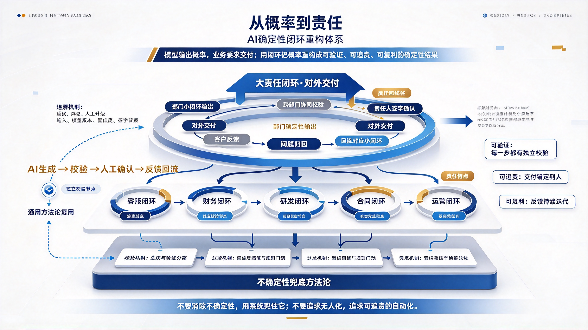

*图：三层体系——底层是不确定性兜底方法论（校验 / 过滤 / 兜底 / 追溯），中层是各部门的业务小闭环（AI 生成 → 校验 → 人工确认 → 反馈回流），外层是对外交付的大责任闭环（跨部门协同校验 → 责任人签字 → 客户反馈 → 问题归因 → 回流到对应小闭环）。*

大模型正在成为企业的新基础设施。它写代码、做分析、生成文案、处理客服、辅助决策，几乎可以接管所有"从输入到输出"的认知劳动。但企业真正需要的不是"能生成"，而是"能交付"。模型吐出的是概率分布，而业务要求的是确定性结果——合同不能出错，诊断不能误判，产线不能停机，财务不能算错。

这中间的鸿沟，靠更大的模型填不平。真正能填平它的，是一套**AI 确定性闭环重构体系**：先提炼通用的不确定性兜底方法论做底座，再把企业流程拆成部门级小闭环，把大模型的概率输出过滤校验成确定结果，最后汇入对外的大责任闭环，锚定到人担责，把通用 AI 能力落地成可追责、可复用的业务生产体系。

## 一、为什么企业需要"确定性重构"

大多数企业的 AI 落地还停留在"工具化"阶段：给员工配一个 ChatBot，让大家自己用；或者在某个环节接入模型，看看能不能提效。这种做法的问题在于——它没有解决确定性交付的问题。

模型可能今天输出正确，明天输出错误；同一个问题换一种问法，答案可能完全不同；它无法解释为什么这样判断，也无法为错误承担后果。当 AI 输出直接进入业务流程，一次幻觉就可能导致客户投诉、合规风险甚至安全事故。

所以企业真正需要的，不是"接入大模型"，而是**用闭环把概率输出重构为确定性交付**。这就像自动驾驶：模型可以识别路况、规划路径，但真正能让车上路的，是感知→决策→控制→监控→接管的完整闭环。没有闭环，再强的模型也只是实验室里的 demo。

## 二、体系架构：底座 → 小闭环 → 大责任闭环

### 第一层：不确定性兜底方法论（底座）

这是整个体系的地基。它的核心思想是：**永远不要直接把模型输出当作最终结果**。每一层 AI 输出都必须经过独立的校验、过滤和兜底。

具体包括四个机制：

- **校验机制**：生成和验证分离。生成 Agent 产出结果，验证 Agent 对照规范做对抗审查，两者不能是同一个模型的同一次调用。
- **过滤机制**：设定置信度阈值和规则门禁。低于阈值或违反硬规则的输出，自动拦截，不进入下游。
- **兜底机制**：当模型不确定或校验不通过时，有明确的降级路径——重试、切换策略、升级人工。
- **追溯机制**：每一次 AI 输出都有完整日志：输入是什么、模型版本、置信度、校验结果、谁最终签字。

这个底座是通用的，可以复用到任何部门、任何场景。它回答的是一个根本问题：**当 AI 可能出错时，系统如何保证不出事？**

### 第二层：部门级小闭环（业务落地）

底座之上，每个业务部门构建自己的小闭环。小闭环的本质是：**把本部门的核心业务流程，改造成"AI 生成→校验→人工确认→反馈回流"的持续迭代系统**。

以客服部门为例：

> 用户提问 → AI 生成回复 → 合规校验（敏感词、政策匹配） → 置信度评估 → 高置信直接发送 / 低置信转人工 → 人工修正后回流训练 → 模型迭代

以财务部门为例：

> 发票录入 → AI 提取字段 → 规则校验（税率、金额、抬头） → 异常标记 → 人工复核 → 复核结果回流 → 提取准确率持续提升

以研发部门为例：

> 需求 Spec → AI 生成代码 → 单元测试 + 代码审查 Agent → CI/CD 门禁 → 合并或退回 → 线上 bug 回流 → 生成规则优化

每个小闭环都有三个共同特征：

1. **有明确的输入输出边界**——知道 AI 在这个环节做什么、不做什么；
2. **有独立的校验节点**——不依赖模型自我判断；
3. **有反馈回流路径**——每一次人工修正都变成下一次改进的数据。

小闭环的价值在于：它让 AI 能力真正嵌入业务流程，而不是浮在表面。每个部门都在积累自己的数据资产和校验规则，形成别人无法复制的业务壁垒。

### 第三层：大责任闭环（对外交付）

小闭环解决的是内部效率问题，大责任闭环解决的是**对外交付的可追责问题**。

企业最终要对客户、对监管、对股东负责。AI 可以辅助决策，但不能签字；可以生成报告，但不能上董事会；可以处理工单，但不能承担合同责任。所以所有小闭环的输出，最终必须汇入一个**锚定到人的责任节点**。

大责任闭环的结构是：

> 各部门小闭环输出 → 跨部门协同校验 → 责任人签字确认 → 对外交付 → 客户/市场反馈 → 问题归因 → 回流到对应小闭环

这个闭环的关键是**责任锚定**。每一笔对外交付，都必须能追溯到具体的人：谁审核的、谁签字的、依据是什么、出了事找谁。这不是为了追责而追责，而是为了让 AI 能力真正可信任——客户知道背后有人负责，监管知道合规有抓手，企业内部知道风险有边界。

## 三、从传统流程到责任型业务线

传统企业的流程是线性的：需求→执行→交付。AI 时代的业务线应该是环形的：执行→校验→交付→反馈→迭代。

这套体系帮企业完成的转型，本质上是从"人做所有事"到"人定义规则、AI 执行、人承担责任"。它不追求全自动，而是追求**可验证、可追责、可复利**。

- **可验证**：每一步 AI 输出都有独立校验，不靠信仰；
- **可追责**：每一次对外交付都锚定到人，不推给模型；
- **可复利**：每一次反馈都回流到小闭环，系统越用越强。

## 四、如何开始

企业不需要一次性重构所有业务。可以从一个高价值、高风险、高反馈密度的场景开始：

1. **选一个场景**——比如客服工单处理、合同审核、代码生成、财务对账；
2. **画出现有流程**——明确哪些环节 AI 可以介入；
3. **设计小闭环**——加入校验、过滤、兜底、回流四个机制；
4. **锚定责任人**——明确谁对最终输出签字；
5. **跑起来并收集反馈**——让闭环真正转动，而不是停在 PPT 上。

当第一个小闭环跑通后，把它的方法论沉淀下来，复制到第二个、第三个部门。最终，所有小闭环汇入大责任闭环，企业就完成了一次从传统流程到 AI 时代责任型业务线的转型。

## 结语

大模型吃掉了人类的感知、记忆、推理、表达和执行，但它吃不掉责任。模型可以生成概率，但只有人能为结果签字。

> AI 确定性闭环重构体系的核心思想很简单：不要试图消除不确定性，而是用系统兜住它；不要追求无人化，而是追求可追责的自动化。

当企业拥有了这套体系，AI 就不再是漂浮在业务之上的工具，而是嵌入流程、持续迭代、可追责的生产力引擎。这才是 AI 时代真正的竞争壁垒——不是谁接入了更强的模型，而是谁先把概率重构成了责任。
