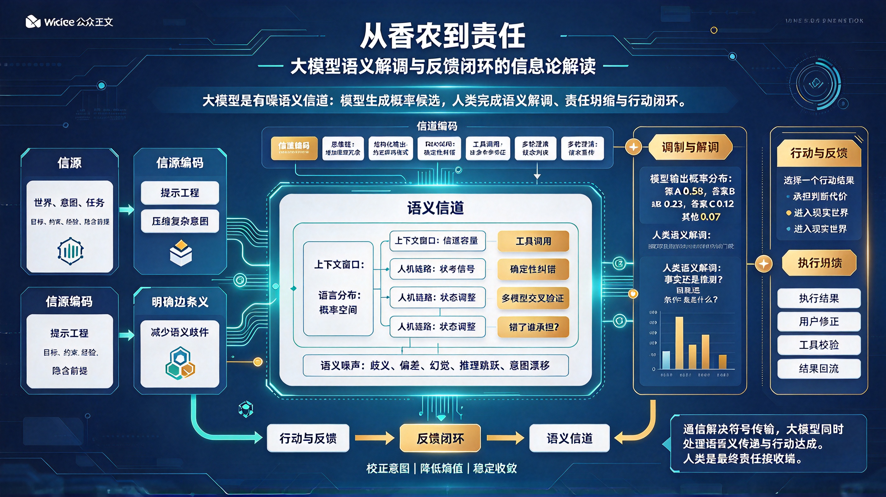
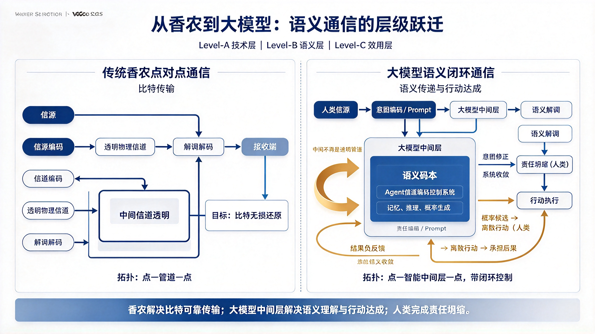

*图：从香农到责任——意图经信源编码成提示，在高维有噪语义信道中传输，模型输出概率候选，人类接收端做语义解调与责任坍缩，再由行动执行的反馈回流驱动意图修正，形成闭环收敛。*

大模型出现之后，很多人把它理解成一种"更聪明的搜索引擎"或"更强的写作工具"。但如果从信息论角度看，它更像是一个**高维语义信道**：人类把意图编码成提示，模型在**概率空间**中生成候选，人类再对这些候选进行**语义解调**和**责任坍缩**，最后通过**执行与反馈完成闭环**。

这个流程并不神秘，它几乎可以完整对应到香农通信模型：信源、信源编码、信道编码、信道、噪声、接收端、反馈。只是原来的"比特传输"升级成了"语义传递与行动达成"。

*图：左为传统香农点对点通信（点—管道—点，目标是比特无损还原），右为大模型语义闭环通信（点—智能中间层—点，带闭环控制）；大模型中间层不再是透明管道，而是由语义码本、Agent 信道编码控制系统以及记忆、推理、概率生成构成，人类在末端完成语义解调、责任坍缩与行动执行，并把结果负反馈回流成意图修正。*

## 一、信源：世界、意图与任务

通信的起点是**信源**。信源产生消息，消息携带信息。

在大模型系统中，信源不再是单纯的语音、图像或二进制数据，而是**人类面对世界时产生的意图**。比如：

- 我要写一份产品方案；
- 我要分析一段代码的问题；
- 我要判断某个市场机会是否成立；
- 我要把一段模糊需求变成可执行计划。

这些意图本身并不是结构化信息。它们**混杂着目标、约束、情绪、经验、隐含前提和未说出口的边界条件**。人类把它们压缩成一句话、一段提示、一个文档，交给大模型。

这一步，就是最初的**信息编码**。

## 二、信源编码：把意图压缩成提示（Prompt）

香农信息论中的**信源编码**，核心是**去除冗余**，用**更少的符号表达相同的信息**。

人类向大模型提问时，也在做类似的事：把复杂意图压缩成有限文本。但问题在于，这种压缩往往是有损的。

用户说"帮我优化这段文案"，模型不知道你要更短、更正式、更活泼，还是更适合投放；用户说"分析一下这个市场"，模型不知道你要宏观趋势、竞品拆解、用户画像，还是商业模式判断。

所以，大模型系统的第一个瓶颈不是模型不够强，而是**人类信源编码效率不足**（提示词工程学）。提示越模糊，语义噪声越大；约束越清晰，信道利用率越高。

好的提示工程，本质上是一种高效的信源编码：保留必要信息，剔除无关冗余，明确边界条件，减少接收端的歧义。

## 三、信道编码：用结构、工具和验证对抗语义噪声

通信里，信道编码不是为了让信号更漂亮，而是为了在噪声中保持**可靠**。它会**主动加入冗余**，比如**校验位**、**纠错码**，让**接收端**即使收到带噪信号，也能**恢复原始信息**。

大模型面对的噪声远比物理信道复杂：

- 语言歧义；
- 训练数据偏差；
- 知识截止；
- 幻觉；
- 推理跳跃；
- 上下文遗忘；
- 用户意图漂移。

这些都不是传统比特错误，而是**语义层面的噪声**。

因此，大模型系统中的"信道编码"也必须升级：

- **思维链**把隐藏推理显式展开，相当于增加推理冗余；
- **结构化输出**把开放文本限制为表格、JSON、步骤列表，相当于约定解码格式；
- **RAG** 引入外部可信资料，相当于提供参考信号；
- **工具调用**让计算器、代码解释器、数据库参与校验，相当于引入确定性纠错模块；
- **多模型交叉验证**相当于多接收端联合判决；
- **多轮澄清**相当于请求重传。

这些机制共同构成语义信道中的**纠错系统**。它们不追求模型"一次说对"，而是让系统在存在噪声的情况下仍能稳定逼近正确结果。

## 四、信道：上下文窗口、语言分布与人机交互链路

在经典通信中，信道有带宽、噪声、衰减和干扰。

在大模型系统中，信道对应的是**上下文窗口、语言分布和人机交互链路**。

上下文窗口决定了模型一次能承载多少信息，类似于信道容量。信息越多，越容易超出注意力边界；信息越远，越容易被稀释。这就是语义信道中的"衰减"。

语言分布决定了模型更倾向于生成哪些表达。它并不是中立的真理通道，而是一个由训练数据塑造的概率空间。模型输出的高概率答案，往往反映的是语料中的高频模式，而不一定是现实世界中的真实结构。

人机交互链路则决定了信息如何在人与模型之间往返。每一次追问、修正、补充，都是在调整信道状态。

所以，大模型并不是在一个干净信道里传输确定比特，**而是在一个高维、有噪、带反馈的语义信道中传递意义**。

## 五、调制与解调：从概率分布到离散判断

大模型内部并不直接输出"正确"或"错误"，而是输出一个概率分布：

> 答案 A：0.58  
> 答案 B：0.23  
> 答案 C：0.12  
> 其他：0.07

这很像通信中的**调制**过程：**连续信号承载离散信息**。模型把语义状态映射为 **logits**，再通过 **Softmax** 转化为概率，最后采样生成离散 **token**。

但问题在于，**模型只负责生成候选，不负责承担后果。它不知道"选错"的代价是什么，也不知道某个判断会引发怎样的现实行动。**

于是，人类接收端必须完成真正的**解调**。

这种解调不是简单地把概率变成文字，而是把**连续可能性坍缩为离散判断**：

- 这是事实，还是推测？
- 这是因果，还是叙述顺序？
- 这在什么条件下成立？
- 如果错了，代价由谁承担？
- 我现在是否可以据此行动？

模型给出的是"可能"，人类必须决定"是否接受"。这就是**语义解调**。而一旦人类基于这个判断采取行动，概率就不再只是概率，它进入了现实世界，产生后果。这就是**责任坍缩**。

大模型可以生成多个候选，但行动只能选择一个。概率在这里必须被切断，判断必须被承担。

## 六、反馈调节：从一次生成到闭环控制

经典香农模型主要是单向通信：信源发送，接收端接收。但大模型系统天然适合做成闭环。

一个完整的事物流转应该是：

> 意图编码 → 模型生成 → 语义解调 → 责任坍缩 → 行动执行 → 结果反馈 → 意图修正 → 再生成

这已经不只是通信，而是**通信与控制论**的结合。

反馈可以来自多个层面：

- 用户发现回答偏离目标，重新补充约束；
- 代码在沙箱中运行失败，返回错误日志；
- 检索资料与模型结论冲突，触发复核；
- 实际执行结果不如预期，调整下一步策略；
- 多次交互后，人类对自身意图也更清晰。

每一次反馈，都在降低系统的不确定性。第一次输出往往是**高熵的**，经过澄清、验证、执行和修正后，系统的状态逐渐**收敛**。

这正是控制论中的负反馈：**用输出结果校正输入偏差，使系统稳定地朝向目标运动**。

## 七、从比特可靠到行动可靠

香农最初解决的是技术问题：符号能否被准确传输。但大模型把问题推到了更深层：

- 符号传对了，意义是否传对了？
- 意义传对了，行动是否做对了？
- 行动做对了，责任由谁承担？

这对应着香农后来提出的三个层次：**技术层、语义层和效用层**。传统通信主要解决第一层；大模型则迫使人类同时处理第二层和第三层。

因此，大模型系统的最终目标不是"生成一段通顺文本"，而是**在噪声语义信道中完成可靠行动**。

在这个意义上，**信息论并没有过时，反而被重新激活。熵仍然是不确定性的度量，编码仍然是对抗噪声的手段，信道容量仍然是系统瓶颈，反馈仍然是稳定控制的关键。只是对象从物理信号扩展到了语义、知识和行动。**

### 三层对照：从香农到大模型

| 通信层次 | 香农的经典问题 | 大模型时代的对应问题 |
|---|---|---|
| 技术层 | 符号能否被准确传输 | 提示是否被完整接收、输出是否稳定可复现 |
| 语义层 | 意义是否传达到位 | 模型是否理解了真实意图，是否存在幻觉与推理跳跃 |
| 效用层 | 传输结果是否有效果 | 判断能否进入行动，错了由谁承担、如何修正 |

## 八、结语：人类仍是责任接收端

大模型把世界展开成概率，人类把概率坍缩成判断。模型擅长生成候选，人类负责选择、验证、执行和承担。

从这个角度看，使用大模型并不是把思考外包给机器，而是把人放回通信链路的末端，**成为最终的责任接收端**。模型可以给出高概率答案，但只有人类能回答：

- 我是否理解它？
- 我是否相信它？
- 我是否愿意据此行动？
- 如果错了，我如何修正？

信息论告诉我们，噪声无法完全消除，但可靠通信仍然可能。大模型时代也一样：不确定性不会消失，但人类可以通过更好的编码、更强的纠错、更清晰的解调和更稳定的反馈闭环，把概率流变成可执行的结果。

> **通信教我们在噪声中重建信号，大模型教我们在概率中重建意义，而人类最终要做的，是在行动中承担判断。**
