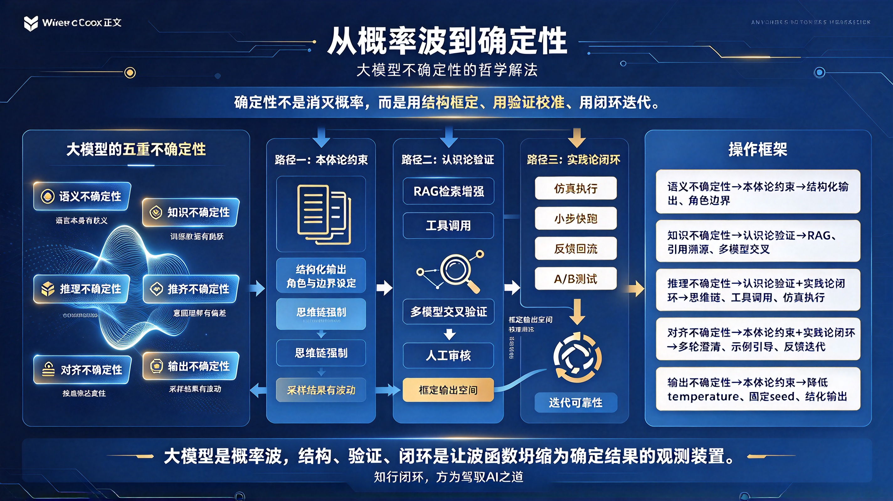

*图：从概率波到确定性 —— 五重不确定性来源（语义 / 知识 / 推理 / 对齐 / 输出），经本体论约束、认识论验证、实践论闭环三条路径，收敛为可验证、可追溯、可复利的结果。*

人类使用大模型时，最大的焦虑不是"它不会回答"，而是"我不知道它这次回答可不可信"。同一个问题，换一种问法，答案可能完全不同；今天问和明天问，结果可能不一样；让它写代码，有时完美运行，有时漏洞百出。这种**不确定性**，是大模型作为概率生成器的本质属性——它不是在"检索真理"，而是在"预测下一个词"。

但不确定性不等于不可控。要将其转化为确定性，首先要**看清不确定性在哪里**，然后从哲学层面找到**转化的路径**。

## 一、大模型不确定性的五个来源

### 1. 语义不确定性：语言本身的模糊性

同一个词在不同语境中含义不同。"苹果"是水果还是公司？"打"是击打还是打电话？大模型通过概率分布来消解歧义，但概率最高的解释未必是你想要的。

**表现**：你问"帮我总结一下"，模型不知道你要的是三句话、三段话还是三页纸。

### 2. 知识不确定性：训练数据的边界

大模型的知识来自训练数据，而数据有**时间边界**（截止于某年某月）、**质量边界**（包含错误信息）、**覆盖边界**（某些领域数据稀缺）。模型不知道自己不知道——它会用流畅的语言编造看似合理的答案，即"幻觉"。

**表现**：你问一个冷门领域的专业问题，模型给出自信但错误的回答。

### 3. 推理不确定性：从前提到结论的跳跃

大模型擅长模式匹配，但不擅长严格的逻辑推导。它可能"碰巧"得到正确答案，但推理链条中隐藏着跳跃或谬误。你无法区分它是"真懂了"还是"猜对了"。

**表现**：数学题答案对了，但中间步骤有逻辑漏洞；代码能跑，但存在边界条件 bug。

### 4. 对齐不确定性：意图理解的偏差

你的真实意图和文字表达之间存在鸿沟。模型按字面理解，可能偏离你的本意。更复杂的是，你自己在提问时也可能没有完全想清楚自己要什么。

**表现**：模型回答了一大堆，但你觉得"不是我要的那个方向"。

### 5. 输出不确定性：采样机制的随机性

大模型生成文本时使用概率采样（如 temperature 参数），相同的输入可能产生不同的输出。这既是创造力的来源，也是确定性的敌人。

**表现**：同样的提示词，刷新一次，答案变了。

## 二、哲学层面的转化路径

面对这五重不确定性，哲学提供了三条根本性的转化路径：**本体论约束、认识论验证、实践论闭环**。

### 路径一：本体论约束——用结构框定概率

大模型的输出空间是开放的、无限的。要获得确定性，首先要**缩小可能性的范围**。

**哲学根基**：康德的"先验范畴"——人的认识不是被动接收世界，而是用先天的认知框架（时间、空间、因果等）去整理经验。没有框架，经验只是一团混沌。

**转化方法**：

- **结构化输出**：不让模型自由发挥，而是规定输出格式（JSON、表格、分点列表），将开放的文本生成转化为受限的结构填充；
- **角色与边界设定**：明确告诉模型"你是一个资深律师，只基于中国现行法律回答，不知道就说不知道"，用角色和边界约束其输出空间；
- **思维链强制**：要求模型"先列出前提，再逐步推理，最后给出结论"，把黑箱的概率跳跃转化为透明的推理链条。

> **核心思想**：确定性不是从模型内部"长出来"的，而是从外部**用结构框出来的**。

### 路径二：认识论验证——用外部事实校准内部概率

大模型内部没有"真值判断器"，它只知道"这个词出现的概率高"，不知道"这个陈述是否为真"。真值必须来自外部。

**哲学根基**：波普尔的"证伪主义"——知识的可靠性不在于它多么自洽，而在于它能否接受外部检验。一个理论只有承担了被推翻的风险，才配称为知识。

**转化方法**：

- **检索增强（RAG）**：让模型的回答必须基于你提供的可信资料，把"模型记得什么"转化为"资料里有什么"，将知识不确定性转化为可追溯的引用；
- **工具调用**：让模型调用计算器、代码解释器、数据库等确定性工具，把推理不确定性外包给确定性系统；
- **多模型交叉验证**：让多个模型独立回答同一问题，比对一致性，用"共识概率"替代"单一概率"；
- **人工审核节点**：在关键决策点设置人的判断，人作为最终的"真值仲裁者"。

> **核心思想**：模型生成假设，外部系统验证假设——**生成与验证分离**，确定性来自验证环节。

### 路径三：实践论闭环——用行动结果反推可靠性

有些问题无法事先验证（如"这段代码有没有 bug"），只能在行动中暴露。

**哲学根基**：杜威的"实用主义"和马克思的"实践论"——真理不是静态的符合，而是在实践中被证实或证伪的过程。"人的思维是否具有客观的真理性，这不是一个理论的问题，而是一个实践的问题。"

**转化方法**：

- **仿真执行**：让模型生成的代码在沙箱中运行，用执行结果而非语言流畅度来判断正确性；
- **小步快跑**：不一次性生成完整方案，而是分步骤生成、分步骤验证，每一步都获得反馈后再继续；
- **反馈回流**：将每次执行的结果（成功/失败、用户满意度）记录并回流，用于优化后续的提示词和模型选择；
- **A/B 测试**：对同一任务尝试多种提示策略，用实际效果数据选择最优路径。

> **核心思想**：确定性不是"事先保证"的，而是**在闭环中迭代出来**的——学以建构认知，习以生成能力，反馈以校准概率。

## 三、从概率波到确定性——一个操作框架

将上述三条路径整合，可以得到一个实用的操作框架：

| 不确定性类型 | 哲学路径 | 具体方法 |
|---|---|---|
| 语义不确定性 | 本体论约束 | 结构化输出、明确角色与边界 |
| 知识不确定性 | 认识论验证 | RAG、引用溯源、多模型交叉 |
| 推理不确定性 | 认识论验证 + 实践论闭环 | 思维链、工具调用、仿真执行 |
| 对齐不确定性 | 本体论约束 + 实践论闭环 | 多轮澄清、示例引导、反馈迭代 |
| 输出不确定性 | 本体论约束 | 降低 temperature、固定 seed、结构化输出 |

## 结语：确定性不是消灭概率，而是驾驭概率

大模型的不确定性不会消失，也不应该消失——正是这种概率性，赋予了它创造力和灵活性。我们要做的不是把大模型变成一台确定性机器，而是**在它周围构建一层确定性的基础设施**：用结构框定它的输出空间，用外部事实验证它的陈述，用实践闭环校准它的可靠性。

这就像航海：大海本身是不确定的，风浪无法控制，但你可以用罗盘确定方向，用海图规避暗礁，用一次次航行积累对这片海域的认知。确定性不在海里，而在你的航海系统中。

> **大模型是概率波，而你的系统——结构、验证、闭环——是让波函数坍缩为确定结果的观测装置。**

学与习的闭环，在此处得到了最深刻的体现：**学，是用哲学框架理解不确定性的来源；习，是在仿真与实践中将概率转化为能力。** 知行闭环，方为驾驭 AI 之道。
