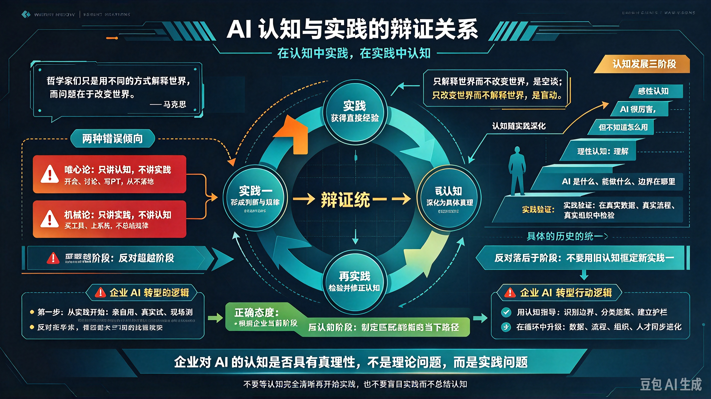

*图：左边的"问题提出"揭示空谈与盲动两种倾向；中部从"认知来源于实践""实践是认知发展的动力""认知对实践的指导作用"三个环节展开辩证关系；右上延伸为"具体的历史的统一"——既不超越阶段，也不落后于阶段；右下则要求反对 AI 认知中的唯心论与机械论。*

## 一、问题的提出

在企业 AI 转型的浪潮中，存在着两种错误的倾向：一种是**只讲认知不讲实践**，把 AI 当作一个理论问题来研究，终日讨论"AI 会不会取代人类""大模型的技术路线是什么""未来的 AI 形态会怎样"，却从不动手去试、去用、去落地；另一种是**只讲实践不讲认知**，盲目地买工具、上系统、推应用，却从不总结规律、不提炼方法、不沉淀经验，结果是在黑暗中摸索，屡试屡败。

这两种倾向，本质上都是**割裂了认知与实践的辩证关系**。

马克思说："哲学家们只是用不同的方式解释世界，而问题在于改变世界。"但在企业 AI 转型的语境下，我们必须补充一句：**只解释世界而不改变世界，是空谈；只改变世界而不解释世界，是盲动。**

本文的目的，就是从认识论的高度，阐明 AI 认知与实践的辩证关系，纠正企业内对待 AI 的错误态度。

---

## 二、认知来源于实践

**人的认知，一点也不能离开实践。**

你对 AI 的认知从哪里来？不是从厂商的 PPT 里来，不是从媒体的报道里来，不是从专家的演讲里来，而是从你自己的实践中来。

一个从未亲手用过 AI 工具的管理者，无论他读了多少篇行业报告，听了多少场技术峰会，他对 AI 的认知都是间接的、抽象的、不牢靠的。他可能知道"AI 能降本增效"这个结论，但他不知道 AI 在具体场景中到底能做什么、不能做什么，不知道 AI 输出的概率性特征会带来什么风险，不知道员工在实际使用中会遇到什么困难。

**只有亲身实践，才能获得直接经验。**

一位制造业企业的生产主管，最初认为 AI"离我很远"。后来他尝试用 AI 来分析产线故障日志，发现 AI 能在几分钟内从数万条日志中找出人类需要几天才能发现的规律。这一刻，他对 AI 的认知发生了质变——从"AI 是遥远的技术"变成了"AI 是我手中的工具"。这种认知，不是从书本上读来的，而是从实践中获得的。

**实践是认知的来源，也是检验认知是否正确的唯一标准。**

2026 年埃森哲调研显示，88%的高管认为公司已为员工提供了充足的 AI 工具，但仅有 21%的员工表示认同，存在 67 个百分点的认知差距。为什么会有这么大的差距？因为高管的认知来源于"采购清单"——我们买了多少工具、投了多少预算；而员工的认知来源于"使用体验"——这些工具到底好不好用、能不能解决问题。两种认知，一个来自间接经验，一个来自直接经验，必然产生冲突。

**解决冲突的办法只有一个：让高管也去实践。** 让他们亲自用一用这些工具，亲自体验一下员工在实际使用中遇到的困难。只有这样，高管的认知才能从"抽象的采购认知"转变为"具体的使用认知"。

---

## 三、实践是认知发展的动力

**认知不是一次完成的，而是在实践中不断深化、不断发展的。**

企业对 AI 的认知，通常经历三个阶段：

**第一阶段：感性认知阶段。** 这是认知的初级阶段。企业看到 ChatGPT 火了，听说 AI 能"降本增效"，感受到了一种模糊的焦虑和兴奋。这个阶段的特点是：认知是表面的、零散的、不系统的。企业知道"AI 很厉害"，但不知道"AI 到底怎么厉害""我的企业该怎么用 AI"。

**第二阶段：理性认知阶段。** 企业开始系统学习 AI 知识，研究技术路线，分析行业案例，制定转型战略。这个阶段的特点是：认知是抽象的、系统的、理论化的。企业能够回答"AI 是什么""AI 能做什么""AI 的边界在哪里"等问题。但问题在于，这个阶段的认知仍然是"纸面上的认知"，没有经过实践的检验。

**第三阶段：实践验证阶段。** 企业开始动手试点，把理性认知付诸实践。在实践中，企业发现：原来 AI 不是万能的，原来数据质量比模型选择更重要，原来组织变革比技术部署更难，原来员工的抵触情绪比预想的更强烈。这些发现，反过来修正和深化了企业的理性认知，使认知从"抽象的理论"变成了"具体的真理"。

**认知的发展，是一个"实践—认知—再实践—再认知"的循环往复过程。**

长江商学院 2026 年调研显示，企业 AI 转型正在从"工具采购期"进入"系统集成期"。这说明企业的认知正在深化——从"买工具就行"的感性认知，发展到"需要建系统"的理性认知，再发展到"需要打通数据、重构流程、变革组织"的更高层次的理性认知。这种认知的深化，不是凭空产生的，而是在实践中不断试错、不断总结、不断修正的结果。

**每一次实践的失败，都是认知深化的契机。**

沃尔玛与 OpenAI 合作推出的即时结账功能，五个月后便宣告终止。问题出在该功能在准确性上存在严重问题，且无法与沃尔玛的内部购物工具匹配。这次失败，使沃尔玛对 AI 的认知发生了深刻变化：AI 不是"即插即用"的万能工具，它必须与企业的内部系统深度集成，必须经过充分的测试和验证。这种认知，是从失败中获得的，比从成功中获得的更加深刻、更加牢固。

---

## 四、认知对实践的指导作用

**认知一旦形成，就会反过来指导实践。**

正确的认知指导正确的实践，错误的认知指导错误的实践。

**错误的认知之一：AI 是"银弹"。** 持有这种认知的企业，认为 AI 能解决一切问题，不顾主客观条件，盲目追求"全面 AI 化"。结果是把 AI 当作"锤子"，到处找"钉子"，最终陷入"不断试点、不断重做、难以放量"的死循环。MIT 报告显示，超过 80%的企业尝试使用生成式 AI，但仅约 5%的项目能进入生产阶段并带来实质价值。这 5%与 80%的差距，本质上是认知差距——前者对 AI 的能力边界有清醒的认知，后者则把 AI 神话了。

**错误的认知之二：AI 是"威胁"。** 持有这种认知的企业和个人，把 AI 视为"敌人"而非"工具"，消极抵制、拒绝学习。WalkMe 2026 年报告显示，超过 54%的员工绕开公司提供的 AI 工具选择手动工作，33%的员工从未使用过 AI。这种"AI 疏离"现象，本质上是认知错误——把"替代"等同于"威胁"，不理解 AI 时代的竞争力不是"人与 AI 的竞争"，而是"会用 AI 的人与不会用 AI 的人的竞争"。

**正确的认知：AI 是"认知放大器"。** AI 的本质不是"替代人的工作"，而是"抬升人的认知基线"。所有人的认知层级都被强制抬升了一层——从"执行层"到"判断层"，从"判断层"到"决策层"，从"决策层"到"创造层"。持有这种认知的企业，不会盲目追求"全面 AI 化"，也不会消极抵制 AI，而是会根据不同岗位、不同层级、不同业务的需求，因岗施策、因人施策，让 AI 真正成为组织的"认知放大器"。

**认知对实践的指导作用，在 AI 时代尤为突出。**

传统工业时代，实践主要依靠经验和技能。一个熟练工人，即使没有系统的理论知识，也能凭借多年积累的经验完成高质量的工作。但在 AI 时代，实践越来越依赖于认知——你对 AI 的理解有多深，你对业务的重构有多彻底，你对组织的变革有多坚决，直接决定了你的 AI 实践能走多远。

**没有正确的认知，就没有正确的实践。**

---

## 五、认知与实践的具体的历史的统一

**认知与实践的统一，不是抽象的统一，而是具体的、历史的统一。**

什么叫"具体的统一"？就是认知必须符合具体的时间、地点、条件。同一个 AI 方案，在 A 企业成功，在 B 企业可能失败；同一个 AI 工具，在今年适用，在明年可能过时。不能脱离具体的企业实际、行业实际、技术发展阶段来谈 AI 认知。

什么叫"历史的统一"？就是认知必须随着实践的发展而发展。AI 技术本身在快速迭代，企业的业务场景在变化，组织的成熟度在提升，认知也必须随之更新。不能用三年前的认知来指导今天的实践，也不能用今天的认知来框定明天的可能性。

**割裂了认知与实践的具体的历史的统一，就会犯两种错误：**

**一种是"超越阶段"的错误。** 企业的认知和实践还处在感性认知阶段，数据基础薄弱、流程尚未梳理、组织尚未变革，就盲目追求"全面 AI 化""无人化""智能化"。这种"大跃进"式的做法，必然导致失败。澳洲联邦银行裁掉人工客服全面使用 AI 语音机器人，结果遇到复杂场景时 AI 彻底失灵，投诉量翻了几倍，最后只能紧急召回人工客服。这就是超越了企业当前的发展阶段，把未来的可能性当成了当下的现实性。

**另一种是"落后于阶段"的错误。** AI 技术已经发展到 Agent 阶段，企业的实践还停留在"用 AI 写邮件"的初级阶段；行业标杆已经在用 AI 重构业务流程，企业还在讨论"AI 会不会取代人类"。这种"守旧"式的做法，必然导致被时代淘汰。2026 年陆续曝光的案例表明，如果短时间内不做 AI 转型，就会面临巨大竞争压力。因为你不做，竞争对手在做。

**正确的态度是：既不要超越阶段，也不要落后于阶段。** 要根据企业当前的发展阶段、数据基础、组织能力，制定与之相匹配的 AI 战略和实践路径。在感性认知阶段，重点是"用起来"；在理性认知阶段，重点是"建系统"；在系统集成阶段，重点是"重构流程、变革组织"。每一个阶段都有其特定的认知任务和实践任务，不能跳跃，也不能停滞。

---

## 六、反对 AI 认知中的唯心论和机械论

在企业 AI 转型中，存在着两种错误的认识论：**唯心论和机械论。**

**唯心论的表现：把 AI 认知当作纯粹的思想活动。** 持有这种观点的人，认为 AI 认知是一个"想清楚"的问题——只要战略想清楚了、路线图画出来了、顶层设计做好了，AI 转型就能成功。他们把大量时间花在开会、讨论、写 PPT 上，却很少动手去试、去用、去落地。他们相信"认知先行"，却不知道**认知只能在实践中形成，不能在空中楼阁中构建**。

这种唯心论的根源，是把 AI 当作一个"理论问题"而非"实践问题"。AI 确实有理论层面，但企业 AI 转型的核心不是理论研究，而是实践落地。再完美的战略，如果不经过实践的检验，也只是纸上谈兵。

**机械论的表现：把 AI 实践当作纯粹的技术活动。** 持有这种观点的人，认为 AI 实践是一个"买工具、上系统、跑数据"的技术问题——只要工具买对了、系统部署了、数据接入了，AI 就能自动产生价值。他们把 AI 转型交给 IT 部门独自承担，业务部门只负责"提需求"，组织部门只负责"配合"，完全不理解 AI 转型本质上是一个**认知升级、流程重构、组织变革**的系统工程。

这种机械论的根源，是把 AI 当作一个"技术问题"而非"认知问题"。AI 确实有技术层面，但企业 AI 转型的核心不是技术部署，而是认知升级。再先进的工具，如果使用者的认知没有升级，也只是"给马车装上了法拉利的引擎"——跑不起来，还容易翻车。

**正确的认识论是辩证唯物论：认知来源于实践，又指导实践；实践检验认知，又发展认知。认知与实践，是一个辩证统一的过程。**

---

## 七、结论

综上所述，我们可以得出以下结论：

**第一，认知来源于实践。** 企业对 AI 的正确认知，不是从书本上读来的，不是从专家那里听来的，而是从自己的实践中获得的。没有实践，就没有认知。

**第二，实践是认知发展的动力。** 企业的 AI 认知，是在实践中不断深化、不断发展的。每一次实践的失败，都是认知深化的契机；每一次实践的成功，都是认知跃升的阶梯。

**第三，认知对实践具有指导作用。** 正确的认知指导正确的实践，错误的认知指导错误的实践。没有正确的认知，就没有正确的实践。

**第四，认知与实践是具体的历史的统一。** 既不能超越阶段，也不能落后于阶段。要根据企业当前的发展阶段，制定与之相匹配的认知任务和实践任务。

**第五，必须反对唯心论和机械论。** 既不能把 AI 认知当作纯粹的思想活动，也不能把 AI 实践当作纯粹的技术活动。认知与实践，是一个辩证统一的过程。

> 马克思说："人的思维是否具有客观的真理性，这不是一个理论的问题，而是一个实践的问题。"
>
> 今天，我们同样可以说：企业对 AI 的认知是否具有真理性，这不是一个理论的问题，而是一个实践的问题。人应该在实践中证明自己思维的真理性，即自己思维的现实性和力量，自己思维的此岸性。

**行动起来吧！** 不要等待"认知完全清晰"再开始实践，因为认知只能在实践中清晰；不要盲目实践而不总结认知，因为实践需要认知的指导。在认知中实践，在实践中认知，让认知与实践的辩证运动，推动企业的 AI 转型不断向前发展。

---

_本文仿《实践论》体例，结合 2026 年企业 AI 转型实际，旨在从认识论的高度阐明 AI 认知与实践的辩证关系。_
