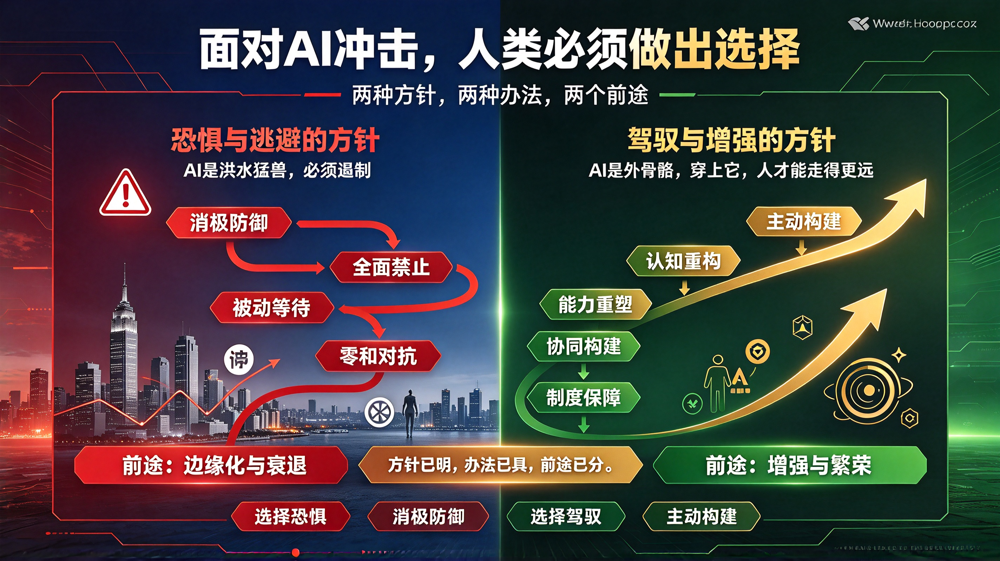

*图：面对AI冲击，人类必须做出选择——两种方针，两种办法，两个前途。左侧是恐惧与逃避的方针（AI是洪水猛兽，必须遏制），经消极防御、全面禁止、被动等待、零和对抗，通向前途：边缘化与衰退；右侧是驾驭与增强的方针（AI是外骨骼，穿上它，人才能走得更远），经认知重构、能力重塑、协同构建、制度保障，通向前途：增强与繁荣。*

## 一、两种方针

当前，人类面对AI的冲击，存在两种截然不同的方针。

**第一种方针，是恐惧与逃避的方针。** 这种方针认为，AI的发展必然导致人类被替代、被边缘化，甚至被消灭。持这种方针的人，或主张全面禁止AI，或消极等待命运的裁决，或在焦虑中无所作为。他们的口号是："AI是洪水猛兽，必须遏制。"

**第二种方针，是驾驭与增强的方针。** 这种方针认为，AI是人类创造的工具，其冲击的本质不是替代，而是倒逼人类重新审视自身的价值。持这种方针的人，主张主动学习AI、理解AI、驾驭AI，将AI转化为增强人类能力的杠杆。他们的口号是："AI是外骨骼，穿上它，人才能走得更远。"

这两种方针，代表了两条截然不同的道路。前者导向停滞与衰退，后者导向进化与繁荣。

---

## 二、两种办法

与两种方针相适应，也存在两种办法。

### 恐惧方针的办法：消极防御

持恐惧方针的人，其办法不外乎以下几种：

1. **全面禁止**——试图通过立法、伦理约束来阻止AI发展。然而历史已经证明，技术的洪流无法用一纸禁令阻挡。当一国禁止时，他国仍在推进，最终只是让自己落后。

2. **被动等待**——寄希望于"AI自己会出问题"，或等待某个救世主般的监管框架从天而降。这种办法的本质是放弃主动权，将命运交给偶然性。

3. **零和对抗**——将AI视为敌人，试图与之对抗。然而对抗的结果，往往是被淘汰——因为拒绝使用AI的人，终将被使用AI的人所超越。

这些办法的共同特征是：**将AI视为外在于人的威胁，而非可被驾驭的工具。** 其结果，只能是在冲击面前节节败退。

### 驾驭方针的办法：主动构建

持驾驭方针的人，其办法则是积极的、建设性的：

1. **认知重构**——首先在思想上完成转变：从"AI会替代我"转向"AI能增强我"。这是所有行动的前提。没有这个认知转变，任何技术手段都是空中楼阁。

2. **能力重塑**——重新定义人类的核心竞争力。在AI时代，记忆力、计算力、重复性技能的价值下降，而**判断力、创造力、价值权衡能力、人际连接能力**的价值上升。人类必须将精力从"做AI能做的事"转向"做只有人能做的事"。

3. **协同构建**——主动设计人机协同的体系。不是让AI取代人，而是重新划分"感知—决策—执行"的边界：AI负责海量信息处理与候选方案生成，人负责价值判断与最终拍板。建立"AI出候选，人做确认"的协作机制。

4. **制度保障**——推动社会层面的适应性变革：教育体系从知识灌输转向批判性思维培养；社会保障体系应对就业结构转型；伦理与法律框架明确AI的责任边界。

这些办法的共同特征是：**将AI视为可被驾驭的工具，主动构建人与AI的协同关系。** 其结果，是在冲击中进化，在变革中壮大。

---

## 三、两个前途

与两种方针、两种办法相适应，存在着两个前途。

### 第一个前途：人类被边缘化

如果采取恐惧的方针、消极防御的办法，其前途必然是：

- **经济层面**：拒绝AI的企业被使用AI的企业淘汰，拒绝AI的行业被AI重构的行业颠覆。大量劳动者因技能过时而被挤出就业市场，贫富差距进一步拉大。

- **社会层面**：AI能力集中在少数科技巨头手中，普通人沦为"数据提供者"而非"价值创造者"，社会阶层固化加剧。

- **文明层面**：人类逐渐丧失独立思考与创造的能力，过度依赖AI导致认知退化。最终，人不再是技术的主人，而成为技术的附庸。

这个前途，是衰退的前途，是被动的前途，是人类主体性丧失的前途。

### 第二个前途：人类被增强

如果采取驾驭的方针、主动构建的办法，其前途则是：

- **经济层面**：AI成为生产力跃升的引擎。人类从重复性劳动中解放出来，专注于更高价值的创造性工作。新的职业、新的产业、新的价值形态不断涌现。

- **社会层面**：人机协同成为常态。教育体系培养出善于驾驭AI的新一代劳动者，社会保障体系平稳过渡，AI红利惠及更广泛的人群。

- **文明层面**：AI成为人类认知的延伸，帮助人类探索更复杂的科学问题、创造更丰富的艺术作品、构建更合理的社会制度。人类的智慧因AI而放大，而非被取代。

这个前途，是进化的前途，是主动的前途，是人类主体性增强的前途。

---

## 四、结论：选择权在人类手中

AI的冲击是客观存在的，正如当年的民族危机是客观存在的一样。但危机之中，从来都蕴含着转机。

问题的关键不在于AI本身，而在于**人类选择什么样的方针、采取什么样的办法**。

- 选择恐惧的方针，采取消极防御的办法，前途必然是边缘化与衰退。
- 选择驾驭的方针，采取主动构建的办法，前途必然是增强与繁荣。

**两个前途之间，没有中间道路。** 犹豫不决、摇摆不定，最终只会滑向第一个前途。因为技术不会等待，时代不会等待。

人类必须做出选择。而这个选择，不在AI手中，不在技术手中，而在每一个个体、每一个组织、每一个社会的行动之中。

方针已明，办法已具，前途已分。

**剩下的，只有行动。**
