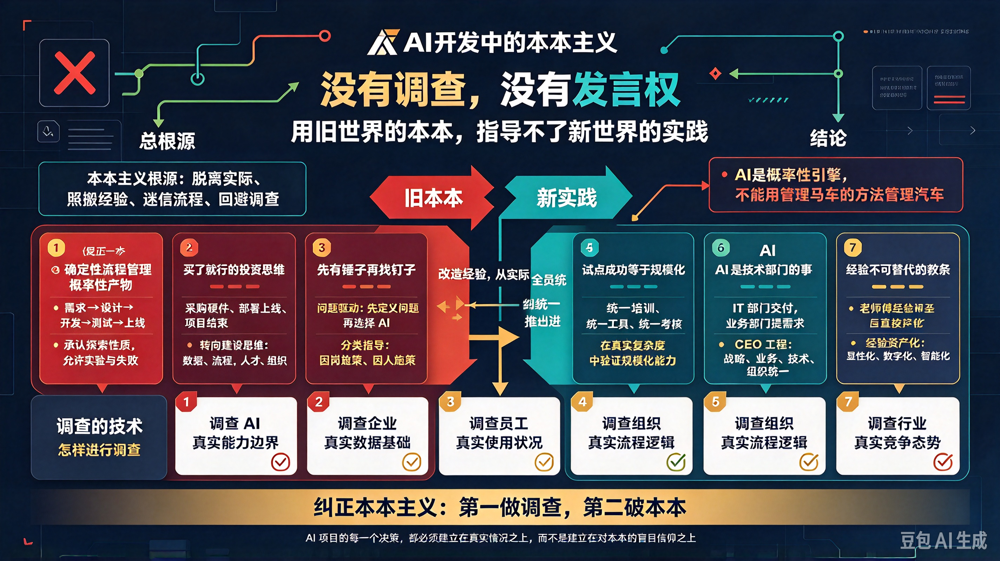

*图：左边是确定性的"本本"——瀑布排期、采购验收、统一推进、试点复制；右边是概率性的 AI 现实。中间断裂的不是流程，而是方法论：用管理确定性工具的办法管理概率性引擎，就像用管理马车的方法管理汽车。*

没有调查，没有发言权。

你对于某个 AI 项目的情况没有调查清楚，或者只调查了一部分，就在那里**发号施令**、**制定方案**、**推动落地**，这不是蠢人，就是妄人。

当前企业 AI 开发中，存在一种极为普遍的现象：**用传统软件工程的经验来指导 AI 项目的开发范式**。他们把 AI 项目当作传统 IT 项目来管理，用瀑布模型排期，用敏捷框架迭代，用 KPI 考核产出，用 ROI 衡量价值。表面上看，一切井井有条、有章可循；实际上，这套"本本"正在把大量 AI 项目送入坟墓。

MIT 与麦肯锡的联合研究显示，90%的生成式 AI 实验项目从未能走出试点阶段。标普全球 2025 年的调查表明，42%的企业承认放弃了大部分 AI 计划，而 2024 年这一比例仅为 17%，短短一年间 AI 项目放弃率飙升了 147%。

这些数字背后，不是 AI 技术不行，而是**指导 AI 开发的方法论不行**——是用旧世界的"本本"来指导新世界的实践。

## 一、"本本"的第一条罪状：用确定性流程管理概率性产物

传统软件工程的"本本"告诉我们：需求明确→设计→开发→测试→上线，每一步都有确定的输入和确定的输出。这是工业时代留下的宝贵经验，在确定性系统中行之有效。

但 AI 项目的本质是什么？是**把"不确定性"收敛为"确定性"**。大语言模型的输出是概率分布，不是确定结果。你给它同一个输入，它可能给你十个不同的输出。你无法用传统的"需求→设计→开发→测试"流水线来管理一个"每次运行结果都可能不同"的系统。

一位受访者的话说得透彻："许多工作不得不反复地在下一个任务中重新打开，或者被拆分成极其微小且无意义的任务，以塞进一到两周的任务中。"

这就是本本主义的危害——**你硬要把一个探索性的、实验性的、充满不确定性的工作，塞进一个确定性的、线性的、可预测的流程框架里**。结果不是流程约束了 AI，而是 AI 撑破了流程。

**纠正的方法：** 承认 AI 项目的探索性质。AI 项目需要一个数据探索和实验的初始阶段，其持续时间不可预测。不能用管理传统软件项目的方式——固定周期、固定范围和固定交付物——来管理 AI 项目。AI 项目需要更大的灵活性、更长的探索周期以及对失败实验的容忍度。

## 二、"本本"的第二条罪状：用"买了就行"的思维指导 AI 投资

传统 IT 采购的"本本"告诉我们：买服务器、买软件、买许可证，部署上线，验收付款，项目结束。这是一套成熟的、经过几十年验证的采购流程。

于是企业照搬这套"本本"来指导 AI 投资。长江商学院 2026 年一季度调研显示，企业将平均 57.2%的 AI 资金投向了硬件，走出了一条重资产、基础设施化的路径。

但 AI 不是服务器。服务器买了就能用，AI 买了不一定能用。88%的高管认为公司已为员工提供了充足的 AI 工具，但仅有 21%的员工表示认同，存在 67 个百分点的认知差距。

这就是本本主义的危害——**你把 AI 当作一台机器来采购，而不是当作一种能力来建设**。机器买了就能运转，能力需要培养、训练、迭代、沉淀。

蚂蚁集团 CEO 韩歆毅说得好："企业 AI 的智能不止于知识累积，更在于经验沉淀。"真正的企业级 AI 智能，需要扎根企业真实的业务流程，持续沉淀企业专属的数据和经验，在真实运转中自主迭代学习。

**纠正的方法：** 从"采购思维"转向"建设思维"。AI 投资不是买一台机器，而是建一套能力。这套能力包括：数据治理、流程重构、人才培养、组织变革、经验沉淀。硬件只是其中最小的一部分。

## 三、"本本"的第三条罪状：用"先有锤子再找钉子"的逻辑推动 AI 落地

传统项目管理的"本本"告诉我们：先确定需求，再寻找方案，最后选择工具。这是一套逻辑严密、环环相扣的方法论。

但当前企业 AI 落地的普遍做法恰恰相反——**先有了 AI 这把"锤子"，再到处找"钉子"**。

ChatGPT 引爆全球关注后，无数企业争先恐后地将大语言模型集成到自己的业务中，先有锤子再找钉子成为普遍现象。

2025 年 10 月，沃尔玛高调宣布与 OpenAI 合作，在 ChatGPT 中推出即时结账功能。然而仅仅五个月后，沃尔玛便终止了这一合作。问题出在该功能在准确性上存在严重问题，且无法与沃尔玛的内部购物工具匹配，导致通过 OpenAI 渠道的订单转化率远低于沃尔玛自有渠道的水平。

这就是本本主义的危害——**你不是从业务问题出发去寻找 AI 解决方案，而是从 AI 技术出发去硬套业务场景**。结果不是 AI 解决了问题，而是 AI 制造了问题。

**纠正的方法：** 从"技术驱动"转向"问题驱动"。成功的项目应当聚焦于要解决的问题，而非用来解决问题的技术。先搞清楚"我要解决什么问题"，再判断"AI 能不能解决这个问题"，最后决定"用什么 AI 来解决这个问题"。

## 四、"本本"的第四条罪状：用"全员统一推进"的方式推行 AI 转型

传统管理学的"本本"告诉我们：标准化、统一化、规模化，是效率的来源。于是企业照搬这套"本本"来推行 AI 转型——全员统一培训、统一工具、统一考核。

但 AI 对不同岗位的影响是截然不同的。有的岗位需要 AI"替代"，有的岗位需要 AI"增强"，有的岗位暂时不需要 AI。长江商学院调研显示，50%的企业报告 AI 对岗位起到"补充/增强"作用，31.4%的企业感受到了"替代"压力，两者并存，不可一概而论。

更荒谬的是，许多企业的 AI 培训"一刀切"——所有人学同样的课程、考同样的证书。不理解认知抬升的方向因人而异：初级执行者需要从"执行层"抬升到"判断层"，中级管理者需要从"判断层"抬升到"决策层"，高级决策者需要从"决策层"抬升到"创造层"。

这就是本本主义的危害——**你用一套标准去要求所有人，结果是谁都不满意**。需要"替代"的岗位觉得不够深入，需要"增强"的岗位觉得脱离实际，暂时不需要 AI 的岗位觉得浪费时间。

**纠正的方法：** 从"统一推进"转向"分类指导"。因岗施策、因人施策。不同岗位、不同层级、不同业务，对 AI 的需求不同，培训方式不同，考核标准不同，转型路径也不同。

## 五、"本本"的第五条罪状：用"试点成功"来代替"规模化落地"

传统项目管理的"本本"告诉我们：先试点，再推广。这是一条经过无数项目验证的成功路径。

但 AI 项目的"试点"和传统项目的"试点"有本质区别。传统项目的试点是在真实环境中进行的，试点成功意味着方案可行。而 AI 项目的试点往往是在**受控环境**中进行的——数据经过筛选，流程经过精简，参与者经过挑选。这一环境中验证有效的方案，进入完整的业务复杂度后往往失效。

试点跑通，不等于落地成功。试点结束，价值未能延续，新的试点重新启动。每一轮循环，组织推进 AI 的资源与信心都在消耗，而真正的落地始终未能发生。

这就是本本主义的危害——**你把"试点成功"等同于"规模化可行"，把"受控环境"等同于"真实环境"**。结果是企业陷入了"不断试点、不断重做、难以放量"的死循环。

**纠正的方法：** 从"试点思维"转向"规模化思维"。试点的目的不是证明"AI 能用"，而是发现"AI 在真实环境中会遇到什么问题"。试点设计必须包含对真实复杂度的模拟——数据不清洗、流程不精简、人员不挑选，在接近真实的环境中去验证。

## 六、"本本"的第六条罪状：用"技术部门的事"来定义 AI 转型的边界

传统 IT 管理的"本本"告诉我们：技术项目是 IT 部门的事，业务部门提需求，IT 部门交付方案，各司其职、边界清晰。

但 AI 转型不是技术项目，而是**组织变革项目**。波士顿咨询集团提出的 10-20-70 法则认为 AI 项目的成功，10%取决于算法，20%取决于技术和数据基础设施，而 70%取决于人、流程和文化转型。然而大多数组织恰恰将这组比例完全颠倒，将 70%的精力投入到技术采购和部署上，仅有 10%关注人员和文化转型。

麦肯锡报告同样印证这一点：工作流再造贡献了约 80%的价值增量。

这就是本本主义的危害——**你把 AI 转型当作一个技术问题来解决，而它本质上是一个组织问题**。技术只是冰山一角，冰山之下是流程重构、组织变革、文化转型、能力升级。

**纠正的方法：** 从"IT 项目"转向"CEO 工程"。AI 转型必须由 CEO 和业务负责人共同推动，而不是交给 IT 部门独自承担。技术、业务、组织三者必须统一于一个整体战略之下。

## 七、"本本"的第七条罪状：用"经验不可替代"的教条拒绝 AI

与上述六种本本主义相反，还有一种本本主义走向另一个极端——**把传统经验神圣化，拒绝一切 AI 介入**。

"老师傅的经验是几十年积累的，AI 怎么可能替代？" "这个行业水深得很，AI 不懂我们的业务。" "AI 生成的东西不靠谱，还是人来做比较放心。"

这种思想在制造业、医疗、法律等传统行业中尤为浓厚。

2026 年陆续曝光的真实案例确实挑战了"全盘无人化"的逻辑。澳洲联邦银行裁掉人工客服全面使用 AI 语音机器人，结果遇到复杂场景时 AI 彻底失灵，投诉量翻了几倍，最后只能紧急召回人工客服。

但这是"全盘替代"的错误，不是"AI 无用"的证据。把"全盘替代"的失败归因于"AI 不行"，就像把"大跃进"的失败归因于"工业化不行"一样荒谬。

这就是本本主义的危害——**你把"经验"当作不可触碰的教条，拒绝承认经验也需要进化**。老师傅的经验是宝贵的，但如果这些经验永远只停留在老师傅的脑子里，不沉淀为组织资产，不通过 AI 实现规模化复用，那这些经验就会随着老师傅的退休而消失。

**纠正的方法：** 从"经验神圣化"转向"经验资产化"。蚂蚁集团韩歆毅提出的"经验型智能"（Experience AI）指明了方向：企业应当把隐性经验显性化、显性经验数字化、数字经验智能化。不是用 AI 替代经验，而是用 AI 放大经验、沉淀经验、传承经验。

## 八、调查的技术：怎样才能不犯本本主义

本本主义的根源在于**不做调查**。不做调查，就只能照搬"本本"；照搬"本本"，就必然脱离实际。

那么，怎样进行调查？

**第一，调查 AI 的真实能力边界。** 不是听厂商的 PPT，不是看媒体的报道，而是自己动手，用真实的业务数据去测试 AI 能做什么、不能做什么。概率性生成模型与确定性交付需求之间的根本性冲突，只有在真实场景中才能被准确感知。

**第二，调查企业的真实数据基础。** 不是听 IT 部门说"我们有数据"，而是亲自去看数据在哪里、质量如何、格式是否统一、口径是否一致。许多企业拥有海量数据，但拥有数据不等于拥有可用的高质量数据。

**第三，调查员工的真实使用状况。** 不是看"AI 采用率"这个表面数字，而是深入了解员工在实际使用 AI 中遇到的真实困难——52%的中国员工表示低质量或误导性的 AI 输出导致了时间浪费和效率下降。

**第四，调查组织的真实流程逻辑。** 不是画一张流程图就完事，而是深入每一个环节，理解信息如何流动、决策如何做出、责任如何分配。许多企业现有的流程本身是为"人"设计的，而不是为"Agent"设计的。

**第五，调查行业的真实竞争态势。** 不是闭门造车，而是走出去看——竞争对手在做什么、行业标杆在做什么、技术前沿在做什么。如果短时间内不做 AI 转型，就会面临巨大竞争压力。因为你不做，竞争对手在做。

## 总结

以上七条罪状，是当前企业 AI 开发中最突出的本本主义表现。它们的共同根源在于：**用旧世界的经验来指导新世界的实践，用确定性的"本本"来管理不确定性的 AI。**

AI 作为新质生产力的代表，它的本质不是"确定性工具"，而是"概率性引擎"。用管理确定性工具的方法来管理概率性引擎，就像用管理马车的方法来管理汽车——不是马车的方法不好，而是它不适用于汽车。

纠正本本主义的方法，归根结底就是两条：

**第一，做调查。** 没有调查就没有发言权。AI 项目的每一个决策，都必须建立在对真实情况的深入调查之上，而不是建立在对"本本"的盲目信仰之上。

**第二，破本本。** 本本不是不好，而是不能照搬。传统软件工程的经验是宝贵的，但必须经过改造才能适用于 AI 项目。改造的方法就是——**从实际出发，从问题出发，从场景出发**，而不是从"本本"出发。

> 一百年前，毛泽东在《反对本本主义》中写道："马克思主义的'本本'是要学习的，但是必须同我国的实际情况相结合。"
>
> 今天，我们同样要说：传统软件工程的"本本"是要学习的，但是必须同 AI 开发的实际情况相结合。脱离实际的"本本"，不是指南针，而是绊脚石。

---

_本文结合 2026 年企业 AI 开发实际，旨在以经典方法论纠正 AI 开发中的教条主义倾向。_
