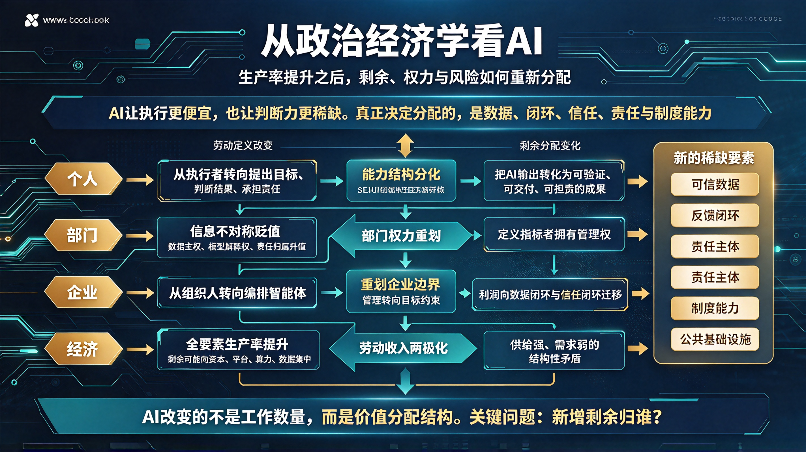

*图：AI 把判断力变成新的稀缺资源——劳动从"亲自完成"转向"提出目标、判断结果、承担责任"；部门权力从信息不对称转向数据与闭环；企业从组织人转向编排智能体；经济层面的核心矛盾则是生产率提升不等于分配改善，新增剩余归谁决定下一轮生产的结构。*

AI正在把一种长期被低估的东西变成稀缺资源：判断力。

过去，生产效率提升主要依靠工具、流程和分工。人通过机器延长体力，通过制度延长协作，通过知识延长经验。AI出现后，许多原本需要训练、记忆、归纳和重复判断的工作，开始被模型压缩成更低成本的计算。它提升的不只是"做得更快"，而是"知道该做什么"的门槛被显著降低。

但从政治经济学角度看，技术从来不会自动带来平等收益。任何一次生产率革命，都会重新分配三类东西：剩余、权力和风险。AI也不例外。

## 一、AI首先改变的是"劳动"的定义

传统劳动中，人承担感知、记忆、推理、表达和执行。AI把其中可模式化的部分抽离出来：信息检索、文本生成、图像识别、代码补全、数据分析、流程自动化。于是，人的劳动开始从"亲自完成"转向"提出目标、判断结果、承担责任"。

这会带来一个看似矛盾的现象：
AI让普通人更容易完成专业工作，但真正稀缺的不再是"会做"，而是"知道为什么做、做到什么程度、由谁承担后果"。

对个人而言，这意味着能力结构会分化。

一部分人会借助AI扩大产出，从执行者变成小型生产单元；另一部分人如果仍停留在可被模型替代的环节，收入议价能力会下降。认知提升并不必然带来地位提升，因为认知本身也会被AI部分外包。真正决定个人位置的，是能否把AI输出转化为可验证、可交付、可承担责任的成果。

## 二、部门层面的权力会向"数据与闭环"集中

在企业内部，AI首先改变的是部门之间的相对价值。

过去，很多部门的权力来自信息不对称：掌握流程、掌握客户、掌握报表、掌握审批。AI会降低这种不对称，使信息更容易被提取、重组和自动化。于是，单纯掌握信息的部门会贬值，而掌握高质量数据、真实反馈闭环和最终决策权的部门会升值。

例如，销售部门如果只掌握客户名单，价值会被AI削弱；但如果掌握客户转化过程中的真实行为数据，并能持续优化策略，价值反而增强。人力部门如果只做流程管理，容易被自动化；但如果能把组织能力、人才流动和绩效反馈变成可计算的系统，就会成为新的中枢。

部门之间的冲突也会变化。过去是资源争夺，未来更多是数据主权、模型解释权和责任归属的争夺。谁能定义指标，谁就拥有事实上的管理权；谁掌握评估标准，谁就能影响资源分配。

## 三、企业会从"组织人"转向"编排智能体"

企业的本质，是把分散的劳动组织起来，形成稳定产出。AI时代，企业仍然需要组织，但组织对象会从"人"扩展到"人、模型、工具、数据和外部服务"的混合体。

这会带来三个变化。

第一，企业边界会重新划定。许多原本必须内部完成的工作，可以通过AI代理和外部平台完成；但涉及核心数据、品牌信誉、合规责任和关键决策的部分，反而会更强烈地留在企业内部。企业不会简单地变小，而是会在"可外包的智能"和"必须自控的信任"之间重新划线。

第二，管理重心会从流程控制转向目标约束。传统管理强调步骤、审批和标准化；AI时代，执行路径可能由模型动态生成，管理更需要定义目标、约束、评估标准和责任链。企业会越来越像一个"目标系统"，而不是单纯的"流程系统"。

第三，利润来源会向闭环迁移。单纯使用通用AI能力，很快会变成行业基础设施；真正能形成差异的，是拥有独特数据、独特反馈、独特场景和独特责任承担机制的企业。AI能力越普及，数据闭环和信任闭环越值钱。

## 四、经济层面的矛盾：生产率提高，不等于分配改善

从宏观上看，AI会提高全要素生产率，降低许多服务和知识产品的边际成本。但它也会加剧一个经典矛盾：生产率提升带来的收益，未必按劳动贡献分配，而可能按资本、数据、平台和算力集中。

算力、数据、模型和平台具有明显的规模效应。越大的平台越能积累数据，越能降低单位成本，越能吸引更多用户，从而形成正反馈。这会使经济中出现新的"地租型收益"：不是来自土地，而是来自平台入口、模型接口、数据通道和生态控制权。

与此同时，劳动收入可能面临两极化。高判断力、高责任承担、高资源协调能力的人会获得更高溢价；中等复杂度、规则明确、可被模型替代的工作会被压缩；低技能服务中，那些仍需物理在场、需要人际信任的部分，短期内反而更难被替代，但议价能力未必同步提高。

这就提出了一个政治经济学问题：
如果AI创造了大量剩余，但这些剩余主要流向平台、算力和数据所有者，那么消费端是否有足够购买力承接新的产出？生产率革命若不能转化为广泛收入增长，就可能变成"供给更强、需求更弱"的结构性矛盾。

## 五、新的稀缺：信任、责任与制度能力

AI越强大，越会暴露一个事实：模型可以生成答案，但不能天然承担后果。

于是，社会会重新定价几样东西：

- 可信数据：不是越多越好，而是可追溯、可验证、可治理的数据更稀缺；
- 责任主体：谁为AI决策负责，谁就拥有最终权力；
- 制度能力：能制定标准、审计模型、界定边界的组织会获得新的治理权；
- 公共基础设施：算力、数据、身份、版权、隐私和反垄断规则，会成为新型公共品；
- 人的尊严与选择权：当许多劳动被替代，社会必须回答"人如何获得收入、意义和参与感"。

AI不会自动解放人，也不会自动压迫人。它更像一面放大器：放大资本的组织能力，放大个人的判断能力，也放大制度滞后带来的风险。

## 六、未来的关键不是"会不会被替代"，而是"剩余归谁"

AI提升生产效率之后，个人、部门、企业和经济的发展方向，最终取决于一个问题：新增剩余如何分配？

如果剩余主要被少数平台捕获，经济会走向更强的集中；如果剩余能通过更开放的数据制度、更公平的竞争规则、更有效的教育和再分配机制扩散，AI才可能真正成为广泛生产力提升的基础设施。

对个人来说，最现实的策略不是恐慌替代，而是尽快把自己从"可被模型压缩的环节"迁移到"能定义问题、整合资源、承担责任、拥有数据或信任关系的位置"。

对组织来说，最重要的能力不是采购多少AI工具，而是能否建立自己的数据闭环、评估体系和责任机制。

对经济来说，最终考验也不是技术有多强，而是制度能否让技术红利转化为更广泛的生产力、收入和创造力。

AI改变的不是工作的数量，而是价值分配的结构。谁能掌握新的稀缺要素——数据、闭环、信任、责任和制度能力——谁就会在下一轮生产中占据主动。
