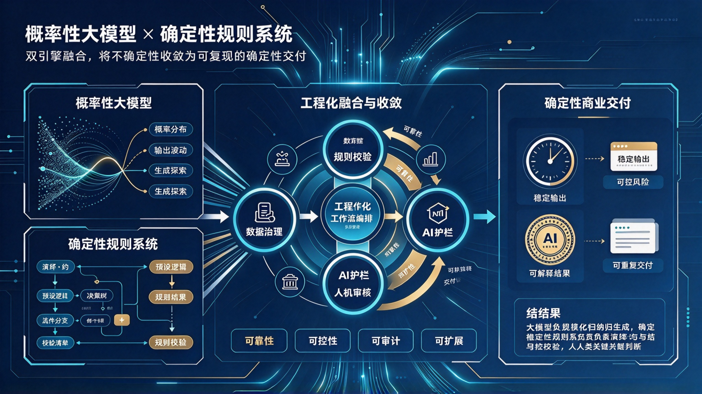

*图：左侧两个引擎——概率性大模型（概率分布、输出波动、生成探索）与确定性规则系统（演绎、预设逻辑、决策树、规则分支、校验清单）；中部是工程化融合与收敛：数据治理 → 工程化工作流编排 → AI 护栏 → 规则校验 → 人机审核，环上达成可靠性、可控性、可审计、可扩展；右侧是确定性交付——稳定输出、可控风险、可解释结果、可重复交付。业务结果：大模型负责规模化生成，规则系统负责演绎与结果校验，人类负责关键判断与责任闭环。*

## 一、问题的提出

企业 AI 落地中，长期存在两条互不服气的路线。

一条路线相信**大模型**：既然模型能理解自然语言、能生成、能推理，那就把业务交给它，让它端到端地解决问题。这条路在 Demo 阶段所向披靡，一到生产就暴露出老毛病——同一个问题，两次回答不一样；偶尔一本正经地编造事实；边界模糊时，谁也说不清它为什么这么答。

另一条路线相信**规则系统**：既然业务要的是可复现、可审计、可追责，那就把流程写成规则、决策树、校验清单，一步步执行。这条路稳如磐石，但它的边界同样明显——规则只能覆盖被预先想到的情况，真实世界的长尾无穷无尽，规则库越写越臃肿，最后没人敢改。

于是形成两难：**要灵活就不确定，要确定就不灵活。**

这个两难之所以长期无解，是因为它被当成了"二选一"的技术选型问题。但按照《矛盾论》的观点，事物发展的根本原因在于内部的矛盾性——大模型与规则系统不是两个互相排斥的备选项，而是**同一个解决方案中相互依存、又相互斗争的两个方面**。确定性不是从其中任何一方单独得来的，而是从二者的对立统一中得来的。

本文的目的，就是阐明这对矛盾，并给出把两种方法落到工程的中枢：**任务分流**——任务进来先分类，确定性任务走规则求解，概率性任务走生成加收敛，两条路径共同汇入同一个确定性交付系统。

---

## 二、两种系统的本质

要看清二者的关系，先要看清它们各自的本性。

**概率性大模型的本质是归纳与生成。** 它从海量数据中习得分布，在给定上下文中采样出下一个最可能的输出。它的力量来自"覆盖"——未经显式编程，也能处理开放域的问题；它的弱点也来自"覆盖"——输出是采样的结果，天然带波动，天然不可复现，天然说不清"为什么"。

**确定性规则系统的本质是演绎与校验。** 它从明确的前提出发，按预设逻辑推导到确定的结论：如果满足条件 A 与 B，则执行 C；如果结果不在合法集合内，则拦截。它的力量来自"确定"——同样的输入永远得到同样的输出，每一步都可追溯；它的弱点也来自"确定"——只能处理被预先定义的情况，遇到规则之外的情形就束手无策。

用一句话概括：**大模型回答"可能是什么"，规则系统判定"必须是什么"。**

前者负责在开放世界中提出候选，后者负责在约束条件下作出裁决。这两件事，本来就不是同一件事。

---

## 三、对立：二者的矛盾

既然本性不同，二者的矛盾就是客观的、必然的。它至少表现在四个方面：

**归纳与演绎的对立。** 一个从经验中概括，一个从前提中推导；一个的结论是"大概率如此"，一个的结论是"必然如此"。把归纳的结论当成演绎的前提，就会出错；用演绎的尺度去要求归纳，就会失望。

**生成与校验的对立。** 生成要求发散——候选越多越好，才能覆盖可能性；校验要求收敛——不合格的一律拦下，宁可漏过不可放过。同一个系统里，这两种要求是相反方向的力。

**覆盖率与精确率的对立。** 追求覆盖率，就要容忍模型去触碰模糊地带，波动随之上升；追求精确率，就要把模糊地带交给规则拒绝或转人工，覆盖率随之下降。

**灵活与可审计的对立。** 模型越灵活，决策路径越难还原；规则越严格，审计越容易，但能处理的问题越少。

**承认这些对立，是解决问题的前提。** 否认对立、企图用一方消灭另一方的做法，必然在实践中碰壁：纯模型路线在强合规场景中交付不了，纯规则路线在开放场景中走不通。

---

## 四、统一：互为存在的前提

但矛盾的双方不只是斗争的，更是统一的——**互为存在的条件，并在一定条件下共居于一个统一体中。**

**没有规则系统，大模型的不确定性无从收敛。** 模型输出了候选，谁来判定它合格？一致性、合法性、合规性、事实性——这些判断必须有一个不随模型波动的尺度。这个尺度就是规则系统。它为概率性的输出提供了确定性的验收边界。

**没有大模型，规则系统覆盖不了真实世界。** 真实业务的输入是自然语言、非结构化文档、模糊意图——规则系统无法把这些东西"读进来"。大模型恰恰是把开放世界翻译进规则世界的前置环节：它抽取要素、归类意图、生成结构化候选，让规则系统有东西可判。

因此，二者不是"谁替代谁"，而是**分工**：

- **大模型负责规模化生成**：候选、草稿、抽取、归类、意图理解
- **规则系统负责演绎与校验**：合法性判定、一致性比对、阈值拦截、流程裁决
- **人类负责关键判断与责任闭环**：争议仲裁、高风险签字、例外处理

**确定性不来自任何一方，而来自这个分工结构本身。** 就像一台机器，发动机提供动力，制动系统提供可控性——只谈发动机跑得多快没有意义，只有二者共居于一台车上，才谈得上"可控的高速"。

---

## 五、矛盾的主要方面：取决于任务性质

矛盾着的双方，地位不是均衡的。**在一定的条件下，主要方面决定事物的性质。** 那么谁是主要方面？答案是：**首先取决于任务的性质，其次取决于风险等级，而不是取决于技术偏好。**

**任务按性质分为两类。** 一类问题的边界可以枚举、判定条件可以写清——合规校验、资格判定、计价核算、格式与完整性检查，这是**确定性任务**；另一类问题的边界开放、输入非结构化、需要理解与创造——意图识别、文案生成、长尾问答，这是**概率性任务**。

**确定性任务中，规则系统是主要方面。** 错误代价高，必须可复现、可审计、可追责。此时大模型是"助手"，只做抽取与草拟，**裁决权归规则与人类**。规则说了算，模型只提供输入。

**概率性任务中，大模型是主要方面。** 目标本身包含多样性，边界无法预先枚举。此时规则是"护栏"，只兜住合规底线（敏感词、事实性、品牌口径），生成由模型主导，产出后经收敛才交付。

**风险等级决定人工介入的深度。** 同样是概率性任务，低风险抽检放行，中风险人工审核后放行，高风险人类判断并签字负责。任务性质决定"谁为主"，风险等级决定"人在哪一层把关"。

**主要方面不是固定的。** 随着闭环转动、反馈积累、护栏规则变厚，原本必须人工裁决的情形会逐步下沉为规则自动拦截；原本只能由模型处理的模糊地带，也会因阈值定型、口径沉淀而固化为确定性任务——主次在一定条件下相互转化。这正是闭环的价值：**每转一圈，规则能直接求解的范围就外扩一分。**

---

## 六、任务分流：两类任务，两条路径

既然任务有两类、方法有两条，工程上就必须有一个**分流**的中枢——任务进来，先判定它属于哪一类，再决定走哪条路。

**分流判据只有一条：边界能否被写清。**

- 判定条件可枚举、业务口径明确、结果需可复现 → **确定性任务**，走规则求解
- 输入开放、意图模糊、长尾无穷、需要创造 → **概率性任务**，走生成加收敛
- 介于两者之间 → 拆开处理：模型负责把开放输入结构化，规则负责判定，人负责例外

**路径一：确定性任务 → 规则引擎直接求解。** 约束建模 → 演绎求解 → 校验清单 → 产出结论。这条路上没有采样，没有波动，同样的输入永远得到同样的输出；结论可指出命中的规则，可回放、可审计。**能直接求解的问题，就不要绕道去生成。**

**路径二：概率性任务 → 大模型生成 + 工程化收敛。** 大模型在受约束的上下文中产出候选（结构化输出缩小采样空间）→ 规则系统对候选做演绎与校验（格式、合法性、一致性、事实性、合规红线）→ 不合格即拦截或降级转人工 → 规则判不了的争议由人判断并签字 → 通过全部关卡才交付。

**两条路径汇入同一个确定性交付系统。** 无论结论来自演绎还是来自收敛，出口是同一个，验收口径也是同一套：稳定输出、可控风险、可解释结果、可重复交付。**分流的是方法，统一的是交付标准。**

**分流不是一次性的静态分类。** 反馈回流会不断改变两条路径的分界：概率性任务中反复出现、边界逐渐清晰的情形，会被沉淀成规则，从路径二迁入路径一；规则覆盖不住、例外频发的部分，会被识别出来交回模型与人处理。**分流器本身也要随闭环演进。**

---

## 七、融合的工程形态：分流—求解/收敛—汇合

把上述认识落到工程上，就是一条**带分流的收敛闭环**：

**任务入口 → 任务分流 →（确定性任务：规则求解｜概率性任务：生成 + 收敛）→ 汇合 → 确定性交付 → 反馈回流 →（回到）分流**

- **任务入口**：业务任务统一进入，不做预先的技术选型
- **任务分流**：按"边界能否写清"判定任务性质，并叠加风险等级决定人工介入深度
- **规则求解**（路径一）：约束建模、演绎求解、校验清单，直接产出确定性结论
- **生成 + 收敛**（路径二）：模型产出候选 → 规则校验 → 人机审核 → 收敛为确定性结论
- **汇合**：两条路径的结论进入统一的交付出口与验收口径
- **反馈回流**：拦截记录、人工修改、重复错误、通过率变化，一边驱动模型侧迭代，一边驱动规则边界外扩——包括把固化的概率性任务迁入路径一

在这个闭环中，大模型与规则系统**始终同时在场**：路径一里模型做结构化前置，路径二里规则做校验闸门。二者之间的张力被保留下来，成为持续改进的动力——这正是矛盾推动事物发展的工程形态。

由此得到的，是四个可验证的特性：**可靠性**（输出稳定）、**可控性**（错误在边界内，可降级）、**可审计**（每次输出可还原全链路）、**可扩展**（新场景是复制流程加调整边界）。

---

## 八、反对两种片面性

在实践中，对这对矛盾存在两种错误的认识，必须加以反对。

**一种是"唯模型论"——只看见生成，看不见校验。** 认为模型足够强之后，规则系统就可以退休。这是把矛盾的斗争性看成了消灭：模型越强，能处理的任务越开放，输出的波动形式越隐蔽，对校验的需求反而越高。把规则拆掉，等于把质检环节撤掉——速度上去了，责任没了。

**另一种是"唯规则论"——只看见确定，看不见覆盖。** 认为只要规则写得足够细，就不需要模型。这是本本主义的现代版本：规则来自过去的经验，而业务面对的是不断出现的新情况。规则库越写越厚，维护成本越来越高，最后无人敢动，成为新的技术债。

**两种片面性的共同毛病，是割裂了对立统一。** 前者只要一方，后者只要另一方；都不懂得确定性是从二者的结合中产生的，而不是从任何一方中单独产生的。

正确的态度是：**在对立中把握统一，在统一中承认对立。** 让模型去生成，让规则去判定，让人去负责；既不要因为不确定而拒绝模型，也不要因为有模型而放弃规则。

---

## 九、结论

综上所述，我们可以得出以下结论：

**第一，大模型与规则系统的矛盾是客观的。** 归纳与演绎、生成与校验、覆盖率与精确率、灵活与可审计——这些对立不会因技术进步而消失，只能被认识和管理。

**第二，二者互为存在的前提。** 没有规则，模型的输出无从收敛；没有模型，规则无从覆盖开放世界。确定性来自二者的分工结构，而非任何一方。

**第三，主要方面取决于任务性质，风险等级决定人工介入深度。** 确定性任务规则为主，概率性任务模型为主、规则兜底。不可脱离具体任务空谈"以谁为主"。

**第四，任务分流是把两种方法落到工程的中枢。** 判据只有一条——边界能否写清：能写清的走规则求解，写不清的走生成加收敛，两者之间的拆开处理。

**第五，分流之后必须汇合。** 方法分两条，出口只有一个：统一的确定性交付系统与同一套验收口径——稳定输出、可控风险、可解释结果、可重复交付。

**第六，融合的工程形态是带分流的收敛闭环。** 任务入口 → 分流 → 规则求解／生成收敛 → 汇合 → 交付 → 反馈回流；回流既优化模型侧，也把固化的任务从概率路径迁入确定路径。

**第七，必须反对唯模型论与唯规则论。** 前者只要生成不要校验，后者只要确定不要覆盖；二者都割裂了对立统一。

> 矛盾着的双方，依据一定的条件，各向着其相反的方面转化。不确定性并不天然是缺陷，它是生成能力的前提；确定性也不天然来自约束，它来自约束与生成的结合。

**概率性大模型 × 确定性规则系统——不是二选一，而是一乘。** 生成与校验相乘，才得到可交付的确定性；而乘法的实现方式是**任务分流**：先分清任务属于哪一类，再决定用哪条路径，最后汇入同一个交付系统。

---

_本文仿《矛盾论》体例，结合 2026 年企业 AI 工程实践，阐明概率性大模型与确定性规则系统的对立统一，是本系列"AI 时代方法论"的矛盾论篇。_
