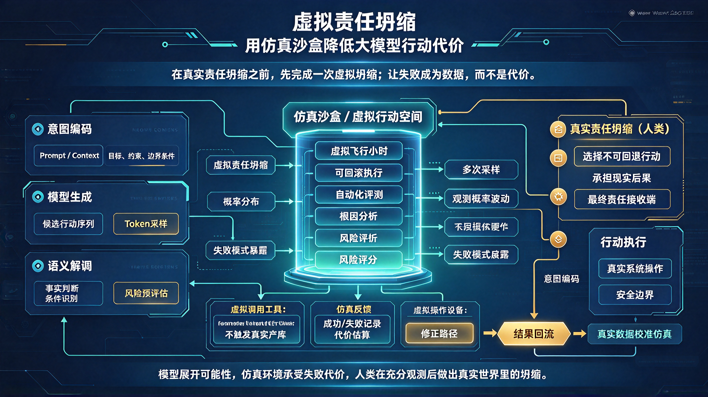

*图：在语义解调与真实责任坍缩之间插入一层虚拟坍缩——Agent 在仿真沙盒中反复执行、失败、修正，把不可逆的现实代价转化为可回滚的虚拟代价，失败数据回流驱动迭代，人类只在充分观测之后做出那一次不可回退的判断。*

通信教我们在噪声中重建信号，大模型教我们在概率中重建意义，而人类最终要做的，是在行动中承担判断。但判断一旦落地，代价就是真实的：一句错误回复可能赔钱，一次误操作可能删库，一个错误调度可能撞车。

于是问题变成：**能否在真实责任坍缩之前，先完成一次虚拟坍缩？**

## 一、大模型行动的代价困境

大模型从"聊天"走向"行动"之后，最大的变化不是它更聪明了，而是它开始**在真实世界留下痕迹**。

2026 年以来，企业级 Agent 落地面临一个普遍矛盾：模型能力已经可以自主调用工具、执行流程、跨系统协作，但生产环境对它的要求是"可控、可审计、可追责"。理想汽车为 Agent 构建隔离沙箱，正是因为原生框架在企业内网中暴露出越权风险和数据安全红线；DoorDash 用数百场模拟对话验证客服机器人，才敢把幻觉率降到可接受水平；YC 最新一批创业公司中，Arga Labs 直接做"上线前数字孪生验证层"，创始人说了一句反直觉的话："Agent 能力越强，它犯错的代价就越大。"

这恰好印证了前面的信息论框架：模型输出的是概率分布，而真实行动要求离散判断。从概率到判断的那一刀，就是**责任坍缩**。问题在于，如果每一次坍缩都直接发生在现实世界，试错成本太高，数据飞轮根本转不起来。

## 二、虚拟责任坍缩：在行动之前先失败一千次

"元宇宙"这个词已经被用得太泛，但剥开营销外壳，它的核心价值非常具体：**提供一个低成本、可回滚、可度量的虚拟行动空间。**

在这个空间里，Agent 可以：

- 反复调用工具而不触发真实支付；
- 执行代码而不污染生产数据库；
- 操作设备而不损坏物理硬件；
- 做出错误决策而只损失算力，不损失金钱或安全。

具身智能领域已经证明了这条路径的有效性。光轮智能用自研物理仿真平台让机器人在虚拟环境中反复训练，真实失误再回流到数据平台形成闭环；智元机器人发布 Genie Sim 3.0，实现"零硬件部署，全真实验证"，仿真与真实评测差异已小于 10%；上海 AI 实验室通过仿真数据扩增将具身智能数据采集成本降至 0.02 元/条，任务成功率提升至 93.3%。

这些案例的共同点是：**把真实世界的不可逆行动，转化为虚拟空间的可重复实验。**

## 三、从信息论闭环到虚拟闭环

把前面的完整链路补上"虚拟层"，就变成了：

> 意图编码 → 模型生成 → 语义解调 → **虚拟责任坍缩** → 仿真反馈 → 意图修正 → 真实责任坍缩 → 行动执行 → 结果回流

关键变化在中间那段：

| 原链路 | 升级后 | 价值 |
|---|---|---|
| 语义解调后直接行动 | 先在沙盒中执行 | 错误不溢出 |
| 一次坍缩定生死 | 虚拟环境中多次采样 | 概率波动可观测 |
| 失败即损失 | 失败即数据 | 反向驱动数据飞轮 |
| 人工事后复盘 | 自动化评测 + 根因分析 | 迭代速度数量级提升 |

这其实也是物理 AI 数据飞轮的核心逻辑：生成 → 增强 → 筛选 → 训练 → 评估 → 再生成，失败本身成为系统进化的燃料。

## 四、三层创业切入点

### 1. 虚拟行动沙盒（Harness + Sandbox）

让 Agent 在隔离环境中执行代码、浏览器操作、API 调用和桌面控制。OpenAI Agents SDK 2026 年 4 月的更新已经把 Harness（控制层）和 Compute（沙盒执行层）彻底解耦，说明行业共识正在形成：模型归模型，执行环境必须独立且可控。创业机会在于把这个能力产品化——让企业 Agent 上线前必须跑够"虚拟飞行小时"。

### 2. 行业数字孪生仿真

不同行业的"虚拟世界"差异巨大。制造业需要物理引擎对齐力觉和碰撞，客服需要对话模拟器还原用户行为，供应链需要业务规则引擎模拟订单流转。通用沙盒解决的是"安全执行"，行业仿真解决的是"真实对齐"。后者壁垒更高，因为仿真质量直接决定 Sim-to-Real 的迁移效果。

### 3. 责任度量与审计层

这是最容易被忽视、但可能最具平台价值的一层。虚拟环境中每一次执行都应该产生可审计的记录：风险评分、失败模式、修正路径、代价估算。这些数据不仅能用于模型迭代，还能支撑 Agent 的合规审计、保险定价和权责划分。2026 年 5 月网信办等三部门发布的《智能体规范应用与创新发展实施意见》已明确"可控、可审计、可追责"的合规底线，责任度量基础设施的需求只会越来越强。

## 五、必须警惕的边界

- **仿真不等于现实**。物理规则、业务逻辑、人性反应，任何一层对齐不足都会导致"虚拟里完美，现实里翻车"。
- **不要做成纯渲染平台**。3D 好看没有价值，关键是执行语义是否真实、反馈信号是否可信。
- **虚拟坍缩不能替代最终责任**。沙盒只是把第一次试错成本降到最低，人类仍然是最终的责任接收端。
- **跨模型中立性很重要**。如果只做某个大模型的插件，很容易被平台吞掉；更稳的是做"跨模型的行动验证层"。

## 六、结语

香农用一根管道解决了比特的可靠传输，大模型用一个携带人类智慧密码本的中间层试图解决语义的可靠理解，而虚拟责任坍缩要解决的是：**在行动真正发生之前，让概率的代价变得足够便宜。**

这不是逃避责任，而是把责任从"一次性豪赌"变成"可迭代、可度量、可回滚的工程过程"。模型展开可能性，仿真环境承受失败的代价，人类在充分观测之后，再做出那个不可回退的判断。

> **通信在噪声中重建信号，大模型在概率中重建意义，而仿真沙盒在虚拟中预演后果——最终，人类仍然站在链路的末端，承担那个真实世界里的坍缩。**
